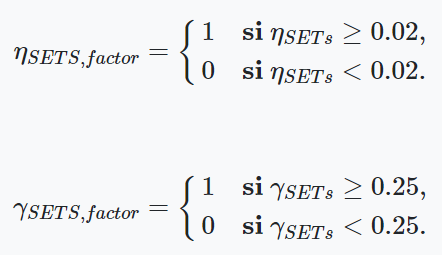

```{r Carga de librerías, message=FALSE, warning=FALSE}
library(deSolve)
library(shiny)
library(ggplot2)
library(Rmisc)
library(scales)
library(extrafont)
library(data.table)
library(reshape2)
library(knitr)
library(tidyverse)
library(lattice)
library(ggpubr)
```

```{r Carga de EDIAM a la sesión de R}
# Especificar directorio donde se guardó el modelo.

dir.model <- 
  "C:/Users/Guillermo GC/Dropbox/TEC MTY MPE/7o Trimestre/Modelación Avanzada/EDIAM/"
  
    # "C:/Users/GuillermoAlbertoGarc/Dropbox/TEC MTY MPE/7o Trimestre/Métodos para el análisis de decisiones bajo incertidumbre/EDIAM/"

# Especificar la versión del modelo que estamos utilizando
model.version <-
  "ediam_9_14_2016.r"

# Cargar el modelo en la sesión
source(
  paste(dir.model,
        model.version,
        sep="")
  )

#Checar que el modelo se haya cargado correctamente.
ediam
```

# Problema 1 (25 puntos)

## Técnicas de Reducción de Varianza -Parte 2-

1.  Diseña dos alternativas de política pública para el modelo EDIAM. Para la construcción de sus alternativas emplea los mismos criterios de costo y efectividad empleados en el problema 1 de la Tarea 3. Tu primer política puede hacer uso de impuestos de carbono, subsidios a la investigación y subsidios de tecnología en ambas regiones. En tu segunda política puedes además emplear el fondo verde. [Script-R y características de alternativas]

```{r 1.1 Definición de políticas}
#The Ediam model requires two input vectors
#Choose your policy
#Define your policy

policies.1 <-
  c(
#carbon tax
    tax.rate.N=0.25,
    tax.rate.S=0.3,
#Technology push in Advanced Region
	  epsi.re.subsidy.N = 0.15, #Technology subsidy in Advanced Region
    s.re.subsidy.N = 1.0, #R&D subsidy in Advanced Region
#Technology push in Emerging Region
    epsi.re.subsidy.S = 0.25, #Technology subsidy in Emerging Region
    epsi.re.GFsubsidy.N = 0.0,#Technology subsidy in GCF
    s.re.subsidy.S = 0.5, #R&D subsidy in Emerging Region
    s.re.GFsubsidy.N = 0.0, #R&D subsidy in GCF
    policy.half.life = as.numeric(0.01) #Policy half time
)

policies.2 <-
  c(
#carbon tax
    tax.rate.N=0.5,
    tax.rate.S=0.6,
#Technology push in Advanced Region
	  epsi.re.subsidy.N = 0.3, #Technology subsidy in Advanced Region
    s.re.subsidy.N = 2.0, #R&D subsidy in Advanced Region
#Technology push in Emerging Region
    epsi.re.subsidy.S = 0.5, #Technology subsidy in Emerging Region
    epsi.re.GFsubsidy.N = 0.4,#Technology subsidy in GCF
    s.re.subsidy.S = 1.0, #R&D subsidy in Emerging Region
    s.re.GFsubsidy.N = 1.5, #R&D subsidy in GCF
    policy.half.life = as.numeric(0.01) #Policy half time
)
```

2.  Implementa el siguiente modelo de incertidumbre para el modelo EDIAM:

-   Innovation propensity SETs: distribución exponencial con parámetro `λ=50`
-   R&D Returns SETs: distribución normal con parámetros `μ=0.25`, `σ=0.1`
-   Climate Sensitivity to GHG: distribución Weibull con parámetros `α=5.0`, `β=5.0`
-   Carbon Sink Capacity:distribución normal con parámetros `μ=0.0018`,`σ=0.0005`

Genera una muestra `N=500` de este modelo de incertidumbre y estima el intervalo de confianza del 95% para las variables: "Crecimiento Temperatura", "Crecimiento económico promedio en región avanzada" y "Crecimiento económico promedio en región emergente". Genera una tabla en la que compares directamente la estimación para cada política. Columnas: variables de desempeño; renglones: políticas [Script-R y tabla con resultados resultados].

```{r 1.2 Definición de función ediam.monte.carlo, warning=FALSE}
# Define function to run EDIAM across the experimental design
ediam.monte.carlo<-function(Exp.design,policies)
 {
  exp.out<-apply(Exp.design,1,function(x){
                                 #load parameters from Ex.design.table
                                  params<-c( CO2.Concentration.0 = as.numeric(x["CO2.Concentration.0"]), #
                                             TimeStep = as.numeric(x["TimeStep"]),#
                                             EndTime = as.numeric(x["EndTime"]), #
                                             alfa = as.numeric(x["alfa"]),
                                             epsilon = as.numeric(x["epsilon"]), #elasticity of subsitution
                                             Gamma.re = as.numeric(x["Gamma.re"]), #R&D returns SETs
                                             k.re = as.numeric(x["k.re"]),#
                                             Gamma.ce = as.numeric(x["Gamma.ce"]), #R&D returns FETs
                                             k.ce = as.numeric(x["k.ce"]),#
                                             Eta.re = as.numeric(x["Eta.re"]), #Innovation propensity SETs
                                             Eta.ce = as.numeric(x["Eta.ce"]), #Innovation propensity FETs
                                             Nu.re = as.numeric(x["Nu.re"]),  #Transferability SETs
                                             Nu.ce = as.numeric(x["Nu.ce"]),  #Transferability FETs
                                             qsi = as.numeric(x["qsi"]),#
                                             Delta.S = as.numeric(x["Delta.S"]),
                                             Delta.Temp.Disaster = as.numeric(x["Delta.Temp.Disaster"]),#
                                             Beta.Delta.Temp = as.numeric(x["Beta.Delta.Temp"]),
                                             CO2.base = as.numeric(x["CO2.base"]),
                                             labor.growth_N = as.numeric(x["labor.growth_N"]),# Population growth Advanced Region
                                             labor.growth_S = as.numeric(x["labor.growth_S"]),# Population growth Emerging Region
                                             lambda.S = as.numeric(x["lambda.S"]),
                                             sigma.utility = as.numeric(x["sigma.utility"]),
                                             rho = as.numeric(x["rho"]), #Discount rate
                                             Yre.0_N = as.numeric(x["Yre.0_N"]),
                                             Yce.0_N = as.numeric(x["Yce.0_N"]),
                                             Yre.0_S = as.numeric(x["Yre.0_S"]),
                                             Yce.0_S = as.numeric(x["Yce.0_S"]),
                                             size.factor = as.numeric(x["size.factor"]),#
                                             Run.ID = as.numeric(x["Run.ID"]));
                                     #run the model
                                      ediam(policies,params)
                                             })
#Transform results into a data frame
 exp.out<-do.call("rbind",exp.out)
 return(exp.out)
 }
```

```{r 1.2 Generación del diseño experimental}
#Create an experiment table
sample.size_1 <- 
  500

#Experimental.design
set.seed(55555)

Exp.design_1.2 <- 
  data.frame(Run.ID=1:sample.size_1,
             CO2.Concentration.0 = 382.2461,
             TimeStep = as.numeric(5),#
             EndTime = as.numeric(300), #
             alfa = 0.33,
             epsilon = 5.0, #elasticity of subsitution
             Gamma.re = rnorm(sample.size_1,0.25,0.1), #R&D returns SETs
             k.re = as.numeric(0.0),#
             Gamma.ce = 0.25, #R&D returns FETs
             k.ce = as.numeric(0.0),#
             Eta.re = rexp(sample.size_1,50), #Innovation propensity SETs
             Eta.ce = 0.02, #Innovation propensity FETs
             Nu.re = 0.02,  #Transferability SETs
             Nu.ce = 0.02,  #Transferability FETs
             qsi = as.numeric(0.0100539),#
             Delta.S = rnorm(sample.size_1, 0.0018, 0.0005), # Carbon Sink Capacity
             Delta.Temp.Disaster = as.numeric(6.0),#
             Beta.Delta.Temp = rweibull(sample.size_1, 5, 5), # Climate Sensitivity to GHG
             CO2.base = 289.415,
             labor.growth_N = as.numeric(0),# Population growth Advanced Region
             labor.growth_S = as.numeric(0),# Population growth Emerging Region
             lambda.S = 0.1443,
             sigma.utility = 2.0,
             rho = 0.008, #Discount rate
             Yre.0_N = 45.55,
             Yce.0_N = 193.2,
             Yre.0_S = 27.82,
             Yce.0_S = 257.54,
             size.factor = as.numeric(4.0)#
             )
```

```{r 1.2 Implementación de EDIAM bajo las políticas 1 y 2, warning=FALSE}
#run the experiment
exp.out.P1_1.2 <-
  ediam.monte.carlo(Exp.design_1.2, policies.1)

exp.out.P2_1.2 <-
  ediam.monte.carlo(Exp.design_1.2, policies.2)

#Part1. Estimate confidence intervals without variance reduction method
#average economic growth
P1 <- 
  aggregate(exp.out.P1_1.2[,c("Growth.Rate_N","Growth.Rate_S")],
            list(Run.ID=exp.out.P1_1.2$Run.ID),
            mean,
            na.rm=TRUE)

#Estimating temperature growth
Delta.temp.P1_1.2 <-
  subset(exp.out.P1_1.2[,c("Run.ID","Delta.Temp")],
         exp.out.P1_1.2$time==300)

P1 <-
  merge(P1,Delta.temp.P1_1.2)

#the same for a1
#average economic growth
P2 <-
  aggregate(exp.out.P2_1.2[,c("Growth.Rate_N","Growth.Rate_S")],
            list(Run.ID=exp.out.P2_1.2$Run.ID),
            mean,
            na.rm=TRUE)

Delta.temp.P2_1.2 <-
  subset(exp.out.P2_1.2[,c("Run.ID","Delta.Temp")],
         exp.out.P2_1.2$time==300)

P2 <-
  merge(P2,Delta.temp.P2_1.2)
```

```{r 1.2 Cálculo de intervalos de confianza}
#Define confidence level

confidence.level <- 0.05

#status quo
CI.P1_Delta.Temp <-
  with(P1,as.numeric(t.test(Delta.Temp,
                            conf.level = (1-confidence.level))$conf.int))
#alternative 1
CI.P2_Delta.Temp <-
  with(P2,as.numeric(t.test(Delta.Temp,
                            conf.level = (1-confidence.level))$conf.int))

#status quo
CI.P1_Growth.Rate_N <-
  with(P1,as.numeric(t.test(Growth.Rate_N,
                            conf.level = (1-confidence.level))$conf.int))
#alternative 1
CI.P2_Growth.Rate_N <-
  with(P2,as.numeric(t.test(Growth.Rate_N,
                            conf.level = (1-confidence.level))$conf.int))

#status quo
CI.P1_Growth.Rate_S <-
  with(P1,as.numeric(t.test(Growth.Rate_S,
                            conf.level = (1-confidence.level))$conf.int))
#alternative 1
CI.P2_Growth.Rate_S <-
  with(P2,as.numeric(t.test(Growth.Rate_S,
                            conf.level = (1-confidence.level))$conf.int))
```

```{r 1.2 Elaboración de tabla de intervalos de confianza}
# Matriz de intervalos de confianza
mat_intervalos_1.2 <- 
  matrix(nrow = 2, 
         ncol = 7)

mat_intervalos_1.2[1,1] <- "Política 1"
mat_intervalos_1.2[2,1] <- "Política 2"

# Crecimiento de temperatura
mat_intervalos_1.2[1,2] <- 
  round(CI.P1_Delta.Temp[1],4)

mat_intervalos_1.2[1,3] <- 
  round(CI.P1_Delta.Temp[2],4)

mat_intervalos_1.2[2,2] <-
  round(CI.P2_Delta.Temp[1],4)

mat_intervalos_1.2[2,3] <- 
  round(CI.P2_Delta.Temp[2],4)

# Crecimiento económico promedio en región avanzada
mat_intervalos_1.2[1,4] <- 
  round(CI.P1_Growth.Rate_N[1],4)

mat_intervalos_1.2[1,5] <- 
  round(CI.P1_Growth.Rate_N[2],4)

mat_intervalos_1.2[2,4] <-
  round(CI.P2_Growth.Rate_N[1],4)

mat_intervalos_1.2[2,5] <-
  round(CI.P2_Growth.Rate_N[2],4)

# Crecimiento económico promedio en región avanzada
mat_intervalos_1.2[1,6] <- 
  round(CI.P1_Growth.Rate_S[1],4)

mat_intervalos_1.2[1,7] <- 
  round(CI.P1_Growth.Rate_S[2],4)

mat_intervalos_1.2[2,6] <-
  round(CI.P2_Growth.Rate_S[1],4)

mat_intervalos_1.2[2,7] <-
  round(CI.P2_Growth.Rate_S[2],4)

kable(mat_intervalos_1.2,
      align = "c",
      col.names = 
        c("Políticas",
          "Mínimo de Crecimiento de Temperatura",
          "Máximo de Crecimiento de Temperatura",
          "Mínimo de Crecimiento Económico en Región Avanzada",
          "Máximo de Crecimiento Económico en Región Avanzada",
          "Mínimo de Crecimiento Económico en Región Emergente",
          "Máximo de Crecimiento Económico en Región Emergente"),
      caption = "Tabla comparativa de los Intervalos de Confianza del Crecimiento de Temperatura y del Crecimiento Económico en las Regiones Avanzada y Emergente bajo la implementación de las Políticas 1 y 2.")
```

3.  Usa la variable aleatoria "Innovation propensity SETs" como variable de control y empleando un tamaño de muestra `N=500` estima el intervalo de confianza del 95% para las variables: "Crecimiento Temperatura", "Crecimiento económico promedio en región avanzada" y "Crecimiento económico promedio en región emergente". Genera una tabla en la que compares directamente la estimación para cada política. Columnas: variables de desempeño; renglones: política. Compara tus resultados con los resultados del inciso 2.b). ¿Cuál es tu conclusión con respecto de la utilidad de esta técnica de reducción de varianza? [Script-R, resultados y comentarios]

```{r 1.3 Cálculo de Intervalos de Confianza con Variable de Control}
#Part2) Estimate confidence interval using control variates
 #the control variable "Y" is "Innovation propensity SETs" (Eta.re)
 #estimate the variance of "Y" and the convariance of "Y" (control variable) and "X" (output variable)
 #define each vector separately
Y<-Exp.design_1.2$Eta.re

DT.1<-P1$Delta.Temp
DT.2<-P2$Delta.Temp

GN.1<-P1$Growth.Rate_N
GN.2<-P2$Growth.Rate_N

GS.1<-P1$Growth.Rate_S
GS.2<-P2$Growth.Rate_S

#estimate estatistics
var.Y<-var(Y)
mean.Y<-mean(Y,na.rm=TRUE)

mean.DT.1<-mean(DT.1,na.rm=TRUE)
mean.DT.2<-mean(DT.2,na.rm=TRUE)
var.DT.1<-var(DT.1,na.rm=TRUE)
var.DT.2<-var(DT.2,na.rm=TRUE)
cov.DT.1.Y<-cov(DT.1,Y,use="complete")
cov.DT.2.Y<-cov(DT.2,Y,use="complete")

mean.GN.1<-mean(GN.1,na.rm=TRUE)
mean.GN.2<-mean(GN.2,na.rm=TRUE)
var.GN.1<-var(GN.1,na.rm=TRUE)
var.GN.2<-var(GN.2,na.rm=TRUE)
cov.GN.1.Y<-cov(GN.1,Y,use="complete")
cov.GN.2.Y<-cov(GN.2,Y,use="complete")

mean.GS.1<-mean(GS.1,na.rm=TRUE)
mean.GS.2<-mean(GS.2,na.rm=TRUE)
var.GS.1<-var(GS.1,na.rm=TRUE)
var.GS.2<-var(GS.2,na.rm=TRUE)
cov.GS.1.Y<-cov(GS.1,Y,use="complete")
cov.GS.2.Y<-cov(GS.2,Y,use="complete")

#estimate the value of the correction factor
P.1.DT<-cov.DT.1.Y/var.Y
P.2.DT<-cov.DT.2.Y/var.Y

P.1.GN<-cov.GN.1.Y/var.Y
P.2.GN<-cov.GN.2.Y/var.Y

P.1.GS<-cov.GS.1.Y/var.Y
P.2.GS<-cov.GS.2.Y/var.Y

#estimate the corrected mean using this control variable
nu<-1/50 #This is the true mean of the control variable: we know it because we use uncertainty model is known

DT.1.c<-mean.DT.1-P.1.DT*(mean.Y-nu)
DT.2.c<-mean.DT.2-P.2.DT*(mean.Y-nu)

GN.1.c<-mean.GN.1-P.1.GN*(mean.Y-nu)
GN.2.c<-mean.GN.2-P.2.GN*(mean.Y-nu)

GS.1.c<-mean.GS.1-P.1.GS*(mean.Y-nu)
GS.2.c<-mean.GS.2-P.2.GS*(mean.Y-nu)

#estimate corrected variance
var.DT.1.c<-var.DT.1+(P.1.DT^2)*var.Y-2*P.1.DT*cov.DT.1.Y
var.DT.2.c<-var.DT.2+(P.2.DT^2)*var.Y-2*P.2.DT*cov.DT.2.Y

var.GN.1.c<-var.GN.1+(P.1.GN^2)*var.Y-2*P.1.GN*cov.GN.1.Y
var.GN.2.c<-var.GN.2+(P.2.GN^2)*var.Y-2*P.2.GN*cov.GN.2.Y

var.GS.1.c<-var.GS.1+(P.1.GS^2)*var.Y-2*P.1.GS*cov.GS.1.Y
var.GS.2.c<-var.GS.2+(P.2.GS^2)*var.Y-2*P.2.GS*cov.GS.2.Y

#estimate corrected confidence intervals
z <- qnorm(1-confidence.level/2)

CI.P1.c_Delta.Temp <-
  c(DT.1.c-z*var.DT.1.c/sample.size_1,DT.1.c+z*var.DT.1.c/sample.size_1)
CI.P2.c_Delta.Temp <-
  c(DT.2.c-z*var.DT.2.c/sample.size_1,DT.2.c+z*var.DT.2.c/sample.size_1)

CI.P1.c_Growth.Rate_N <-
  c(GN.1.c-z*var.GN.1.c/sample.size_1,GN.1.c+z*var.GN.1.c/sample.size_1)
CI.P2.c_Growth.Rate_N <-
  c(GN.2.c-z*var.GN.2.c/sample.size_1,GN.2.c+z*var.GN.2.c/sample.size_1)

CI.P1.c_Growth.Rate_S <-
  c(GS.1.c-z*var.GS.1.c/sample.size_1,GS.1.c+z*var.GS.1.c/sample.size_1)
CI.P2.c_Growth.Rate_S <-
  c(GS.2.c-z*var.GS.2.c/sample.size_1,GS.2.c+z*var.GS.2.c/sample.size_1)
```

```{r 1.3 Elaboración de tabla de intervalos de confianza}
# Matriz de intervalos de confianza
mat_intervalos_1.3 <- 
  matrix(nrow = 2, 
         ncol = 7)

mat_intervalos_1.3[1,1] <- "Política 1"
mat_intervalos_1.3[2,1] <- "Política 2"

# Crecimiento de temperatura
mat_intervalos_1.3[1,2] <- 
  round(CI.P1.c_Delta.Temp[1],4)

mat_intervalos_1.3[1,3] <- 
  round(CI.P1.c_Delta.Temp[2],4)

mat_intervalos_1.3[2,2] <-
  round(CI.P2.c_Delta.Temp[1],4)

mat_intervalos_1.3[2,3] <- 
  round(CI.P2.c_Delta.Temp[2],4)

# Crecimiento económico promedio en región avanzada
mat_intervalos_1.3[1,4] <- 
  round(CI.P1.c_Growth.Rate_N[1],4)

mat_intervalos_1.3[1,5] <- 
  round(CI.P1.c_Growth.Rate_N[2],4)

mat_intervalos_1.3[2,4] <-
  round(CI.P2.c_Growth.Rate_N[1],4)

mat_intervalos_1.3[2,5] <-
  round(CI.P2.c_Growth.Rate_N[2],4)

# Crecimiento económico promedio en región avanzada
mat_intervalos_1.3[1,6] <- 
  round(CI.P1.c_Growth.Rate_S[1],4)

mat_intervalos_1.3[1,7] <- 
  round(CI.P1.c_Growth.Rate_S[2],4)

mat_intervalos_1.3[2,6] <-
  round(CI.P2.c_Growth.Rate_S[1],4)

mat_intervalos_1.3[2,7] <-
  round(CI.P2.c_Growth.Rate_S[2],4)

kable(mat_intervalos_1.3,
      align = "c",
      col.names = 
        c("Políticas",
          "Mínimo de Crecimiento de Temperatura",
          "Máximo de Crecimiento de Temperatura",
          "Mínimo de Crecimiento Económico en Región Avanzada",
          "Máximo de Crecimiento Económico en Región Avanzada",
          "Mínimo de Crecimiento Económico en Región Emergente",
          "Máximo de Crecimiento Económico en Región Emergente"),
      caption = "Tabla comparativa de los Intervalos de Confianza del Crecimiento de Temperatura y del Crecimiento Económico en las Regiones Avanzada y Emergente bajo la implementación de las Políticas 1 y 2 considerando la variable `Innovation Propensity SETs` como variable de control.")
```

### 1.3 Comentarios:
*R: A partir de la comparación de los intervalos de confianza generados por el modelo de incertidumbre para las tres variables de salida bajo la implementación de las dos políticas considerando variables de control y sin considerarlas (ejercicios 1.3 y 1.2, respectivamente), podemos concluir que efectivamente los intervalos de confianza más estrechos obtenidos en el ejercicio 1.3 a comparación de en el ejercicio 1.2 demuestran que las variables de control son efectivas en el incremento de la presición del modelo en cuestión.*

# Problema 2 (25 puntos)

## Diseño de experimentos

1.  Emplea el modelo de incertidumbre del problema 1 y una muestra `N=1,000`. Crea los siguientes dos factores en tu tabla experimental:

{width="300"}

Emplea la función summary() para describir ambos factores en tu tabla experimental. ¿Cuál es el balance de escenarios favorables y desfavorables en tu diseño experimental? [Script-R, resultados y comentarios]

```{r 2.1 Muestreo y generación de factores para Eta.re y Gamma.re}
#Create an experiment table
sample.size_2 <- 
  1000

#Experimental.design
set.seed(55555)

Exp.design_2.1 <- 
  data.frame(Run.ID=1:sample.size_2,
             CO2.Concentration.0 = 382.2461,
             TimeStep = as.numeric(5),#
             EndTime = as.numeric(300), #
             alfa = 0.33,
             epsilon = 5.0, #elasticity of subsitution
             Gamma.re = rnorm(sample.size_2,0.25,0.1), #R&D returns SETs
             k.re = as.numeric(0.0),#
             Gamma.ce = 0.25, #R&D returns FETs
             k.ce = as.numeric(0.0),#
             Eta.re = rexp(sample.size_2,50), #Innovation propensity SETs
             Eta.ce = 0.02, #Innovation propensity FETs
             Nu.re = 0.02,  #Transferability SETs
             Nu.ce = 0.02,  #Transferability FETs
             qsi = as.numeric(0.0100539),#
             Delta.S = rnorm(sample.size_2, 0.0018, 0.0005), # Carbon Sink Capacity
             Delta.Temp.Disaster = as.numeric(6.0),#
             Beta.Delta.Temp = rweibull(sample.size_2, 5, 5), # Climate Sensitivity to GHG
             CO2.base = 289.415,
             labor.growth_N = as.numeric(0),# Population growth Advanced Region
             labor.growth_S = as.numeric(0),# Population growth Emerging Region
             lambda.S = 0.1443,
             sigma.utility = 2.0,
             rho = 0.008, #Discount rate
             Yre.0_N = 45.55,
             Yce.0_N = 193.2,
             Yre.0_S = 27.82,
             Yce.0_S = 257.54,
             size.factor = as.numeric(4.0)#
             )

Eta.re_factor <- data.frame()
Gamma.re_factor <- data.frame()

for(i in 1:sample.size_2){
  Eta.re_factor[i,1] <- 
    ifelse(Exp.design_2.1[i,11] >= 0.02, 1, 0)
  Gamma.re_factor[i,1] <- 
    ifelse(Exp.design_2.1[i,7] >= 0.25, 1, 0)
}

Exp.design_2.1$Eta.re_factor <- Eta.re_factor
Exp.design_2.1$Gamma.re_factor <- Gamma.re_factor

summary(select(Exp.design_2.1, Eta.re_factor, Gamma.re_factor))
```

### 2.1 Comentarios
*R: Analizando las medias obtenidas de ejecutar la función summary(), y considerando que los factores generados de Eta.re y Gamma.re solamente pueden tomar valores de 0 o 1, podemos concluir que el 36.6% de los datos del factor de Eta.re en el diseño experimental son iguales a 1 y el resto son iguales a 0; mientras que el 47.5% de los datos del factor de Gamma.re en el mismo diseño experimental son iguales a 1 y el resto son iguales a 0.*

2.  Estima la respuesta promedio `Ri` para cada uno de los puntos de diseño del experimento. En una tabla reporta tu resultado para cada uno de los puntos de diseño (i.e. combinación de factores) [Script-R, resultados y comentarios]

```{r 2.2 Estimación de respuestas promedio, warning=FALSE}
#run the experiment
exp.out.P1_2.2 <-
  ediam.monte.carlo(Exp.design_2.1, policies.1)
 
exp.out.P2_2.2 <-
    ediam.monte.carlo(Exp.design_2.1, policies.2)

#Incorporate factors in outcome
exp.out.Eta.re_factor <- data.frame()
exp.out.Gamma.re_factor <- data.frame()

for (i in 1:sample.size_2){
  exp.out.Eta.re_factormovil <- as.data.frame(rep(Exp.design_2.1$Eta.re_factor[i,],61))
  exp.out.Eta.re_factor <- rbind(exp.out.Eta.re_factor,exp.out.Eta.re_factormovil)
  
  exp.out.Gamma.re_factormovil <- as.data.frame(rep(Exp.design_2.1$Gamma.re_factor[i,],61))
  exp.out.Gamma.re_factor <- rbind(exp.out.Gamma.re_factor,exp.out.Gamma.re_factormovil)
}

exp.out.P1_2.2$Eta.re_factor <- exp.out.Eta.re_factor
exp.out.P1_2.2$Gamma.re_factor <- exp.out.Gamma.re_factor

#subset los resultados del experimento, política 1
OutVars.P1_2.2 <- 
  aggregate(exp.out.P1_2.2[,c("Growth.Rate_N", "Growth.Rate_S")],
            list(Run.ID = exp.out.P1_2.2$Run.ID),
            mean,
            na.rm = TRUE)

Delta.temp.P1_2.2 <-
  subset(exp.out.P1_2.2[,c("Run.ID","Delta.Temp")],
         exp.out.P1_2.2$time==300)

Delta.temp.P1_2.2 <-
  merge(Delta.temp.P1_2.2,
        Exp.design_2.1[,c("Run.ID","Eta.re_factor","Gamma.re_factor")],
        by = "Run.ID")

OutVars.P1_2.2 <- 
  merge(OutVars.P1_2.2,
        Delta.temp.P1_2.2,
        by = "Run.ID")

#mean response at first design point
P1_R00 <- 
  subset(OutVars.P1_2.2,
         OutVars.P1_2.2$Eta.re_factor == 0 & 
           OutVars.P1_2.2$Gamma.re_factor == 0)

P1_R01 <- 
  subset(OutVars.P1_2.2,
         OutVars.P1_2.2$Eta.re_factor == 0 & 
           OutVars.P1_2.2$Gamma.re_factor == 1)

P1_R10 <- 
  subset(OutVars.P1_2.2,
         OutVars.P1_2.2$Eta.re_factor == 1 & 
           OutVars.P1_2.2$Gamma.re_factor == 0)

P1_R11 <- 
  subset(OutVars.P1_2.2,
         OutVars.P1_2.2$Eta.re_factor == 1 & 
           OutVars.P1_2.2$Gamma.re_factor == 1)

#subset los resultados del experimento, política 2
OutVars.P2_2.2 <- 
  aggregate(exp.out.P2_2.2[,c("Growth.Rate_N", "Growth.Rate_S")],
            list(Run.ID = exp.out.P2_2.2$Run.ID),
            mean,
            na.rm = TRUE)

Delta.temp.P2_2.2 <-
  subset(exp.out.P2_2.2[,c("Run.ID","Delta.Temp")],
         exp.out.P2_2.2$time==300)

Delta.temp.P2_2.2 <-
  merge(Delta.temp.P2_2.2,
        Exp.design_2.1[,c("Run.ID","Eta.re_factor","Gamma.re_factor")],
        by = "Run.ID")

OutVars.P2_2.2 <- 
  merge(OutVars.P2_2.2,
        Delta.temp.P2_2.2,
        by = "Run.ID")

#mean response at first design point
P2_R00 <- 
  subset(OutVars.P2_2.2,
         OutVars.P2_2.2$Eta.re_factor == 0 & 
           OutVars.P2_2.2$Gamma.re_factor == 0)

P2_R01 <- 
  subset(OutVars.P2_2.2,
         OutVars.P2_2.2$Eta.re_factor == 0 & 
           OutVars.P2_2.2$Gamma.re_factor == 1)

P2_R10 <- 
  subset(OutVars.P2_2.2,
         OutVars.P2_2.2$Eta.re_factor == 1 & 
           OutVars.P2_2.2$Gamma.re_factor == 0)

P2_R11 <- 
  subset(OutVars.P2_2.2,
         OutVars.P2_2.2$Eta.re_factor == 1 & 
           OutVars.P2_2.2$Gamma.re_factor == 1)
```

```{r 2.2 Elaboración de matriz de respuestas promedio}
# Matriz de respuestas promedio
mat_promedios_2.2 <- 
  matrix(nrow = 8, 
         ncol = 5)

# Establezco la política que se aplica en la matriz
for (i in 1:4){
  mat_promedios_2.2[i,1] <- "Política 1"
}

for (i in 5:8){
  mat_promedios_2.2[i,1] <- "Política 2"
}

# Establezco los puntos de diseño en la matriz
for(i in c(1,5)){
  mat_promedios_2.2[i,2] <- "Eta.re_factor = 0, Gamma.re_factor = 0"
}

for(i in c(2,6)){
  mat_promedios_2.2[i,2] <- "Eta.re_factor = 1, Gamma.re_factor = 0"
}

for(i in c(3,7)){
  mat_promedios_2.2[i,2] <- "Eta.re_factor = 0, Gamma.re_factor = 1"
}

for(i in c(4,8)){
  mat_promedios_2.2[i,2] <- "Eta.re_factor = 1, Gamma.re_factor = 1"
}

# Crecimiento de temperatura
## Política 1
mat_promedios_2.2[1,3] <- 
  round(mean(P1_R00$Delta.Temp,na.rm = TRUE),4)

mat_promedios_2.2[2,3] <- 
  round(mean(P1_R10$Delta.Temp,na.rm = TRUE),4)

mat_promedios_2.2[3,3] <- 
  round(mean(P1_R01$Delta.Temp,na.rm = TRUE),4)

mat_promedios_2.2[4,3] <- 
  round(mean(P1_R11$Delta.Temp,na.rm = TRUE),4)

## Política 2
mat_promedios_2.2[5,3] <- 
  round(mean(P2_R00$Delta.Temp,na.rm = TRUE),4)

mat_promedios_2.2[6,3] <- 
  round(mean(P2_R10$Delta.Temp,na.rm = TRUE),4)

mat_promedios_2.2[7,3] <- 
  round(mean(P2_R01$Delta.Temp,na.rm = TRUE),4)

mat_promedios_2.2[8,3] <- 
  round(mean(P2_R11$Delta.Temp,na.rm = TRUE),4)

# Crecimiento económico promedio en región avanzada
## Política 1
mat_promedios_2.2[1,4] <- 
  round(mean(P1_R00$Growth.Rate_N,na.rm = TRUE),4)

mat_promedios_2.2[2,4] <- 
  round(mean(P1_R10$Growth.Rate_N,na.rm = TRUE),4)

mat_promedios_2.2[3,4] <- 
  round(mean(P1_R01$Growth.Rate_N,na.rm = TRUE),4)

mat_promedios_2.2[4,4] <- 
  round(mean(P1_R11$Growth.Rate_N,na.rm = TRUE),4)

## Política 2
mat_promedios_2.2[5,4] <- 
  round(mean(P2_R00$Growth.Rate_N,na.rm = TRUE),4)

mat_promedios_2.2[6,4] <- 
  round(mean(P2_R10$Growth.Rate_N,na.rm = TRUE),4)

mat_promedios_2.2[7,4] <- 
  round(mean(P2_R01$Growth.Rate_N,na.rm = TRUE),4)

mat_promedios_2.2[8,4] <- 
  round(mean(P2_R11$Growth.Rate_N,na.rm = TRUE),4)

# Crecimiento económico promedio en región emergente
## Política 1
mat_promedios_2.2[1,5] <- 
  round(mean(P1_R00$Growth.Rate_S,na.rm = TRUE),4)

mat_promedios_2.2[2,5] <- 
  round(mean(P1_R10$Growth.Rate_S,na.rm = TRUE),4)

mat_promedios_2.2[3,5] <- 
  round(mean(P1_R01$Growth.Rate_S,na.rm = TRUE),4)

mat_promedios_2.2[4,5] <- 
  round(mean(P1_R11$Growth.Rate_S,na.rm = TRUE),4)

## Política 2
mat_promedios_2.2[5,5] <- 
  round(mean(P2_R00$Growth.Rate_S,na.rm = TRUE),4)

mat_promedios_2.2[6,5] <- 
  round(mean(P2_R10$Growth.Rate_S,na.rm = TRUE),4)

mat_promedios_2.2[7,5] <- 
  round(mean(P2_R01$Growth.Rate_S,na.rm = TRUE),4)

mat_promedios_2.2[8,5] <- 
  round(mean(P2_R11$Growth.Rate_S,na.rm = TRUE),4)

kable(mat_promedios_2.2,
      align = "c",
      col.names = 
        c("Políticas",
          "Puntos de diseño",
          "Crecimiento de Temperatura Promedio",
          "Crecimiento Económico Promedio en Región Avanzada",
          "Crecimiento Económico Promedio en Región Emergente"),
      caption = "Tabla comparativa de las Respuestas Promedio del Crecimiento de Temperatura y del Crecimiento Económico en las Regiones Avanzada y Emergente bajo la implementación de las Políticas 1 y 2 y bajo diferentes puntos de diseño")
```

### 2.2 Comentarios
*R: A partir de estos resultados, podemos concluir que la Política 2 en promedio tiene mejores resultados en términos de Crecimiento de Temperatura Promedio (crecimientos menores) que la Política 1, sin importar el punto de diseño que se considere. En cuanto a los crecimientos económicos, en la región avanzada se aprecia que el crecimiento económico es mayor en promedio con la implementación de la Política 2 solamente en los puntos de diseño en los cuales el factor de Eta.re es igual a 1; por lo cual la Política 1 es más efectiva en promedio para la mejora de esta variable de salida en aquellos escenarios en los cuales el factor de Eta.re es igual a 0. Por último, en el crecimiento económico de la región emergente nuevamente vemos un mejor desempeño promedio para todos los puntos de diseño cuando se implementa la Política 2 en comparación con la Política 1.*

3.  Estima el efecto individual de cada uno de los factores así como el efecto de su interacción. ¿Cuál es tu conclusión sobre el papel de cada uno de estos factores? [Script-R, resultados y comentarios]

```{r 2.3 Efecto inidividual de los factores bajo la Política 1}
mat_efectos_P1_2.3 <-
  matrix(nrow = 3,
         ncol = 4)

for (i in 1:3){
  mat_efectos_P1_2.3[i,1] <- 
    c("e1","e2","e12")[i]
}

mat_efectos_P1_2.3[1,2] <- 
  round(0.5*
    ((mean(P1_R10$Delta.Temp,na.rm = TRUE) - 
      mean(P1_R00$Delta.Temp,na.rm = TRUE)) +
      (mean(P1_R11$Delta.Temp,na.rm = TRUE) - 
      mean(P1_R01$Delta.Temp,na.rm = TRUE))), 4)

mat_efectos_P1_2.3[2,2] <- 
  round(0.5*
    ((mean(P1_R01$Delta.Temp,na.rm = TRUE) - 
      mean(P1_R00$Delta.Temp,na.rm = TRUE)) +
      (mean(P1_R11$Delta.Temp,na.rm = TRUE) - 
      mean(P1_R10$Delta.Temp,na.rm = TRUE))), 4)

mat_efectos_P1_2.3[3,2] <-
  round(0.5*
    ((mean(P1_R10$Delta.Temp,na.rm = TRUE) - 
      mean(P1_R00$Delta.Temp,na.rm = TRUE)) +
      (mean(P1_R11$Delta.Temp,na.rm = TRUE) - 
      mean(P1_R01$Delta.Temp,na.rm = TRUE))), 4)

mat_efectos_P1_2.3[1,3] <- 
  round(0.5*
    ((mean(P1_R10$Growth.Rate_N,na.rm = TRUE) - 
      mean(P1_R00$Growth.Rate_N,na.rm = TRUE)) +
      (mean(P1_R11$Growth.Rate_N,na.rm = TRUE) - 
      mean(P1_R01$Growth.Rate_N,na.rm = TRUE))), 4)

mat_efectos_P1_2.3[2,3] <- 
  round(0.5*
    ((mean(P1_R01$Growth.Rate_N,na.rm = TRUE) - 
      mean(P1_R00$Growth.Rate_N,na.rm = TRUE)) +
      (mean(P1_R11$Growth.Rate_N,na.rm = TRUE) - 
      mean(P1_R10$Growth.Rate_N,na.rm = TRUE))), 4)

mat_efectos_P1_2.3[3,3] <- 
  round(0.5*
    ((mean(P1_R10$Growth.Rate_N,na.rm = TRUE) - 
      mean(P1_R00$Growth.Rate_N,na.rm = TRUE)) +
      (mean(P1_R11$Growth.Rate_N,na.rm = TRUE) - 
      mean(P1_R01$Growth.Rate_N,na.rm = TRUE))), 4)

mat_efectos_P1_2.3[1,4] <- 
  round(0.5*
    ((mean(P1_R10$Growth.Rate_S,na.rm = TRUE) - 
      mean(P1_R00$Growth.Rate_S,na.rm = TRUE)) +
      (mean(P1_R11$Growth.Rate_S,na.rm = TRUE) - 
      mean(P1_R01$Growth.Rate_S,na.rm = TRUE))), 4)

mat_efectos_P1_2.3[2,4] <- 
  round(0.5*
    ((mean(P1_R01$Growth.Rate_S,na.rm = TRUE) - 
      mean(P1_R00$Growth.Rate_S,na.rm = TRUE)) +
      (mean(P1_R11$Growth.Rate_S,na.rm = TRUE) - 
      mean(P1_R10$Growth.Rate_S,na.rm = TRUE))), 4)

mat_efectos_P1_2.3[3,4] <- 
  round(0.5*
    ((mean(P1_R10$Growth.Rate_S,na.rm = TRUE) - 
      mean(P1_R00$Growth.Rate_S,na.rm = TRUE)) +
      (mean(P1_R11$Growth.Rate_S,na.rm = TRUE) - 
      mean(P1_R01$Growth.Rate_S,na.rm = TRUE))), 4)

kable(mat_efectos_P1_2.3,
      align = "c",
      col.names = 
        c("Efectos de factores e interacción de factores",
          "Efecto en el Crecimiento de Temperatura Promedio",
          "Efecto en el Crecimiento Económico Promedio en Región Avanzada",
          "Efecto en el Crecimiento Económico Promedio en Región Emergente"),
      caption = "Tabla comparativa de los efectos individuales de los factores 1 y 2 (`Eta.re` y `Gamma.re`, respectivamente) ejercen en las variables de salida del modelo EDIAM bajo la implementación de la Política 1.")
```

```{r 2.3 Efecto inidividual de los factores bajo la Política 2}
mat_efectos_P2_2.3 <-
  matrix(nrow = 3,
         ncol = 4)

for (i in 1:3){
  mat_efectos_P2_2.3[i,1] <- 
    c("e1","e2","e12")[i]
}

mat_efectos_P2_2.3[1,2] <- 
  round(0.5*
    ((mean(P2_R10$Delta.Temp,na.rm = TRUE) - 
      mean(P2_R00$Delta.Temp,na.rm = TRUE)) +
      (mean(P2_R11$Delta.Temp,na.rm = TRUE) - 
      mean(P2_R01$Delta.Temp,na.rm = TRUE))), 4)

mat_efectos_P2_2.3[2,2] <- 
  round(0.5*
    ((mean(P2_R01$Delta.Temp,na.rm = TRUE) - 
      mean(P2_R00$Delta.Temp,na.rm = TRUE)) +
      (mean(P2_R11$Delta.Temp,na.rm = TRUE) - 
      mean(P2_R10$Delta.Temp,na.rm = TRUE))), 4)

mat_efectos_P2_2.3[3,2] <-
  round(0.5*
    ((mean(P2_R10$Delta.Temp,na.rm = TRUE) - 
      mean(P2_R00$Delta.Temp,na.rm = TRUE)) +
      (mean(P2_R11$Delta.Temp,na.rm = TRUE) - 
      mean(P2_R01$Delta.Temp,na.rm = TRUE))), 4)

mat_efectos_P2_2.3[1,3] <- 
  round(0.5*
    ((mean(P2_R10$Growth.Rate_N,na.rm = TRUE) - 
      mean(P2_R00$Growth.Rate_N,na.rm = TRUE)) +
      (mean(P2_R11$Growth.Rate_N,na.rm = TRUE) - 
      mean(P2_R01$Growth.Rate_N,na.rm = TRUE))), 4)

mat_efectos_P2_2.3[2,3] <- 
  round(0.5*
    ((mean(P2_R01$Growth.Rate_N,na.rm = TRUE) - 
      mean(P2_R00$Growth.Rate_N,na.rm = TRUE)) +
      (mean(P2_R11$Growth.Rate_N,na.rm = TRUE) - 
      mean(P2_R10$Growth.Rate_N,na.rm = TRUE))), 4)

mat_efectos_P2_2.3[3,3] <- 
  round(0.5*
    ((mean(P2_R10$Growth.Rate_N,na.rm = TRUE) - 
      mean(P2_R00$Growth.Rate_N,na.rm = TRUE)) +
      (mean(P2_R11$Growth.Rate_N,na.rm = TRUE) - 
      mean(P2_R01$Growth.Rate_N,na.rm = TRUE))), 4)

mat_efectos_P2_2.3[1,4] <- 
  round(0.5*
    ((mean(P2_R10$Growth.Rate_S,na.rm = TRUE) - 
      mean(P2_R00$Growth.Rate_S,na.rm = TRUE)) +
      (mean(P2_R11$Growth.Rate_S,na.rm = TRUE) - 
      mean(P2_R01$Growth.Rate_S,na.rm = TRUE))), 4)

mat_efectos_P2_2.3[2,4] <- 
  round(0.5*
    ((mean(P2_R01$Growth.Rate_S,na.rm = TRUE) - 
      mean(P2_R00$Growth.Rate_S,na.rm = TRUE)) +
      (mean(P2_R11$Growth.Rate_S,na.rm = TRUE) - 
      mean(P2_R10$Growth.Rate_S,na.rm = TRUE))), 4)

mat_efectos_P2_2.3[3,4] <- 
  round(0.5*
    ((mean(P2_R10$Growth.Rate_S,na.rm = TRUE) - 
      mean(P2_R00$Growth.Rate_S,na.rm = TRUE)) +
      (mean(P2_R11$Growth.Rate_S,na.rm = TRUE) - 
      mean(P2_R01$Growth.Rate_S,na.rm = TRUE))), 4)

kable(mat_efectos_P2_2.3,
      align = "c",
      col.names = 
        c("Efectos de factores e interacción de factores",
          "Efecto en el Crecimiento de Temperatura Promedio",
          "Efecto en el Crecimiento Económico Promedio en Región Avanzada",
          "Efecto en el Crecimiento Económico Promedio en Región Emergente"),
      caption = "Tabla comparativa de los efectos individuales de los factores 1 y 2 (`Eta.re` y `Gamma.re`, respectivamente) ejercen en las variables de salida del modelo EDIAM bajo la implementación de la Política 2.")
```

### 2.3 Comentarios
*R: En conclusión a la evaluación de los efectos de los factores de `Eta.re` y `Gamma.re`, así como de su interacción, podemos apreciar primeramente que a partir de la implementación de la Política 2, ambos factores tienen un mayor efecto en las tres variables de salida que con la implementación de la Política 1. Por otro lado, se aprecia que el factor de `Eta.re` tiene, en todos los casos, un mayor efecto en las tres variables de salida que el factor `Gamma.re`, por lo cual se podría sugerir que una mayor propensidad a la innovación en las tecnologías limpias podría ser determinante para acercarse al futuro deseable de tener el menor incremento de temperatura promedio posible y el mayor crecimiento económico posible tanto en la región avanzada como en la región emergente.*

# Problema 3 (25 puntos)

## Meta-modelado

1.  Emplea el modelo de incertidumbre del problema 1 y una muestra `N=500`. Desarrolla un meta-modelo para la variable "Crecimiento Temperatura" para cada uno de los casos de política del problema 1. Estandariza los valores de cada una las variables aleatorias y estima los modelos de regresión correspondientes. ¿Qué variable aleatoria parece ser más relevante para determinar el crecimiento de la temperatura? ¿Qué tan diferentes son los resultados para cada política? [Script-R, resultados y comentarios]

```{r 3.1 Desarrollo de meta-modelos del crecimiento de temperatura bajo la implementación de las políticas 1 y 2}
#subset the experitmental results to the variables of interest
## Política 1
Delta.temp.P1_3.1 <-
  subset(exp.out.P1_1.2[,c("Run.ID","Delta.Temp")],
         exp.out.P1_1.2$time == 300)

Delta.temp.P1_3.1 <-
  merge(Delta.temp.P1_3.1,
        Exp.design_1.2[,c("Run.ID","Beta.Delta.Temp","Delta.S","Gamma.re","Eta.re")],
        by ="Run.ID")

## Política 2
Delta.temp.P2_3.1 <-
  subset(exp.out.P2_1.2[,c("Run.ID","Delta.Temp")],
         exp.out.P2_1.2$time == 300)

Delta.temp.P2_3.1 <-
  merge(Delta.temp.P2_3.1,
        Exp.design_1.2[,c("Run.ID","Beta.Delta.Temp","Delta.S","Gamma.re","Eta.re")],
        by ="Run.ID")

# Normalizing the covariates
## Política 1
Delta.temp.P1_3.1$Beta.Delta.Temp.Z <-
  as.numeric(scale(Delta.temp.P1_3.1$Beta.Delta.Temp,center=TRUE,scale=TRUE))
Delta.temp.P1_3.1$Delta.S.Z <-
  as.numeric(scale(Delta.temp.P1_3.1$Delta.S,center=TRUE,scale=TRUE))
Delta.temp.P1_3.1$Gamma.re.Z <-
  as.numeric(scale(Delta.temp.P1_3.1$Gamma.re,center=TRUE,scale=TRUE))
Delta.temp.P1_3.1$Eta.re.Z <-
  as.numeric(scale(Delta.temp.P1_3.1$Eta.re,center=TRUE,scale=TRUE))

## Política 2
Delta.temp.P2_3.1$Beta.Delta.Temp.Z <-
  as.numeric(scale(Delta.temp.P2_3.1$Beta.Delta.Temp,center=TRUE,scale=TRUE))
Delta.temp.P2_3.1$Delta.S.Z <-
  as.numeric(scale(Delta.temp.P2_3.1$Delta.S,center=TRUE,scale=TRUE))
Delta.temp.P2_3.1$Gamma.re.Z <-
  as.numeric(scale(Delta.temp.P2_3.1$Gamma.re,center=TRUE,scale=TRUE))
Delta.temp.P2_3.1$Eta.re.Z <-
  as.numeric(scale(Delta.temp.P2_3.1$Eta.re,center=TRUE,scale=TRUE))

#create the meta-model for temperature using normalized covariates
## Política 1
meta.model.temp.P1_3.1 <-
  lm(Delta.Temp ~ 
       Beta.Delta.Temp.Z + Delta.S.Z + Gamma.re.Z + Eta.re.Z, 
     data = Delta.temp.P1_3.1)

summary(meta.model.temp.P1_3.1)

## Política 2
meta.model.temp.P2_3.1 <-
  lm(Delta.Temp ~ 
       Beta.Delta.Temp.Z + Delta.S.Z + Gamma.re.Z + Eta.re.Z, 
     data = Delta.temp.P2_3.1)

summary(meta.model.temp.P2_3.1)
```

### 3.1 Comentarios
*R: A partir de los resultados obtenidos, basándonos en los estimados de coeficientes, se aprecia que `Eta.re` y `Gamma.re` son las variables que influyen de forma más significativamente en la variable de Crecimiento de Temperatura Promedio, de entre las 4 variables evaluadas. Asimismo, se aprecia también que bajo la Política 2, la influencia de ambas variables incrementa, pues la influencia de `Eta.re` incrementa de -1.73 a -2.34 de reducción en `Delta.Temp` por cada unidad de `Eta.re` estandarizada de incremento y la influencia de `Gamma.re` incrementa de -0.51 a -0.72 de reducción en `Delta.Temp` por cada unidad de `Gamma.re` estandarizada de incremento.*

2.  Realiza el mismo ejercicio de meta-modelado para la variable: "Crecimiento económico promedio en región avanzada". ¿Qué variable aleatoria parece ser más relevante para determinar el crecimiento económico en la región avanzada? ¿Qué tan diferentes son los resultados para cada política? [Script-R, resultados y comentarios]

```{r 3.2 Desarrollo de meta-modelos del crecimiento económico de la región avanzada bajo la implementación de las políticas 1 y 2}
#subset the experitmental results to the variables of interest
## Política 1
Growth.Rate_N.P1_3.2 <-
  aggregate(exp.out.P1_1.2[,c("Growth.Rate_N")],
            list(Run.ID = exp.out.P1_1.2$Run.ID),
            mean,
            na.rm = TRUE)

Growth.Rate_N.P1_3.2 <-
  merge(Growth.Rate_N.P1_3.2,
        Exp.design_1.2[,c("Run.ID","Beta.Delta.Temp","Delta.S","Gamma.re","Eta.re")],
        by ="Run.ID")

## Política 2
Growth.Rate_N.P2_3.2 <-
  aggregate(exp.out.P2_1.2[,c("Growth.Rate_N")],
            list(Run.ID = exp.out.P2_1.2$Run.ID),
            mean,
            na.rm = TRUE)

Growth.Rate_N.P2_3.2 <-
  merge(Growth.Rate_N.P2_3.2,
        Exp.design_1.2[,c("Run.ID","Beta.Delta.Temp","Delta.S","Gamma.re","Eta.re")],
        by ="Run.ID")

# Normalizing the covariates
## Política 1
Growth.Rate_N.P1_3.2$Beta.Delta.Temp.Z <-
  as.numeric(scale(Growth.Rate_N.P1_3.2$Beta.Delta.Temp,center=TRUE,scale=TRUE))
Growth.Rate_N.P1_3.2$Delta.S.Z <-
  as.numeric(scale(Growth.Rate_N.P1_3.2$Delta.S,center=TRUE,scale=TRUE))
Growth.Rate_N.P1_3.2$Gamma.re.Z <-
  as.numeric(scale(Growth.Rate_N.P1_3.2$Gamma.re,center=TRUE,scale=TRUE))
Growth.Rate_N.P1_3.2$Eta.re.Z <-
  as.numeric(scale(Growth.Rate_N.P1_3.2$Eta.re,center=TRUE,scale=TRUE))

## Política 2
Growth.Rate_N.P2_3.2$Beta.Delta.Temp.Z <-
  as.numeric(scale(Growth.Rate_N.P2_3.2$Beta.Delta.Temp,center=TRUE,scale=TRUE))
Growth.Rate_N.P2_3.2$Delta.S.Z <-
  as.numeric(scale(Growth.Rate_N.P2_3.2$Delta.S,center=TRUE,scale=TRUE))
Growth.Rate_N.P2_3.2$Gamma.re.Z <-
  as.numeric(scale(Growth.Rate_N.P2_3.2$Gamma.re,center=TRUE,scale=TRUE))
Growth.Rate_N.P2_3.2$Eta.re.Z <-
  as.numeric(scale(Growth.Rate_N.P2_3.2$Eta.re,center=TRUE,scale=TRUE))

#create the meta-model for temperature using normalized covariates
## Política 1
meta.model.growthN.P1_3.2 <-
  lm(x ~ 
       Beta.Delta.Temp.Z + Delta.S.Z + Gamma.re.Z + Eta.re.Z, 
     data = Growth.Rate_N.P1_3.2)

summary(meta.model.growthN.P1_3.2)

## Política 2
meta.model.growthN.P2_3.2 <-
  lm(x ~ 
       Beta.Delta.Temp.Z + Delta.S.Z + Gamma.re.Z + Eta.re.Z, 
     data = Growth.Rate_N.P2_3.2)

summary(meta.model.growthN.P2_3.2)
```

### 3.2 Comentarios
*R: A partir de los resultados obtenidos, basándonos en los estimados de coeficientes, se aprecia que `Eta.re` y `Gamma.re` son nuevamente las variables que influyen de forma más significativa en la variable de Crecimiento Económico en la Región Avanzada, de entre las 4 variables evaluadas. Asimismo, se aprecia también que bajo la Política 2, la influencia de ambas variables incrementa, pues la influencia de `Eta.re` incrementa de 1.58% a 1.66% de incremento en `Growth.Rate_N` por cada unidad de `Eta.re` estandarizada de incremento y la influencia de `Gamma.re` incrementa de 0.56% a 0.64% de incremento en `Growth.Rate_N` por cada unidad de `Gamma.re` estandarizada de incremento.*

3.  Realiza el mismo ejercicio de meta-modelado para la variable: "Crecimiento económico promedio en región emergente". ¿Qué variable aleatoria parece ser más relevante para determinar el crecimiento económico en la región emergente? ¿Qué tan diferentes son los resultados para cada política? [Script-R, resultados y comentarios]

```{r 3.3 Desarrollo de meta-modelos del crecimiento económico de la región emergente bajo la implementación de las políticas 1 y 2}
#subset the experitmental results to the variables of interest
## Política 1
Growth.Rate_S.P1_3.3 <-
  aggregate(exp.out.P1_1.2[,c("Growth.Rate_S")],
            list(Run.ID = exp.out.P1_1.2$Run.ID),
            mean,
            na.rm = TRUE)

Growth.Rate_S.P1_3.3 <-
  merge(Growth.Rate_S.P1_3.3,
        Exp.design_1.2[,c("Run.ID","Beta.Delta.Temp","Delta.S","Gamma.re","Eta.re")],
        by ="Run.ID")

## Política 2
Growth.Rate_S.P2_3.3 <-
  aggregate(exp.out.P2_1.2[,c("Growth.Rate_S")],
            list(Run.ID = exp.out.P2_1.2$Run.ID),
            mean,
            na.rm = TRUE)

Growth.Rate_S.P2_3.3 <-
  merge(Growth.Rate_S.P2_3.3,
        Exp.design_1.2[,c("Run.ID","Beta.Delta.Temp","Delta.S","Gamma.re","Eta.re")],
        by ="Run.ID")

# Normalizing the covariates
## Política 1
Growth.Rate_S.P1_3.3$Beta.Delta.Temp.Z <-
  as.numeric(scale(Growth.Rate_S.P1_3.3$Beta.Delta.Temp,center=TRUE,scale=TRUE))
Growth.Rate_S.P1_3.3$Delta.S.Z <-
  as.numeric(scale(Growth.Rate_S.P1_3.3$Delta.S,center=TRUE,scale=TRUE))
Growth.Rate_S.P1_3.3$Gamma.re.Z <-
  as.numeric(scale(Growth.Rate_S.P1_3.3$Gamma.re,center=TRUE,scale=TRUE))
Growth.Rate_S.P1_3.3$Eta.re.Z <-
  as.numeric(scale(Growth.Rate_S.P1_3.3$Eta.re,center=TRUE,scale=TRUE))

## Política 2
Growth.Rate_S.P2_3.3$Beta.Delta.Temp.Z <-
  as.numeric(scale(Growth.Rate_S.P2_3.3$Beta.Delta.Temp,center=TRUE,scale=TRUE))
Growth.Rate_S.P2_3.3$Delta.S.Z <-
  as.numeric(scale(Growth.Rate_S.P2_3.3$Delta.S,center=TRUE,scale=TRUE))
Growth.Rate_S.P2_3.3$Gamma.re.Z <-
  as.numeric(scale(Growth.Rate_S.P2_3.3$Gamma.re,center=TRUE,scale=TRUE))
Growth.Rate_S.P2_3.3$Eta.re.Z <-
  as.numeric(scale(Growth.Rate_S.P2_3.3$Eta.re,center=TRUE,scale=TRUE))

#create the meta-model for temperature using normalized covariates
## Política 1
meta.model.growthS.P1_3.3 <-
  lm(x ~ 
       Beta.Delta.Temp.Z + Delta.S.Z + Gamma.re.Z + Eta.re.Z, 
     data = Growth.Rate_S.P1_3.3)

summary(meta.model.growthS.P1_3.3)

## Política 2
meta.model.growthS.P2_3.3 <-
  lm(x ~ 
       Beta.Delta.Temp.Z + Delta.S.Z + Gamma.re.Z + Eta.re.Z, 
     data = Growth.Rate_S.P2_3.3)

summary(meta.model.growthS.P2_3.3)
```

### 3.3 Comentarios
*R: A partir de los resultados obtenidos, basándonos en los estimados de coeficientes, se aprecia que `Eta.re` y `Gamma.re` son nuevamente las variables que influyen de forma más significativa en la variable de Crecimiento Económico en la Región Emergente, de entre las 4 variables evaluadas. Asimismo, se aprecia también que bajo la Política 2, la influencia de ambas variables incrementa, pues la influencia de `Eta.re` incrementa de 1.16% a 1.50% de incremento en `Growth.Rate_S` por cada unidad de `Eta.re` estandarizada de incremento y la influencia de `Gamma.re` incrementa de 0.52% a 0.67% de incremento en `Growth.Rate_S` por cada unidad de `Gamma.re` estandarizada de incremento.*

4.  Compara tus resultados en los incisos anteriores. ¿Cuál es tu conclusión con respecto de la importancia de cada una de las variables aleatorias a través de los diferentes casos de política y a través de las diferentes variables de desempeño? [Table comparativa y comentarios]

```{r 3.4 Elaboración de tabla comparativa de la importancia de variables aleatorias en la determinación del Crecimiento de Temperatura Promedio}
# Matriz de respuestas promedio
mat_importancia_temp_3.4 <- 
  matrix(nrow = 2, 
         ncol = 5)

# Establezco la política que se aplica en la matriz
mat_importancia_temp_3.4[1,1] <- "Política 1"

mat_importancia_temp_3.4[2,1] <- "Política 2"

# Crecimiento de temperatura
## Política 1

for (i in 2:5){
  mat_importancia_temp_3.4[1,i] <- 
  round(meta.model.temp.P1_3.1$coeff[i],4)
}

## Política 2
for (i in 2:5){
  mat_importancia_temp_3.4[2,i] <- 
  round(meta.model.temp.P2_3.1$coeff[i],4)
}

kable(mat_importancia_temp_3.4,
      align = "c",
      col.names = 
        c("Políticas",
          "Coeficiente `Beta.Delta.Temp.Z`",
          "Coeficiente `Delta.S.Z`",
          "Coeficiente `Gamma.re.Z`",
          "Coeficiente `Eta.re.Z`"),
      caption = "Tabla comparativa de los Coeficientes de Regresión del Meta-modelo que relaciona el Crecimiento de la Temperatura Promedio con las variables aleatorias estandarizadas `Beta.Delta.Temp`, `Delta.S`, `Gamma.re` y `Eta.re`")
```

```{r 3.4 Elaboración de tabla comparativa de la importancia de variables aleatorias en la determinación del Crecimiento Económico de la Región Avanzada}
# Matriz de respuestas promedio
mat_importancia_GN_3.4 <- 
  matrix(nrow = 2, 
         ncol = 5)

# Establezco la política que se aplica en la matriz
mat_importancia_GN_3.4[1,1] <- "Política 1"

mat_importancia_GN_3.4[2,1] <- "Política 2"

# Crecimiento Económico en la Región Avanzada
## Política 1

for (i in 2:5){
  mat_importancia_GN_3.4[1,i] <- 
  round(meta.model.growthN.P1_3.2$coeff[i],4)
}

## Política 2
for (i in 2:5){
  mat_importancia_GN_3.4[2,i] <- 
  round(meta.model.growthN.P2_3.2$coeff[i],4)
}

kable(mat_importancia_GN_3.4,
      align = "c",
      col.names = 
        c("Políticas",
          "Coeficiente `Beta.Delta.Temp.Z`",
          "Coeficiente `Delta.S.Z`",
          "Coeficiente `Gamma.re.Z`",
          "Coeficiente `Eta.re.Z`"),
      caption = "Tabla comparativa de los Coeficientes de Regresión del Meta-modelo que relaciona el Crecimiento Económico de la Región Avanzada con las variables aleatorias estandarizadas `Beta.Delta.Temp`, `Delta.S`, `Gamma.re` y `Eta.re`")
```

```{r 3.4 Elaboración de tabla comparativa de la importancia de variables aleatorias en la determinación del Crecimiento Económico de la Región Emergente}
# Matriz de respuestas promedio
mat_importancia_GS_3.4 <- 
  matrix(nrow = 2, 
         ncol = 5)

# Establezco la política que se aplica en la matriz
mat_importancia_GS_3.4[1,1] <- "Política 1"

mat_importancia_GS_3.4[2,1] <- "Política 2"

# Crecimiento Económico en la Región Emergente
## Política 1

for (i in 2:5){
  mat_importancia_GS_3.4[1,i] <- 
  round(meta.model.growthS.P1_3.3$coeff[i],4)
}

## Política 2
for (i in 2:5){
  mat_importancia_GS_3.4[2,i] <- 
  round(meta.model.growthS.P2_3.3$coeff[i],4)
}

kable(mat_importancia_GS_3.4,
      align = "c",
      col.names = 
        c("Políticas",
          "Coeficiente `Beta.Delta.Temp.Z`",
          "Coeficiente `Delta.S.Z`",
          "Coeficiente `Gamma.re.Z`",
          "Coeficiente `Eta.re.Z`"),
      caption = "Tabla comparativa de los Coeficientes de Regresión del Meta-modelo que relaciona el Crecimiento Económico de la Región Emergente con las variables aleatorias estandarizadas `Beta.Delta.Temp`, `Delta.S`, `Gamma.re` y `Eta.re`")
```

### 3.4 Comentarios
*R: En conclusión a estos resultados, se puede aseverar que las variables aleatorias de mayor importancia en el resultado de las tres variables de salida, bajo la implementación de cualquiera de las políticas propuestas, son `Eta.re` y `Gamma.re`, respectivamente. En las tres variables de salida se puede denotar un incremento en la influencia de estas dos variables para aquellos futuros en los que se aplica la Política 2 con respecto a los futuros en donde se implementa la Política 1, lo cual resulta consistente con las conclusiones del problema 2.3. Comparando la importancia de estas dos variables, se puede decir que `Eta.re` es la variable aleatoria más importante para explicar este sistema complejo. Las otras dos variables, `Beta.Delta.Temp` y `Delta.S`, resultan ser significativas solamente en el Crecimiento de Temperatura Promedio, lo cual es consistente con la naturaleza propia de estas variables, que son climáticas mucho más que económicas o tecnológicas, y por lo tanto resultan no ser importantes en la determinación de los crecimientos económicos en cualquiera de las dos regiones estudiadas.*

# Problema 4 (25 puntos)

## Superficie de respuesta

1.  Emplea el meta-modelo del inciso 4.a) y estima la superficie de respuesta para tu primer alternativa. Considera sólo las dos variables aleatorias más relevantes en tu meta-análisis y sólo la variable de desempeño: "Crecimiento Temperatura".[Script-R y superficie de respuesta]

```{r 4.1 Definición de parámetros del modelo}
#Define model parameters
params<-c(
  CO2.Concentration.0 = 382.2461, #
  TimeStep = as.numeric(5),#
  EndTime = as.numeric(300), #
  alfa = 0.33,
  epsilon = 5.0, #elasticity of subsitution
  Gamma.re = 0.25, #R&D returns SETs
  k.re = as.numeric(0.0),#
  Gamma.ce = 0.25, #R&D returns FETs
  k.ce = as.numeric(0.0),#
  Eta.re = 0.02, #Innovation propensity SETs
  Eta.ce = 0.02, #Innovation propensity FETs
  Nu.re = 0.02,  #Transferability SETs
  Nu.ce = 0.02,  #Transferability FETs
  qsi = as.numeric(0.0100539),#
  Delta.S = 0.001822767,
  Delta.Temp.Disaster = as.numeric(6.0),#
  Beta.Delta.Temp = 5.0,
  CO2.base = 289.415,
  labor.growth_N = as.numeric(0),# Population growth Advanced Region
  labor.growth_S = as.numeric(0),# Population growth Emerging Region
  lambda.S = 0.1443,
  sigma.utility = 2.0,
  rho = 0.008, #Discount rate
  Yre.0_N = 45.55,
  Yce.0_N = 193.2,
  Yre.0_S = 27.82,
  Yce.0_S = 257.54,
  size.factor = as.numeric(4.0),#
  Run.ID = as.numeric(1.0)
  )
```

```{r 4.1 Elaboración de superficie de respuesta del Crecimiento de Temperatura con respecto a Eta.re y Gamma.re con la implementación de la Política 1, echo=TRUE}
#Focus on alternative policy P1

#create the lists for the response surface
Eta.re.seq <-
  seq(0.00,0.15,length=100)
Gamma.re.seq <-
  seq(-0.05,0.50,length=100)

Response.surface.P1_4.1 <-
  expand.grid(list(Eta.re.seq = Eta.re.seq,
                   Gamma.re.seq = Gamma.re.seq))

Response.surface.P1_4.1$Delta.Temp <-
  as.numeric(meta.model.temp.P1_3.1$coeff[1]) +   #Constant term
  as.numeric(meta.model.temp.P1_3.1$coeff[2]) * as.numeric(params["Beta.Delta.Temp"]) +   #Climate Sensitivity
  as.numeric(meta.model.temp.P1_3.1$coeff[3]) * as.numeric(params["Delta.S"]) +   #Carbon Sink Capacity
  as.numeric(meta.model.temp.P1_3.1$coeff[4]) * Response.surface.P1_4.1$Gamma.re.seq + #R&D returns SETS
  as.numeric(meta.model.temp.P1_3.1$coeff[5]) * Response.surface.P1_4.1$Eta.re.seq  #Innovation propensity SETs

#Now we are ready to plot the response surface
wireframe(Delta.Temp ~ 
            Eta.re.seq * Gamma.re.seq, 
          data = Response.surface.P1_4.1,
          xlab = "Innovation Propensity SETs", ylab = "R&D Returns SETs",
          main = "Temperature Anomaly Policy P1",
          drape = TRUE,
          colorkey = TRUE,
          screen = list(z = -60, x = -60)
          )
```

2.  Repite el experimento anterior, pero ahora para tu segunda alternativa de política. [Script-R y superficie de respuesta]

```{r 4.2 Elaboración de superficie de respuesta del Crecimiento de Temperatura con respecto a Eta.re y Gamma.re con la implementación de la Política 2}
#Focus on alternative policy P2

#create the lists for the response surface
Eta.re.seq <-
  seq(0.00,0.15,length=100)
Gamma.re.seq <-
  seq(-0.05,0.50,length=100)

Response.surface.P2_4.2 <-
  expand.grid(list(Eta.re.seq = Eta.re.seq,
                   Gamma.re.seq = Gamma.re.seq))

Response.surface.P2_4.2$Delta.Temp <-
  as.numeric(meta.model.temp.P2_3.1$coeff[1]) +   #Constant term
  as.numeric(meta.model.temp.P2_3.1$coeff[2]) * as.numeric(params["Beta.Delta.Temp"]) +   #Climate Sensitivity
  as.numeric(meta.model.temp.P2_3.1$coeff[3]) * as.numeric(params["Delta.S"]) +   #Carbon Sink Capacity
  as.numeric(meta.model.temp.P2_3.1$coeff[4]) * Response.surface.P2_4.2$Gamma.re.seq + #R&D returns SETS
  as.numeric(meta.model.temp.P2_3.1$coeff[5]) * Response.surface.P2_4.2$Eta.re.seq  #Innovation propensity SETs

#Now we are ready to plot the response surface
wireframe(Delta.Temp ~ 
            Eta.re.seq * Gamma.re.seq, 
          data = Response.surface.P2_4.2,
          xlab = "Innovation Propensity SETs", ylab = "R&D Returns SETs",
          main = "Temperature Anomaly Policy P2",
          drape = TRUE,
          colorkey = TRUE,
          screen = list(z = -60, x = -60)
          )
```

3.  Compara las dos superficies de respuesta anteriores. ¿Qué concluyes con respecto del desempeño de tus alternativas de política? [Resultados y comentarios]

```{r Comparativa de Superficies de Respuesta}
ggarrange(wireframe(Delta.Temp ~ 
            Eta.re.seq * Gamma.re.seq, 
          data = Response.surface.P1_4.1,
          xlab = "Innovation Propensity SETs", ylab = "R&D Returns SETs",
          main = "Temperature Anomaly Policy P1",
          drape = TRUE,
          colorkey = TRUE,
          screen = list(z = -60, x = -60)
          ), 
          wireframe(Delta.Temp ~ 
            Eta.re.seq * Gamma.re.seq, 
          data = Response.surface.P2_4.2,
          xlab = "Innovation Propensity SETs", ylab = "R&D Returns SETs",
          main = "Temperature Anomaly Policy P2",
          drape = TRUE,
          colorkey = TRUE,
          screen = list(z = -60, x = -60)
          ),
          ncol = 2, nrow = 1)
```


### 4.3 Comentarios
*R: A partir de la comparativa de las superficies de respuesta, puedo concluir que la Política 2 es mejor que la Política 1 en obtener el resultado deseable, que es la disminución del Crecimiento de Temperatura Promedio; esto pues, bajo las mismas condiciones de `Eta.re` y `Gamma.re` (mismo punto de diseño), esta política logra un menor incremento promedio de temperatura que la Política 1. Incluso, la diferencia entre las Políticas 1 y 2 resulta ser tan importante que los mejores futuros de mitigación con la implementación de la Política 1 resultan ser peores que los peores escenarios de mitigación bajo la implementación de la Política 2.*