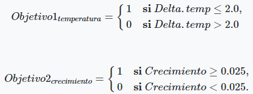

**Carga de librerías**

```{r Carga de librerías, message=FALSE, warning=FALSE}
library(deSolve)
library(shiny)
library(ggplot2)
library(Rmisc)
library(scales)
library(extrafont)
library(data.table)
library(reshape2)
library(knitr)
library(tidyverse)
library(lattice)
library(ggpubr)
library(lhs)
library(rpart)
library(rpart.plot)
```

# Problema 1 (25 puntos)

## Diseño de experimentos exploratorios

1.  Diseña cuatro opciones de política pública de acuerdo a los siguientes lineamientos:

-   La alternativa "P0" es la política del status quo.
-   La alternativa "P1" considera solo la implementación de impuestos al carbono en ambas regiones.
-   La alternativa "P2" considera la implementación de impuestos al carbono y la implementación de subsidios tecnológicos y de investigación y desarrollo en ambas regiones.
-   La alternativa "P3" considera además la implementación del fondo verde.

Emplea el modelo EDIAM: "ediam_10_24_2016.r" con los parámetros base para diseñar alternativas de política que sean viables financieramente y que al final de 300 años mantengan el crecimiento de la temperatura sea igual o menor a dos grados Celsius [Código con R con resultados de diseño].

**1.1 Definición de políticas**

```{r 1.1 Definición de políticas}
#The Ediam model requires two input vectors
#Choose your policy
#Define your policy

policies.0 <-
  c(
#carbon tax
    tax.rate.N = 0,
    tax.rate.S = 0,
#Technology push in Advanced Region
	  epsi.re.subsidy.N = 0, #Technology subsidy in Advanced Region
    s.re.subsidy.N = 0, #R&D subsidy in Advanced Region
#Technology push in Emerging Region
    epsi.re.subsidy.S = 0, #Technology subsidy in Emerging Region
    epsi.re.GFsubsidy.N = 0,#Technology subsidy in GCF
    s.re.subsidy.S = 0, #R&D subsidy in Emerging Region
    s.re.GFsubsidy.N = 0, #R&D subsidy in GCF
    policy.half.life = as.numeric(0.01) #Policy half time
)

policies.1 <-
  c(
#carbon tax
    tax.rate.N = 0.2,
    tax.rate.S = 0.2,
#Technology push in Advanced Region
	  epsi.re.subsidy.N = 0, #Technology subsidy in Advanced Region
    s.re.subsidy.N = 0, #R&D subsidy in Advanced Region
#Technology push in Emerging Region
    epsi.re.subsidy.S = 0, #Technology subsidy in Emerging Region
    epsi.re.GFsubsidy.N = 0,#Technology subsidy in GCF
    s.re.subsidy.S = 0, #R&D subsidy in Emerging Region
    s.re.GFsubsidy.N = 0, #R&D subsidy in GCF
    policy.half.life = as.numeric(0.01) #Policy half time
)

policies.2 <-
  c(
#carbon tax
    tax.rate.N = 0.4,
    tax.rate.S = 0.4,
#Technology push in Advanced Region
	  epsi.re.subsidy.N = 0.25, #Technology subsidy in Advanced Region
    s.re.subsidy.N = 1.0, #R&D subsidy in Advanced Region
#Technology push in Emerging Region
    epsi.re.subsidy.S = 0.25, #Technology subsidy in Emerging Region
    epsi.re.GFsubsidy.N = 0 ,#Technology subsidy in GCF
    s.re.subsidy.S = 1.0, #R&D subsidy in Emerging Region
    s.re.GFsubsidy.N = 0, #R&D subsidy in GCF
    policy.half.life = as.numeric(0.01) #Policy half time
)

policies.3 <-
  c(
#carbon tax
    tax.rate.N = 0.5,
    tax.rate.S = 0.6,
#Technology push in Advanced Region
	  epsi.re.subsidy.N = 0.3, #Technology subsidy in Advanced Region
    s.re.subsidy.N = 2.0, #R&D subsidy in Advanced Region
#Technology push in Emerging Region
    epsi.re.subsidy.S = 0.5, #Technology subsidy in Emerging Region
    epsi.re.GFsubsidy.N = 0.4,#Technology subsidy in GCF
    s.re.subsidy.S = 1.0, #R&D subsidy in Emerging Region
    s.re.GFsubsidy.N = 1.5, #R&D subsidy in GCF
    policy.half.life = as.numeric(0.01) #Policy half time
)
```

**1.1 Carga de EDIAM a la sesión de R**

```{r 1.1 Carga de EDIAM a la sesión de R}
# Especificar directorio donde se guardó el modelo.

dir.model <- 
  "C:/Users/Guillermo GC/Dropbox/TEC MTY MPE/7o Trimestre/Modelación Avanzada/EDIAM/"
  # "C:/Users/GuillermoAlbertoGarc/Dropbox/TEC MTY MPE/7o Trimestre/Modelación Avanzada/EDIAM/"

# Especificar la versión del modelo que estamos utilizando
model.version <-
  "ediam_10_24_2016.r"

# Cargar el modelo en la sesión
source(
  paste(dir.model,
        model.version,
        sep="")
  )
```

2.  Considera los siguientes elementos de incertidumbre del modelo EDIAM:

-   Propensión a la innovación tecnologías verdes: *Eta.re*
-   Propensión a la innovación tecnologías fósiles: *Eta.ce*
-   Retornos a la investigación tecnologías verdes: *Gamma.re*
-   Retornos a la investigación tecnologías fósiles: *Gamma.ce*
-   Transferabilidad tecnologías verdes: *Nu.re*
-   Transferabilidad tecnologías fósiles: *Nu.ce*
-   Crecimiento demográfico naciones avanzadas: *labor.growth.N*
-   Crecimiento demográfico naciones emergentes: *labor.growth.S*
-   Elasticidad de substitución entre energía fósil y verde: *epsilon*
-   Sensibilidad climática a gases tipo invernadero: *Beta.Delta.Temp*
-   Capacidad del sumidero de carbono: *Delta.S*

Considera la definición de "Incertidumbre profunda" vista en clase y clasifica cada una de estas variables en tres categorías: a) variables profundamente inciertas, b) variables inciertas o c) variables no inciertas (i.e. parámetros del modelo). Justifica tu clasificación para cada variable, además: para las variables que consideres profundamente inciertas describe el rango de exploración que consideras apropiado, para las variables inciertas describe el modelo de incertidumbre que consideres apropiado y para las variables no inciertas describe como estimarías este parámetro o cual sería el valor que le asignarías.

-   Propensión a la innovación tecnologías verdes: *Eta.re*

    -   *Variable Profundamente incierta, porque no existe un acuerdo sobre los modelos que pueden describir adecuadamente a esta variable.*
    -   *Rango de exploración de 0.0133 a 0.0267.*

-   Propensión a la innovación tecnologías fósiles: *Eta.ce*

    -   *Variable Profundamente incierta, porque no existe un acuerdo sobre los modelos que pueden describir adecuadamente a esta variable.*
    -   *Rango de exploración de 0.0133 a 0.0267.*

-   Retornos a la investigación tecnologías verdes: *Gamma.re*

    -   *Variable Profundamente incierta, porque no existe un acuerdo sobre los modelos que pueden describir adecuadamente a esta variable.*
    -   *Rango de exploración de 0.1667 a 0.3333.*

-   Retornos a la investigación tecnologías fósiles: *Gamma.ce*

    -   *Variable Profundamente incierta, porque no existe un acuerdo sobre los modelos que pueden describir adecuadamente a esta variable.*
    -   *Rango de exploración de 0.1667 a 0.3333.*

-   Transferabilidad tecnologías verdes: *Nu.re*

    -   *Variable Profundamente incierta, porque no existe un acuerdo sobre los modelos que pueden describir adecuadamente a esta variable.*
    -   *Rango de exploración de 0.0133 a 0.0267.*

-   Transferabilidad tecnologías fósiles: *Nu.ce*

    -   *Variable Profundamente incierta, porque no existe un acuerdo sobre los modelos que pueden describir adecuadamente a esta variable.*
    -   *Rango de exploración de 0.0133 a 0.0267.*

-   Crecimiento demográfico naciones avanzadas: *labor.growth.N*

    -   *Variable no incierta, porque no se considera este efecto.*
    -   *Parámetro: 0*

-   Crecimiento demográfico naciones emergentes: *labor.growth.S*

    -   *Variable no incierta, porque no se considera este efecto.*
    -   *Parámetro: 0*

-   Elasticidad de substitución entre energía fósil y verde: *epsilon*

    -   *Variable Profundamente incierta, porque no existe un acuerdo sobre los modelos que pueden describir adecuadamente a esta variable.*
    -   *Rango de exploración de 3 a 10.*

-   Sensibilidad climática a gases tipo invernadero: *Beta.Delta.Temp*

    -   *Variable incierta, porque existen acuerdos sobre 12 modelos climáticos que pueden predecir esta variable.*
    -   *Rango de exploración/Modelo de incertidumbre/Estimación o parámetro*

-   Capacidad del sumidero de carbono: *Delta.S*

    -   *Variable incierta, porque existen acuerdos sobre 12 modelos climáticos que pueden predecir esta variable.*
    -   *Rango de exploración/Modelo de incertidumbre/Estimación o parámetro*

3.  En tareas anteriores hemos empleado dos métricas para evaluar el desempeño de las diferentes políticas: 1) crecimiento de la temperatura en el año 300 y 2) crecimiento económico promedio en ambas regiones. Define estas tres métricas especificando sus unidades de medición y el objetivo de política que consideras debe ser alcanzado. [Listado o tabla de variables con justificación y rangos de valores]

-   Crecimiento de la Temperatura Promedio en el año 300: *Delta.Temp*
    -   Crecimiento promedio de la temperatura desde tiempos preindustriales

    -   Unidades: *Grados Celsius (°C)*

    -   Considero que el objetivo de política debería ser el mantener un incremento de temperatura de 2°C o inferior para el final del periodo de simulación (año 300).
-   Crecimiento Económico Promedio en la Región Avanzada: *Growth.Rate_N*
    -   Crecimiento económico promedidado anual para el periodo de estudio identificado en la región avanzada.

    -   Unidades: *Porcentaje (%)*

    -   Considero que el objetivo de política debería ser el mantener un crecimiento económico promedio de 2.5% o superior para todo el periodo de simulación en la región avanzada.
-   Crecimiento Económico Promedio en la Región Emergente: *Growth.Rate_S*
    -   Crecimiento económico promedidado anual para el periodo de estudio identificado en la región emergente.

    -   Unidades: *Porcentaje (%)*

    -   Considero que el objetivo de política debería ser el mantener un crecimiento económico promedio de 2.5% o superior para todo el periodo de simulación en la región emergente.

4.  Usa la intuición del modelo EDIAM que has adquirido en las tareas anteriores y describe brevemente como esperas que funcionen tus alternativas de política en este sistema: ¿Cómo los diferentes elementos de incertidumbre pueden afectar el desempeño de cada alternativa? [Discusión por alternativa]

*R: Esperaría que, conforme se avanza desde la Política 0 hasta la Política 3, las métricas de desempeño se vean más favorables en términos de crecimiento de temperatura promedio y crecimiento económico promedio en la región emergente. Los elementos de incertidumbre determinarían, en mayor o menor medida según la política implementada, la vulnerabilidad del sistema en cuestión.*

5.  Describe la estructura de tu estudio empleando la matriz "XLRM" descrita por Lempert, Popper y Bankes (2003) [Matriz XLRM con descripción ]


*R: Se detallan en la matriz las principales 7 variables de incertidumbre profunda, junto con las variables inciertas (variables climáticas). En términos de Políticas, se presentan las 4 alternativas propuestas que van desde la política Laissez Faire (Política 0) hasta la política más intervencionista (Política 3). El sistema, como sabemos, se relaciona a través del modelo EDIAM, el cual explora las relaciones entre el cambio climático y el desarrollo tecnológico y económico. Finalmente, se enlistan las métricas de desempeño, que van en términos climáticos (Crecimiento promedio de la temperatura) y económicos (Crecimientos económicos promedio en las regiones avanzada y emergente).*

# Problema 2 (25 puntos)

## Muestreo LHC

Para las preguntas de este problema considera sólo las variables profundamente inciertas que definiste en el problema anterior (i.e. al menos 5 variables) y responde a los siguientes incisos:

1.  Emplea el muestro tipo LHC y genera una muestra de tamaño **N = 100** y semilla **Z = 55555** de las variables profundamente inciertas que definiste en el problema anteriores [Código en R].

**2.1 Función de creación de experimentos mixtos**

```{r 2.1 Función de creación de experimentos mixtos}
#Define function to create mix experiments

exp.design.table <-
  function(dir.exp.inputs,Limits.File,sample.size,Policies.File,Policy.Switch,Climate.File,Climate.Switch){
    
    Limits <-
      read.csv(paste(dir.exp.inputs,Limits.File,sep="")) #type1->constant,type2->factorial, type3->latinhypercube
    
    Limits$Description <- NULL
    Limits$Comments <- NULL
    
    Policies <-
      read.csv(paste(dir.exp.inputs,Policies.File,sep=""))
    
    Climate <- 
      read.csv(paste(dir.exp.inputs,Climate.File,sep=""))
    
    #Separate variables into the three different strings
    Constants <-
      Limits[Limits$Type==1,"VarName"]
    Factorial <-
      Limits[Limits$Type==2,"VarName"]
    LatinHyperCube <- 
      Limits[Limits$Type==3,"VarName"]
    
    #Create factorial part of the experimental design
    
    Create.factorial.exp<-function(Limits){
      if (length(Factorial)==0){
        c()
        } else{
          Limits.Factorial <- 
            Limits[Limits$Type==2,]
          
          row.names(Limits.Factorial) <- 
            Limits.Factorial$VarName
          
          Limits.Factorial <- 
            Limits.Factorial[,c("Min","Max","Gradient")]
          
          Limits.Factorial$Gradient <-
            ifelse(Limits.Factorial$Gradient >1,
                   Limits.Factorial$Gradient,
                   2) #this allows the instruction below to use gradient=1 as input and work ok
          
          l <-
            lapply(data.frame(t(Limits.Factorial)),
                   function (x) {
                     seq(x[1],x[2],by=(x[2]-x[1])/(x[3]-1))
                     }
                   ) #if in doubt about the function look at the form of data.frame(t(Limits.Factorial))
          
          return(expand.grid(l))
        }
      }
    
    Exp.design.factorial <-
      Create.factorial.exp(Limits)

    #Create Latin hyper cube part of experimental design
    
    Create.LHC.exp<-function(Limits){
      if (length(LatinHyperCube)==0){
        c()
        } else {
          library(lhs)
          
          sample <- 
            randomLHS(sample.size,length(LatinHyperCube))
          
          Limits.LHC <-
            Limits[Limits$Type==3,]
          
          row.names(Limits.LHC) <-
            Limits.LHC$VarName
          
          Limits.LHC <- 
            Limits.LHC[,c("Min","Max")]
          
          Limits.LHC$Row.Number <-
            c(1:nrow(Limits.LHC))
          
          lhc.p1 <-
            as.data.frame(apply(Limits.LHC,1,
                                function (x){
                                  sample[,x[3]]*(x[2]-x[1])+x[1]
                                  }
                                )
                          )
          
          lhc.p1$LHC.Type <-
            "Sample"
          
          #add extreme values to sample table
          lhc.p2 <- 
            Limits[Limits$Type==3,]
          
          row.names(lhc.p2) <-
            lhc.p2$VarName
          
          lhc.p2 <-
            lhc.p2[,c("Min","Max","Gradient")]
          
          lhc.p2$Gradient <-
            2
          
          lhc.p2$Gradient <-
            ifelse(lhc.p2$Gradient > 1,
                   lhc.p2$Gradient,
                   2) #this allows the instruction below to use gradient=1 as input and work ok
          
          lhc.p2 <-
            lapply(data.frame(t(lhc.p2)),
                   function (x) {
                     seq(x[1],x[2],by=(x[2]-x[1])/(x[3]-1))
                     }
                   ) #if in doubt about the function look at the form of data.frame(t(lhc.p2))
          
          lhc.p2 <-
            expand.grid(lhc.p2)
          
          lhc.p2$LHC.Type <-
            "Extremes"
          
          #rbind both tables
          lhc <-
            rbind(lhc.p1,lhc.p2)
          return(lhc)
        }
      }

Exp.design.LHC <-
  Create.LHC.exp(Limits)

#Create constant part of the experimental design

Create.Constant.exp <- 
  function(Limits)
    {
    if (length(Constants)==0)
      {
      c()
      } else {
        Limits.Constant <-
          Limits[Limits$Type==1,]
        
        varnames <-
          Limits.Constant$VarName
        
        Limits.Constant <-
          data.frame(t(Limits.Constant[,"Cte"]))
        
        colnames(Limits.Constant) <- 
          varnames
        
        return(Limits.Constant)
      }
    }

Exp.design.Constant <- 
  Create.Constant.exp(Limits)

#Join the three experimental design tables to create total number of futures
Exp.design <-
  if(length(Factorial)==0 && length(LatinHyperCube)==0){
    Exp.design.Constant
  } else {
    if(length(Factorial)==0){
      Exp.design.LHC
    } else {
        if(length(LatinHyperCube)==0){
          Exp.design.factorial
        } else {
            merge(Exp.design.LHC,Exp.design.factorial)
        }
    }
  }


Exp.design <-
  if(length(Factorial)==0 && length(LatinHyperCube)==0){
    Exp.design
  } else {
      if(length(Constants)==0){
        Exp.design
      } else {
          merge(Exp.design,Exp.design.Constant)
      }
    }

#Finally add reference Future.ID
 #Exp.design.reference<-Limits
 #varnames<-Exp.design.reference$VarName
 #Exp.design.reference<-data.frame(t(Exp.design.reference[,"Cte"]))
 #colnames(Exp.design.reference)<-varnames

#rbind with rest of experiment
# Exp.design<-rbind(Exp.design,Exp.design.reference)

# Join with climate scenarios to create total number of futures
Climate <-
  if(Climate.Switch==FALSE) {
    Climate[1,]
  } else {
      Climate
  }

Exp.design <-
  merge(Exp.design,Climate)

Exp.design$Future.ID <-
  as.numeric(row.names(Exp.design))

#Join total number of futures with policies to create total number of runs
Policies <-
  if(Policy.Switch==FALSE) {Policies[1,]}else{Policies}

Exp.design <-
  merge(Exp.design,Policies)

Exp.design$Run.ID <-
  as.numeric(row.names(Exp.design))

return(Exp.design)
}
```

**2.1 Definición de directorio de trabajo**

```{r 2.1 Definición de directorio de trabajo}
#define root directory for experiment's inputs

dir.exp.inputs <-
  r"(C:\Users\Guillermo GC\Dropbox\TEC MTY MPE\7o Trimestre\Modelación Avanzada\Tareas\Tarea 2\)"
  # r"(C:\Users\GuillermoAlbertoGarc\Dropbox\TEC MTY MPE\7o Trimestre\Modelación Avanzada\Tareas\Tarea 2\)"

Limits.File <-
  "Limits.csv"
Policies.File <-
  "Policies.csv"
Climate.File <-
  "Climate.csv"
```

**2.1 Muestreo LHC con tamaño de muestra 100**

```{r 2.1 Muestreo LHC con tamaño de muestra 100}
sample.size_2.1 <- 100
Policy.Switch <- FALSE
Climate.Switch <- FALSE

set.seed(55555)

Exp.design_2.1 <-
  exp.design.table(dir.exp.inputs,
                   Limits.File,
                   sample.size_2.1,
                   Policies.File,
                   Policy.Switch,
                   Climate.File,
                   Climate.Switch)

#Create scatter plots
deep.uncertain.vars_2.1 <- c("epsilon",
                             "Eta.re",
                             "Eta.ce",
                             "Gamma.ce",
                             "Gamma.re",
                             "Nu.re",
                             "Nu.ce")
```

2.  Genera una matriz de gráficos de dispersión de tu muestra para todas las variables ¿Qué concluyes con respecto de la pertinencia de la muestra generada? [Código en R, matriz gráfica y discusión]

**2.2 Matriz de gráficos de dispersión con tamaño de muestra 100**

```{r 2.2 Matriz de gráficos de dispersión con tamaño de muestra 100}
pairs(Exp.design_2.1[,deep.uncertain.vars_2.1])
```

*R: Considerando el diagrama de dispersión generado, se puede apreciar en éste que hay espacios que tienen escaza representación en la muestra. Esto coincide con un tamaño de muestra tan bajo como lo es de 100 muestras más las 128 puntas que se generan a partir de las 7 variables de incertidumbre; pues con estos números se puede notar que incluso las puntas tienen mayor representatividad que el espacio intermedio en la muestra.*

3.  Genera una nueva muestra tipo LHC de tamaño **N=1,000** y semilla **Z=55555**. Genera nuevamente la matriz de gráficos de dispersión, ¿Qué diferencia percibes con respecto a la muestra generada en el ejercicio anterior? [Código en R, matriz gráfica y discusión]

**2.3 Muestreo LHC y matriz de gráficos de dispersión con tamaño de muestra 1,000**

```{r 2.3 Muestreo LHC y matriz de gráficos de dispersión con tamaño de muestra 1,000}
sample.size_2.3 <- 1000
Policy.Switch <- FALSE
Climate.Switch <- FALSE

set.seed(55555)

Exp.design_2.3 <-
  exp.design.table(dir.exp.inputs,
                   Limits.File,
                   sample.size_2.3,
                   Policies.File,
                   Policy.Switch,
                   Climate.File,
                   Climate.Switch)

pairs(Exp.design_2.3[,deep.uncertain.vars_2.1])
```

*R: Considerando el nuevo tamaño de muestra de 1,000 más 128 muestras de las puntas, se puede apreciar en el nuevo diagrama de dispersión que hay una mucha mayor representación del espacio muestral, con algunas muy puntuales excepciones.*

4.  Incrementa el tamaño de muestra hasta que consideres satisfactoria la exploración del espacio de incertidumbre que propusiste en el ejercicio anterior, ¿Qué tan grande tiene que ser tu experimento? ¿Es factible tu experimento con los recursos disponibles en tu computadora personal? [Código en R, matriz gráfica y discusión]

**2.4 Muestreo LHC y matriz de gráficos de dispersión con tamaño de muestra 1,500**

```{r 2.4 Muestreo LHC y matriz de gráficos de dispersión con tamaño de muestra 1,500}
sample.size_2.4 <- 1500
Policy.Switch <- FALSE
Climate.Switch <- FALSE

set.seed(55555)

Exp.design_2.4 <-
  exp.design.table(dir.exp.inputs,
                   Limits.File,
                   sample.size_2.4,
                   Policies.File,
                   Policy.Switch,
                   Climate.File,
                   Climate.Switch)

pairs(Exp.design_2.4[,deep.uncertain.vars_2.1])
```

*R: Considero que un tamaño de muestra de 1,500 más 128 puntas es mucho más satisfactorio que el tamaño de muestra de 1,000; y que este incremento adicional no requerirá un poder computacional tal que se complique su ejecución con mi computadora personal.*

5.  Considera las restricciones de los recursos computacionales disponibles y elimina las variables de incertidumbre que consideres menos relevantes. Emplea la matriz de gráficos de dispersión para evaluar la calidad de tu muestra, justificar tu elección de dimensiones de incertidumbre y justificar el tamaño de tu muestra [Código en R, matrix final y justificación textual]

**2.5 Muestreo LHC con variables de incertidumbre selectas y matriz de gráficos de dispersión con tamaño de muestra 1,500**

```{r 2.5 Muestreo LHC con variables de incertidumbre selectas y matriz de gráficos de dispersión con tamaño de muestra 1,500}
sample.size_2.5 <- 1500
Policy.Switch <- FALSE
Climate.Switch <- FALSE

set.seed(55555)

Limits.File_2.5 <-
  "Limits_2.5.csv"

Exp.design_2.5 <-
  exp.design.table(dir.exp.inputs,
                   Limits.File_2.5,
                   sample.size_2.5,
                   Policies.File,
                   Policy.Switch,
                   Climate.File,
                   Climate.Switch)

#Create scatter plots
deep.uncertain.vars_2.5 <- c("epsilon",
                             "Eta.re",
                             "Gamma.re",
                             "Nu.re")

pairs(Exp.design_2.5[,deep.uncertain.vars_2.5])
```

*R: Según los ejercicios realizados en seminarios, se ha determinado previamente que las variables con mayor influencia en los resultados de nuestras métricas de desempeño suelen ser epsilon, Eta.re, Gamma.re y Nu.re; es por esto que se opta por seleccionar estas variables de incertidumbre. Para este ejercicio, se considera finalmente el tamaño de muestra de 1,500 que se determinó en el inciso anterior que cubre satisfactoriamente el espacio muestral. Sin embargo, al considerar una menor cantidad de variables de incertidumbre, al evaluar las puntas solamente se consideran 16 observaciones de futuros adicionales en lugar de las 128 que se consideraban en ejercicios anteriores.*

# Problema 3 (25 puntos)

## Criterios de robustez

1.  Considera las cuatro alternativas definidas en el problema 1 y el diseño experimental definido en el problema 2: ¿Cuántos futuros son considerados en tu experimento?, ¿Cuántas corridas del modelo deben ser ejecutadas? [Respuesta simple]

*R: El experimento considera un total de 1,516 futuros, en los cuales se incluyen los 1,500 propuestos como tamaño de muestra y 16 adicionales que consideran las puntas (los extremos mínimo y máximo de las variables profundamente inciertas.)*

2.  Crea una tabla experimental para correr tu experimento y estima el tiempo necesario para ejecutar tu experimento [Tabla experimental y estimación de ejecución del experimento]

**3.2 Definición de función para correr EDIAM con el diseño experimental**

```{r 3.2 Definición de función para correr EDIAM con el diseño experimental}
ediam.experiment <-
  function(Exp.design,policies){
    exp.out <-
      apply(Exp.design,1,function(x){ #load parameters from Ex.design.table
        params <-
          c(CO2.Concentration.0 = 382.2461, #
          TimeStep = as.numeric(x["TimeStep"]),#
          EndTime = as.numeric(x["EndTime"]), #
          alfa = as.numeric(x["alfa"]),
          epsilon = as.numeric(x["epsilon"]), #elasticity of subsitution
          Gamma.re = as.numeric(x["Gamma.re"]), #R&D returns SETs
          k.re = as.numeric(x["k.re"]),#
          Gamma.ce = as.numeric(x["Gamma.ce"]), #R&D returns FETs
          k.ce = as.numeric(x["k.ce"]),#
          Eta.re = as.numeric(x["Eta.re"]), #Innovation propensity SETs
          Eta.ce = as.numeric(x["Eta.ce"]), #Innovation propensity FETs
          Nu.re = as.numeric(x["Nu.re"]),  #Transferability SETs
          Nu.ce = as.numeric(x["Nu.ce"]),  #Transferability FETs
          qsi = as.numeric(x["qsi"]),#
          Delta.S = as.numeric(x["Delta.S"]),
          Delta.Temp.Disaster = as.numeric(x["Delta.Temp.Disaster"]),#
          Beta.Delta.Temp = as.numeric(x["Beta.Delta.Temp"]),
          CO2.base = as.numeric(x["CO2.base"]),
          labor.growth_N = as.numeric(x["labor.growth_N"]),# Population growth Advanced Region
          labor.growth_S = as.numeric(x["labor.growth_S"]),# Population growth Emerging Region
          lambda.S = as.numeric(x["lambda.S"]),
          sigma.utility = as.numeric(x["sigma.utility"]),
          rho = as.numeric(x["rho"]), #Discount rate
          Yre.0_N = as.numeric(x["Yre.0_N"]),
          Yce.0_N = as.numeric(x["Yce.0_N"]),
          Yre.0_S = as.numeric(x["Yre.0_S"]),
          Yce.0_S = as.numeric(x["Yce.0_S"]),
          size.factor = as.numeric(x["size.factor"]),#
          Run.ID = as.numeric(x["Run.ID"]));
        
        #run the model
        ediam(policies,params)
        }
        )
    
    #Transform results into a data frame
    exp.out <-
      do.call("rbind",exp.out)
    
    return(exp.out)
    }
```

**3.2 Tabla experimental**

```{r}
Exp.design_3.2 <- 
  Exp.design_2.5

kable(head(Exp.design_3.2),
      align = c("c"))
```

*R: Estimo que el experimento tardará aproximadamente 10 minutos para correr las 4 alternativas de política. Por lo tanto, cada alternativa tardaría aproximadamente 2.5 minutos.*

3.  Emplea la versión del modelo EDIAM: "ediam_10_24_2016.r" y evalúa cada una de tus alternativas empleando tu diseño experimental. Genera un data.frame que resuma el desempeño de cada alternativa. El número de filas de dicho data.frame debe ser igual al número de futuros considerados en el experimento. Las columnas deben contener los resultados de las variables: Delta.Temp, Growth.Rate_N, Growth.Rate_S, así como el correspondiente "Future.ID". La variable indica el crecimiento de la temperatura en el año 300 de la simulación, y las variables y indican el crecimiento promedio durante la simulación en cada región respectivamente. Emplea la función aggregate() para estimar el crecimiento promedio. Emplea la función merge() para unir las tres variables en una sola tabla a través de su Run.ID. Crea una tabla para cada una de las políticas evaluadas, tal que: "a0","a1","a2" y "a3" indiquen los resultados para cada alternativa evaluada. Emplea la función summary() para describir el desempeño de cada una de estas alternativas.[Código en R y resumén de cada alternativa]

**3.3 Ejecución del experimento para cada alternativa de política**

```{r 3.3 Ejecución del experimento para cada alternativa de política, warning=FALSE}
exp.out.P0 <-
  ediam.experiment(Exp.design_3.2,policies.0)

exp.out.P1 <-
  ediam.experiment(Exp.design_3.2,policies.1)

exp.out.P2 <-
  ediam.experiment(Exp.design_3.2,policies.2)

exp.out.P3 <-
  ediam.experiment(Exp.design_3.2,policies.3)
```

**3.3 Unificación de resultados por política implementada**

```{r 3.3 Unificación de resultados por política implementada, warning=FALSE}
# Unifico los resultados dela implementación de cada política en una base de datos
exp.out.P0$Policy <- 
  "P0"
exp.out.P1$Policy <- 
  "P1"
exp.out.P2$Policy <- 
  "P2"
exp.out.P3$Policy <- 
  "P3"

exp.out <-
  rbind(exp.out.P0,
        exp.out.P1,
        exp.out.P2,
        exp.out.P3)

# Unifico los resultados con el diseño experimental utilizado
exp.out <- 
  merge(exp.out,
        Exp.design_3.2, 
        by="Run.ID")
```

**3.3 Estimación de las métricas de desempeño**

```{r 3.3 Estimación de las métricas de desempeño, warning=FALSE}
# Estimación del crecimiento económico promedio de ambas regiones bajo cada política
## Política 0
P0 <-
  subset(exp.out,
         Policy =="P0")

P0 <-
  aggregate(P0[,c("Growth.Rate_N","Growth.Rate_S")],
            list(Run.ID = P0$Run.ID),
            mean,
            na.rm=TRUE)

## Política 1
P1 <-
  subset(exp.out,
         Policy =="P1")

P1 <-
  aggregate(P1[,c("Growth.Rate_N","Growth.Rate_S")],
            list(Run.ID = P1$Run.ID),
            mean,
            na.rm=TRUE)

## Política 2
P2 <-
  subset(exp.out,
         Policy =="P2")

P2 <-
  aggregate(P2[,c("Growth.Rate_N","Growth.Rate_S")],
            list(Run.ID = P2$Run.ID),
            mean,
            na.rm=TRUE)

## Política 3
P3 <-
  subset(exp.out,
         Policy =="P3")

P3 <-
  aggregate(P3[,c("Growth.Rate_N","Growth.Rate_S")],
            list(Run.ID = P3$Run.ID),
            mean,
            na.rm=TRUE)

# Estimación del Crecimiento de la Temperatura Promedio en el año 300
## Política 0
Delta.temp.P0 <-
  subset(exp.out,
         Policy =="P0" & time == 300)[,c("Run.ID","Delta.Temp")]

## Política 1
Delta.temp.P1 <-
  subset(exp.out,
         Policy =="P1" & time == 300)[,c("Run.ID","Delta.Temp")]

## Política 2
Delta.temp.P2 <-
  subset(exp.out,
         Policy =="P2" & time == 300)[,c("Run.ID","Delta.Temp")]

## Política 3
Delta.temp.P3 <-
  subset(exp.out,
         Policy =="P3" & time == 300)[,c("Run.ID","Delta.Temp")]
```

**3.3 Elaboración de base de datos para cada política y summary() de resultados**

```{r 3.3 Elaboración de base de datos para cada política y summary() de resultados, warning=FALSE}
# Elaboración de base de datos para cada política
## Política 0
P0 <-
  merge(P0,
        Delta.temp.P0,
        by = "Run.ID")

kable(head(P0),
      align = c("c"))

## Política 1
P1 <-
  merge(P1,
        Delta.temp.P1,
        by = "Run.ID")

kable(head(P1),
      align = c("c"))

## Política 2
P2 <-
  merge(P2,
        Delta.temp.P2,
        by = "Run.ID")

kable(head(P2),
      align = c("c"))

## Política 3
P3 <-
  merge(P3,
        Delta.temp.P3,
        by = "Run.ID")

kable(head(P3),
      align = c("c"))

# Resumen de resultados de cada política
summary(P0)
summary(P1)
summary(P2)
summary(P3)
```

4.  Considera el desempeño de tus cuatro alternativas con respecto de las tres métricas de desempeño definidas en el problema 1. Para cada métrica estima en cada futuro la alternativa que se comporta mejor y calcula el porcentaje de futuros en que resulta ser la mejor alternativa [Código en R y tabla con resultados]

**3.4 Identificación de desempeño de políticas en cada futuro con cada métrica**

```{r 3.4 Identificación de desempeño de políticas en cada futuro con cada métrica}
# Contadores de desempeño de cada política en cada métrica de desempeño
## Política 0

num_P0_DT <- 0
num_P0_GN <- 0
num_P0_GS <- 0

## Política 1
num_P1_DT <- 0
num_P1_GN <- 0
num_P1_GS <- 0

## Política 2
num_P2_DT <- 0
num_P2_GN <- 0
num_P2_GS <- 0

## Política 3
num_P3_DT <- 0
num_P3_GN <- 0
num_P3_GS <- 0

## Ninguna
num_N_DT <- 0
num_N_GN <- 0
num_N_GS <- 0

# Ciclo de cuenta de la política más exitosa en cada métrica

for (i in 1:nrow(P0)){
  # Crecimiento de la Temperatura Promedio
  min_DT <-
    min(P0$Delta.Temp[i],
        P1$Delta.Temp[i],
        P2$Delta.Temp[i],
        P3$Delta.Temp[i])

  ifelse(min_DT == P0$Delta.Temp[i] &
           min_DT == P1$Delta.Temp[i] & 
           min_DT == P2$Delta.Temp[i] &
           min_DT == P3$Delta.Temp[i],
         num_N_DT <- 
           num_N_DT + 1,
         ifelse(P0$Delta.Temp[i] == min_DT,
                num_P0_DT <-
                  num_P0_DT + 1,
                ifelse(P1$Delta.Temp[i] == min_DT,
                       num_P1_DT <-
                         num_P1_DT + 1,
                       ifelse(P2$Delta.Temp[i] == min_DT,
                              num_P2_DT <-
                                num_P2_DT + 1,
                              num_P3_DT <-
                                num_P3_DT + 1
                              )
                       )
                )
         )
  
  # Crecimiento Económico en la Región Avanzada
  max_GN <-
    max(P0$Growth.Rate_N[i],
        P1$Growth.Rate_N[i],
        P2$Growth.Rate_N[i],
        P3$Growth.Rate_N[i])

  ifelse(max_GN == P0$Growth.Rate_N[i] &
           max_GN == P1$Growth.Rate_N[i] & 
           max_GN == P2$Growth.Rate_N[i] &
           max_GN == P3$Growth.Rate_N[i],
         num_N_GN <- 
           num_N_GN + 1,
         ifelse(P0$Growth.Rate_N[i] == max_GN,
                num_P0_GN <-
                  num_P0_GN + 1,
                ifelse(P1$Growth.Rate_N[i] == max_GN,
                       num_P1_GN <-
                         num_P1_GN + 1,
                       ifelse(P2$Growth.Rate_N[i] == max_GN,
                              num_P2_GN <-
                                num_P2_GN + 1,
                              num_P3_GN <-
                                num_P3_GN + 1
                              )
                       )
                )
         )

  # Crecimiento Económico en la Región Emergente
  max_GS <-
    max(P0$Growth.Rate_S[i],
        P1$Growth.Rate_S[i],
        P2$Growth.Rate_S[i],
        P3$Growth.Rate_S[i])

  ifelse(max_GS == P0$Growth.Rate_S[i] &
           max_GS == P1$Growth.Rate_S[i] & 
           max_GS == P2$Growth.Rate_S[i] &
           max_GS == P3$Growth.Rate_S[i],
         num_N_GS <- 
           num_N_GS + 1,
         ifelse(P0$Growth.Rate_S[i] == max_GS,
                num_P0_GS <-
                  num_P0_GS + 1,
                ifelse(P1$Growth.Rate_S[i] == max_GS,
                       num_P1_GS <-
                         num_P1_GS + 1,
                       ifelse(P2$Growth.Rate_S[i] == max_GS,
                              num_P2_GS <-
                                num_P2_GS + 1,
                              num_P3_GS <-
                                num_P3_GS + 1
                              )
                       )
                )
         )
}
```

**3.4 Elaboración de tabla comparativa de desempeño de políticas**

```{r 3.4 Elaboración de tabla comparativa de desempeño de políticas}
# Matriz comparativa de desempeño de políticas
mat_desempeño_3.4 <- 
  matrix(nrow = 3, 
         ncol = 6)

mat_desempeño_3.4[1,1] <- "Crecimiento de Temperatura Promedio"
mat_desempeño_3.4[2,1] <- "Crecimiento Económico en Región Avanzada"
mat_desempeño_3.4[3,1] <- "Crecimiento Económico en Región Emergente"

# Política 0
## Delta.Temp
mat_desempeño_3.4[1,2] <- 
  round(100*num_P0_DT/nrow(P0),2)
  
## Growth.Rate_N
mat_desempeño_3.4[2,2] <- 
   round(100*num_P0_GN/nrow(P0),2)
  
## Growth.Rate_S
mat_desempeño_3.4[3,2] <- 
   round(100*num_P0_GS/nrow(P0),2)

# Política 1
## Delta.Temp
mat_desempeño_3.4[1,3] <- 
   round(100*num_P1_DT/nrow(P1),2)
  
## Growth.Rate_N
mat_desempeño_3.4[2,3] <- 
   round(100*num_P1_GN/nrow(P1),2)
  
## Growth.Rate_S
mat_desempeño_3.4[3,3] <- 
   round(100*num_P1_GS/nrow(P1),2)

# Política 2
## Delta.Temp
mat_desempeño_3.4[1,4] <- 
   round(100*num_P2_DT/nrow(P2),2)
  
## Growth.Rate_N
mat_desempeño_3.4[2,4] <- 
   round(100*num_P2_GN/nrow(P2),2)
  
## Growth.Rate_S
mat_desempeño_3.4[3,4] <- 
   round(100*num_P2_GS/nrow(P2),2)

# Política 3
## Delta.Temp
mat_desempeño_3.4[1,5] <- 
   round(100*num_P3_DT/nrow(P3),2)
  
## Growth.Rate_N
mat_desempeño_3.4[2,5] <- 
   round(100*num_P3_GN/nrow(P3),2)
  
## Growth.Rate_S
mat_desempeño_3.4[3,5] <- 
   round(100*num_P3_GS/nrow(P3),2)

# Ninguna
## Delta.Temp
mat_desempeño_3.4[1,6] <- 
   round(100*num_N_DT/nrow(P0),2)
  
## Growth.Rate_N
mat_desempeño_3.4[2,6] <- 
   round(100*num_N_GN/nrow(P0),2)
  
## Growth.Rate_S
mat_desempeño_3.4[3,6] <- 
   round(100*num_N_GS/nrow(P0),2)

kable(mat_desempeño_3.4,
      align = "c",
      col.names = 
        c("Métricas de Desempeño",
          "Política 0",
          "Política 1",
          "Política 2",
          "Política 3",
          "Ninguna"),
      caption = "Tabla comparativa del porcentaje de los futuros en los cuales cada política es mejor que sus políticas alternativas. [%]")
```

5.  Estima para cada futuro y cada política el nivel de arrepentimiento (ecuación 3.1 Lempert, Popper y Bankes (2003)) con respecto de cada una de las métricas de medición. Agrega estas tres nuevas columnas en cada una de las tablas que generaste en el inciso 4.c) y estima para cada política el arrepentimiento promedio y arrepentimiento total con respecto de cada métrica de desempeño [Código en R y tabla con resultados]

**3.5 Estimación del nivel de arrepentimiento para cada política y para cada futuro**

```{r 3.5 Estimación del nivel de arrepentimiento para cada política y para cada futuro}

# Cálculo del nivel de arrepentimiento de cada política implementada en cada futuro
for (i in 1:nrow(P0)){
  ## Política 0
  P0$Regret.DT[i] <- 
    min(P0$Delta.Temp[i],
        P1$Delta.Temp[i],
        P2$Delta.Temp[i],
        P3$Delta.Temp[i]) -
    P0$Delta.Temp[i]
  
  P0$Regret.GN[i] <- 
    max(P0$Growth.Rate_N[i],
        P1$Growth.Rate_N[i],
        P2$Growth.Rate_N[i],
        P3$Growth.Rate_N[i]) -
    P0$Growth.Rate_N[i]
  
  P0$Regret.GS[i] <- 
    max(P0$Growth.Rate_S[i],
        P1$Growth.Rate_S[i],
        P2$Growth.Rate_S[i],
        P3$Growth.Rate_S[i]) -
    P0$Growth.Rate_S[i]
  
  ## Política 1
  P1$Regret.DT[i] <- 
    min(P0$Delta.Temp[i],
        P1$Delta.Temp[i],
        P2$Delta.Temp[i],
        P3$Delta.Temp[i]) -
    P1$Delta.Temp[i]
  
  P1$Regret.GN[i] <- 
    max(P0$Growth.Rate_N[i],
        P1$Growth.Rate_N[i],
        P2$Growth.Rate_N[i],
        P3$Growth.Rate_N[i]) -
    P1$Growth.Rate_N[i]
  
  P1$Regret.GS[i] <- 
    max(P0$Growth.Rate_S[i],
        P1$Growth.Rate_S[i],
        P2$Growth.Rate_S[i],
        P3$Growth.Rate_S[i]) -
    P1$Growth.Rate_S[i]
  
  ## Política 2
  P2$Regret.DT[i] <- 
    min(P0$Delta.Temp[i],
        P1$Delta.Temp[i],
        P2$Delta.Temp[i],
        P3$Delta.Temp[i]) -
    P2$Delta.Temp[i]
  
  P2$Regret.GN[i] <- 
    max(P0$Growth.Rate_N[i],
        P1$Growth.Rate_N[i],
        P2$Growth.Rate_N[i],
        P3$Growth.Rate_N[i]) -
    P2$Growth.Rate_N[i]
  
  P2$Regret.GS[i] <- 
    max(P0$Growth.Rate_S[i],
        P1$Growth.Rate_S[i],
        P2$Growth.Rate_S[i],
        P3$Growth.Rate_S[i]) -
    P2$Growth.Rate_S[i]
  
  ## Política 3
  P3$Regret.DT[i] <- 
    min(P0$Delta.Temp[i],
        P1$Delta.Temp[i],
        P2$Delta.Temp[i],
        P3$Delta.Temp[i]) -
    P3$Delta.Temp[i]
  
  P3$Regret.GN[i] <- 
    max(P0$Growth.Rate_N[i],
        P1$Growth.Rate_N[i],
        P2$Growth.Rate_N[i],
        P3$Growth.Rate_N[i]) -
    P3$Growth.Rate_N[i]
  
  P3$Regret.GS[i] <- 
    max(P0$Growth.Rate_S[i],
        P1$Growth.Rate_S[i],
        P2$Growth.Rate_S[i],
        P3$Growth.Rate_S[i]) -
    P3$Growth.Rate_S[i]
}

regrets_DT <- 
  data.frame("Run.ID" = seq(1,nrow(P0),1), 
             P0$Regret.DT,
             P1$Regret.DT,
             P2$Regret.DT,
             P3$Regret.DT)

regrets_GN <- 
  data.frame("Run.ID" = seq(1,nrow(P0),1), 
             P0$Regret.GN,
             P1$Regret.GN,
             P2$Regret.GN,
             P3$Regret.GN)

regrets_GS <- 
  data.frame("Run.ID" = seq(1,nrow(P0),1), 
             P0$Regret.GS,
             P1$Regret.GS,
             P2$Regret.GS,
             P3$Regret.GS)
```

**3.5 Tabla de arrepentimientos promedios de cada política con cada métrica de desempeño**

```{r 3.5 Tabla de arrepentimientos promedios de cada política con cada métrica de desempeño}
# Matriz comparativa de arrepentimiento de políticas
mat_regrets_prom_3.5 <- 
  matrix(nrow = 3, 
         ncol = 5)

mat_regrets_prom_3.5[1,1] <- "Crecimiento de Temperatura Promedio [°C]"
mat_regrets_prom_3.5[2,1] <- "Crecimiento Económico en Región Avanzada [%]"
mat_regrets_prom_3.5[3,1] <- "Crecimiento Económico en Región Emergente [%]"

# Política 0
## Delta.Temp
mat_regrets_prom_3.5[1,2] <- 
  round(mean(P0$Regret.DT),2)
  
## Growth.Rate_N
mat_regrets_prom_3.5[2,2] <- 
   round(100*mean(P0$Regret.GN),2)
  
## Growth.Rate_S
mat_regrets_prom_3.5[3,2] <- 
   round(100*mean(P0$Regret.GS),2)

# Política 1
## Delta.Temp
mat_regrets_prom_3.5[1,3] <- 
  round(mean(P1$Regret.DT),2)
  
## Growth.Rate_N
mat_regrets_prom_3.5[2,3] <- 
   round(100*mean(P1$Regret.GN),2)
  
## Growth.Rate_S
mat_regrets_prom_3.5[3,3] <- 
   round(100*mean(P1$Regret.GS),2)

# Política 2
## Delta.Temp
mat_regrets_prom_3.5[1,4] <- 
  round(mean(P2$Regret.DT),2)
  
## Growth.Rate_N
mat_regrets_prom_3.5[2,4] <- 
   round(100*mean(P2$Regret.GN),2)
  
## Growth.Rate_S
mat_regrets_prom_3.5[3,4] <- 
   round(100*mean(P2$Regret.GS),2)

# Política 3
## Delta.Temp
mat_regrets_prom_3.5[1,5] <- 
  round(mean(P3$Regret.DT),2)
  
## Growth.Rate_N
mat_regrets_prom_3.5[2,5] <- 
   round(100*mean(P3$Regret.GN),2)
  
## Growth.Rate_S
mat_regrets_prom_3.5[3,5] <- 
   round(100*mean(P3$Regret.GS),2)

kable(mat_regrets_prom_3.5,
      align = "c",
      col.names = 
        c("Métricas de Desempeño",
          "Política 0",
          "Política 1",
          "Política 2",
          "Política 3"),
      caption = "Tabla comparativa del nivel de arrepentimiento promedio de la implementación de cada política para cada métrica de desempeño.")
```

**3.5 Tabla de arrepentimientos totales de cada política con cada métrica de desempeño**

```{r 3.5 Tabla de arrepentimientos totales de cada política con cada métrica de desempeño}
# Matriz comparativa de arrepentimiento de políticas
mat_regrets_tot_3.5 <- 
  matrix(nrow = 3, 
         ncol = 5)

mat_regrets_tot_3.5[1,1] <- "Crecimiento de Temperatura Promedio [°C]"
mat_regrets_tot_3.5[2,1] <- "Crecimiento Económico en Región Avanzada [%]"
mat_regrets_tot_3.5[3,1] <- "Crecimiento Económico en Región Emergente [%]"

# Política 0
## Delta.Temp
mat_regrets_tot_3.5[1,2] <- 
  round(sum(P0$Regret.DT),2)
  
## Growth.Rate_N
mat_regrets_tot_3.5[2,2] <- 
   round(100*sum(P0$Regret.GN),2)
  
## Growth.Rate_S
mat_regrets_tot_3.5[3,2] <- 
   round(100*sum(P0$Regret.GS),2)

# Política 1
## Delta.Temp
mat_regrets_tot_3.5[1,3] <- 
  round(sum(P1$Regret.DT),2)
  
## Growth.Rate_N
mat_regrets_tot_3.5[2,3] <- 
   round(100*sum(P1$Regret.GN),2)
  
## Growth.Rate_S
mat_regrets_tot_3.5[3,3] <- 
   round(100*sum(P1$Regret.GS),2)

# Política 2
## Delta.Temp
mat_regrets_tot_3.5[1,4] <- 
  round(sum(P2$Regret.DT),2)
  
## Growth.Rate_N
mat_regrets_tot_3.5[2,4] <- 
   round(100*sum(P2$Regret.GN),2)
  
## Growth.Rate_S
mat_regrets_tot_3.5[3,4] <- 
   round(100*sum(P2$Regret.GS),2)

# Política 3
## Delta.Temp
mat_regrets_tot_3.5[1,5] <- 
  round(sum(P3$Regret.DT),2)
  
## Growth.Rate_N
mat_regrets_tot_3.5[2,5] <- 
   round(100*sum(P3$Regret.GN),2)
  
## Growth.Rate_S
mat_regrets_tot_3.5[3,5] <- 
   round(100*sum(P3$Regret.GS),2)

kable(mat_regrets_tot_3.5,
      align = "c",
      col.names = 
        c("Métricas de Desempeño",
          "Política 0",
          "Política 1",
          "Política 2",
          "Política 3"),
      caption = "Tabla comparativa del nivel de arrepentimiento promedio de la implementación de cada política para cada métrica de desempeño.")
```

6.  Genera un diagrama de caja para cada métrica de desempeño en el que compares el nivel de arrepentimiento de cada política. ¿Distingues algún patrón de comportamiento? [Código en R, gráfico y discusión de resultados]

**3.6 Elaboración de diagramas de caja comparativos del arrepentimiento derivado de la implementación de cada política para cada métrica de desempeño.**

```{r 3.6 Elaboración de diagramas de caja comparativos del arrepentimiento derivado de la implementación de cada política para cada métrica de desempeño., eval=FALSE, include=FALSE}

# Diagrama de caja del nivel de arrepentimiento de la métrica Crecimiento de Temperatura Promedio bajo cada política
boxplot(regrets_DT[,-1],
        outline = FALSE)

# Diagrama de caja del nivel de arrepentimiento de la métrica Crecimiento Económico de la Región Avanzada bajo cada política
boxplot(100*regrets_GN[,-1],
        outline = FALSE)

# Diagrama de caja del nivel de arrepentimiento de la métrica Crecimiento Económico de la Región Emergente bajo cada política
boxplot(100*regrets_GS[,-1],
        outline = FALSE)
```


*R: Para el caso del crecimiento promedio de la temperatura, se aprecia que el arrepentimiento (negativo, para este caso en particular) se aproxima a cero conforme se avanza desde la política 0 hasta la política 3. En este sentido, se aprecia que los impuestos al carbono propuestos para la política 1 distan mucho de ser un cambio importante a comparación de la política 0; mientras que los subsidios a la tecnología y a la investigación efectivamente representan una mejora importante en términos de arrepentimiento. Finalmente, la implementación adicional del fondo verde implica un arrepentimiento que prácticamente se mantiene en ceros. Por otro lado, es importante apreciar también de estos gráficos que, conforme se avanza en la política, los resultados de nivel de arrepentimiento muestran una menor varianza; por lo cual se sugiere que la implementación de una política más completa para este caso como la política 3 puede traer mayor seguridad en el resultado que la implementación de cualquier otra política.*

*Para el caso del crecimiento económico promedio en la región avanzada, se puede apreciar que el menor arrepentimiento se encuentra en su mayoría concentrado en la política 0, y que el arrepentimiento incrementa conforme se avanza en la política hasta que en las políticas 2 y 3 se mantiene similar. Sin embargo, es importante notar que; conforme se avanza en la política, la varianza en los resultados de arrepentimiento se incrementa, por lo que implementar esta política contra implementar cualquiera de las otras puede traer mucha incertidumbre en el crecimiento económico de la región avanzada.*

*Para el caso del crecimiento económico promedio en la región emergente, se puede apreciar que el menor arrepentimiento se encuentra prácticamente completamente concentrado en la política 3, y que el arrepentimiento incrementa conforme se avanza en la política hasta que en la política 3 se desploma. En este sentido, se sugiere que seguramente la implementación del fondo verde implicaría dar mayor certeza de que se tendrá un crecimiento económico importante en la región emergente a comparación de con la implementación de las otras políticas sugeridas. Por otro lado, es importante apreciar también que para las políticas 0 y 1 la varianza no es muy distinta pero que en la política 2 se reduce y en la política 3 se desploma, lo cual quiere decir que la incertidumbre sobre el resultado de la política en esta métrica se reduce de forma importante para la política 3.*

7.  Genera para cada política tres gráficos de dispersión considerando todos los futuros analizados: 1) arrepentimiento con respecto del nivel de temperatura vs arrepentimiento con respecto del nivel de crecimiento en la región avanzada, 2) arrepentimiento con respecto del nivel de temperatura vs arrepentimiento con respecto del nivel de crecimiento en la región emergente y 3) arrepentimiento con respecto del nivel de crecimiento en la región avanzada vs arrepentimiento con respecto del nivel de crecimiento en la región emergente. ¿Identificas algún patrón de comportamiento en tus políticas? [Gráficos y discusión de resultados]

**3.7 Ajuste de bases de datos para descarga**

```{r 3.7 Ajuste de bases de datos para descarga}
regrets_P0 <-
  data.frame("Run.ID" = seq(1,nrow(P0),1),
             "DT" = regrets_DT$P0.Regret.DT,
             "GN" = regrets_GN$P0.Regret.GN,
             "GS" = regrets_GS$P0.Regret.GS,
             "Política" = "P0"
             )

regrets_P1 <-
  data.frame("Run.ID" = seq(1,nrow(P1),1),
             "DT" = regrets_DT$P1.Regret.DT,
             "GN" = regrets_GN$P1.Regret.GN,
             "GS" = regrets_GS$P1.Regret.GS,
             "Política" = "P1"
             )

regrets_P2 <-
  data.frame("Run.ID" = seq(1,nrow(P2),1),
             "DT" = regrets_DT$P2.Regret.DT,
             "GN" = regrets_GN$P2.Regret.GN,
             "GS" = regrets_GS$P2.Regret.GS,
             "Política" = "P2"
             )

regrets_P3 <-
  data.frame("Run.ID" = seq(1,nrow(P3),1),
             "DT" = regrets_DT$P3.Regret.DT,
             "GN" = regrets_GN$P3.Regret.GN,
             "GS" = regrets_GS$P3.Regret.GS,
             "Política" = "P3"
             )

regrets <- 
  rbind(regrets_P0,
        regrets_P1,
        regrets_P2,
        regrets_P3)
```

**3.7 Exportación de bases de datos de arrepentimiento a archivos .csv**

```{r 3.7 Exportación de bases de datos de arrepentimiento a archivos .csv}
write.csv(regrets,paste0(dir.exp.inputs,
                            "regrets.csv"),
          row.names=FALSE)
```


*R: En el primer set de gráficas, se identifica que quizás en la mayoría de los futuros muestreados, el arrepentimiento en términos de Crecimiento Económico Promedio en la Región Avanzada es independiente del arrepentimiento por el Crecimiento de la Temperatura Promedio en el caso de la implementación de las Políticas 0 y 1; pues se puede apreciar que hay una cantidad importante de futuros en los cuales el arrepentimiento por el crecimiento económico en la región avanzada es prácticamente del 0% mientras que el arrepentimiento por el crecimiento de la temperatura va desde 0 hasta alrededor de -6.5°C. En la Política 2, sin embargo, se aprecia que hay un incremento promedio del arrepentimiento sobre el crecimiento económico en la región avanzada que lo lleva hasta alrededor de 0.5% y una disminución en el arrepentimiento promedio por el crecimiento de la temperatura promedio que la lleva hasta alrededor de -2.0°C Finalmente, con la implementación de la Política 3, se puede vislumbrar que su implementación implica prácticamente un arrepentimiento de 0 en el crecimiento de la temperatura promedio; pero sin embargo el arrepentimiento por el crecimiento económico promedio en la región avanzada varía de 0 hasta 1.25% aproximadamente. En conclusión a esta primer set de gráficas, se puede decir que existe una disyuntiva entre estas dos métricas, pues la implementación de las Políticas 0 o 1 implicaría un grado de incertidumbre importante en el crecimiento de la temperatura promedio y un arrepentimiento muy bajo en el crecimiento económico de la región avanzada, mientras que la implementación de la política 3 implicaría un arrepentimiento de prácticamente 0 en el crecimiento de la temperatura promedio a costo de un alto grado de incertidumbre en el crecimiento económico de la región avanzada. La Política 2, por su parte, implica prácticamente un alto grado de incertidumbre para las dos métricas en cuestión.*

*En el segundo set de gráficas, contrario a lo identificado en el anterior, se aprecia una clara alineación entre el arrepentimiento del crecimiento de la temperatura promedio y el arrepentimiento del crecimiento económico en la región emergente; pues a partir de la implementación de la Política 3, ambas métricas reducen su arrepentimiento a un nivel de 0. Con las Políticas 0 y 1, se aprecia que existe un alto grado de incertidumbre sobre el comportamiento de ambas métricas, y que a mayor arrepentimiento exista sobre una de las métricas, el arrepentimiento promedio sobre la otra también incrementa. Con la Política 2, por su parte, se aprecia que hay un menor grado de incertidumbre sobre ambas métricas que con las Políticas 0 y 1, que especialmente se refleja en una alta concentración de futuros alrededor del 2% del crecimiento económico promedio en la región emergente.*

*En el tercer set de gráficas, consistente con lo establecido para los primeros dos, se aprecia que el crecimiento económico en la región emergente presenta una disyuntiva con el crecimiento económico en la región avanzada. Esto pues, con la implementación de las Políticas 0 y 1, hay una gran concentración de futuros en los cuales el arrepentimiento por el crecimiento económico en la región avanzada resulta con valores muy cercanos a 0 mientras hay un alto grado de incertidumbre con el arrepentimiento por el crecimiento económico en la región emergente. Con la implementación de la Política 3 por su parte, existe una gran certeza de que el arrepentimiento por el crecimiento económico en la región emergente será prácticamente 0 mientras hay un alto grado de incertidumbre con el arrepentimiento por el crecimiento económico en la región avanzada. Con la Política 2, finalmente, se aprecia un grado de incertidumbre considerable para ambas métricas de desempeño.*

# Problema 4 (25 puntos)

## Descubrimiento de escenarios: introducción

1.  Considera los siguientes dos objetivos:

-   Mantener el crecimiento de la temperatura por debajo de dos grados Celsius al final de la simulación
-   Mantener el nivel de crecimiento promedio en ambas regiones igual o mayor a 2.5% (i.e. las dos regiones cumplen este objetivo de manera simultanea)

En cada tabla de resultados agrega las siguientes dos variables categóricas:

{width="355"}

Emplea la función summary() para describir el desempeño de cada política. Estima el porcentaje de futuros en el que cada alternativa cumple los dos objetivos ¿Cuál de tus alternativas es más robusta con respecto del objetivo ambiental? ¿Cuál de tus alternativas cumple con mayor frecuencia el objetivo de crecimiento? [Código en R, resultados y respuesta a preguntas]

**4.1 Incorporación de objetivos de métricas de desempeño a bases de datos de políticas**

```{r 4.1 Incorporación de objetivos de métricas de desempeño a bases de datos de políticas}
# Política 0

## Objetivo 1
P0$Obj1DT <- 
  ifelse(P0$Delta.Temp <= 2, 1, 0)

## Objetivo 2
P0$Obj2GNGS <- 
  ifelse(P0$Growth.Rate_N >= 0.025 & P0$Growth.Rate_S >= 0.025, 1, 0)

## Objetivos 1 y 2
P0$Obj12 <- 
  ifelse(P0$Obj1DT == 1 & P0$Obj2GNGS == 1, 1, 0)

# Política 1

## Objetivo 1
P1$Obj1DT <- 
  ifelse(P1$Delta.Temp <= 2, 1, 0)

## Objetivo 2
P1$Obj2GNGS <- 
  ifelse(P1$Growth.Rate_N >= 0.025 & P1$Growth.Rate_S >= 0.025, 1, 0)

## Objetivos 1 y 2
P1$Obj12 <- 
  ifelse(P1$Obj1DT == 1 & P1$Obj2GNGS == 1, 1, 0)

# Política 2

## Objetivo 1
P2$Obj1DT <- 
  ifelse(P2$Delta.Temp <= 2, 1, 0)

## Objetivo 2
P2$Obj2GNGS <- 
  ifelse(P2$Growth.Rate_N >= 0.025 & P2$Growth.Rate_S >= 0.025, 1, 0)

## Objetivos 1 y 2
P2$Obj12 <- 
  ifelse(P2$Obj1DT == 1 & P2$Obj2GNGS == 1, 1, 0)

# Política 3

## Objetivo 1
P3$Obj1DT <- 
  ifelse(P3$Delta.Temp <= 2, 1, 0)

## Objetivo 2
P3$Obj2GNGS <- 
  ifelse(P3$Growth.Rate_N >= 0.025 & P3$Growth.Rate_S >= 0.025, 1, 0)

## Objetivos 1 y 2
P3$Obj12 <- 
  ifelse(P3$Obj1DT == 1 & P3$Obj2GNGS == 1, 1, 0)
```

**4.1 Resumen de resultados de cada política**

```{r 4.1 Resumen de resultados de cada política}
# Resumen de resultados de cada política
summary(P0[,8:10])

summary(P1[,8:10])

summary(P2[,8:10])

summary(P3[,8:10])
```

*R: Con base en estos resultados, se puede afirmar que la Política 0 no cumple con ninguno de los objetivos en ninguno de los futuros muestreados; lo cual se puede justificar con el hecho de que el segundo objetivo implica crecimiento de almentos 2.5% para ambas regiones, y en el caso de la Política 0 se promueve solamente el crecimiento económico de la región avanzada. Para la Política 1, se cumplen ambos objetivos en el 0.1319% de los casos, para la Política 2 en el 11.48% de los casos y para la Política 3 en el 14.12% de los casos. Esto nos lleva a concluir que la Política 3 es la más robusta en términos de cumplimiento de ambos objetivos. Con respecto al cumplimiento de los objetivos individuales, nuevamente la Política 3 es la más robusta en ambos casos, pues el objetivo ambiental se cumple en el 58.31% de los casos y el objetivo de crecimiento económico en ambas regiones se cumple en 14.71% de los casos.*

2.  Considera sólo el objetivo ambiental y emplea la función sdprim() para describir las condiciones de vulnerabilidad de tus políticas. Lista al menos dos cajas de vulnerabilidad para cada política, describe sus métricas de densidad y cobertura, así como los rangos de valores de cada uno de los factores de incertidumbre relevantes. ¿Identificas algún patrón de comportamiento ?

**4.2 Unificación de bases de datos de resultados de políticas con diseño experimental**

```{r 4.2 Unificación de bases de datos de resultados de políticas con diseño experimental}
# Política 0
P0 <- 
  merge(P0,
        Exp.design_3.2,
        by = "Run.ID")

# Política 1
P1 <- 
  merge(P1,
        Exp.design_3.2,
        by = "Run.ID")

# Política 2
P2 <- 
  merge(P2,
        Exp.design_3.2,
        by = "Run.ID")

# Política 3
P3 <- 
  merge(P3,
        Exp.design_3.2,
        by = "Run.ID")
```

**4.2 Elaboración de árboles de regresión**

```{r 4.2 Elaboración de árboles de decisión}
# Política 0
rpart_P0 <- 
  rpart(Obj1DT ~
          epsilon +
          Eta.re +
          Gamma.re +
          Nu.re, 
        data = P0,
        method = "anova",
        maxdepth = 3)

# Gráfico de árbol de regresión
rpart.plot(rpart_P0)

# Política 1
rpart_P1 <- 
  rpart(Obj1DT ~
          epsilon +
          Eta.re +
          Gamma.re +
          Nu.re, 
        data = P1,
        method = "anova",
        maxdepth = 3)

# Gráfico de árbol de regresión
rpart.plot(rpart_P1)

# Política 2
rpart_P2 <- 
  rpart(Obj1DT ~
          epsilon +
          Eta.re +
          Gamma.re +
          Nu.re, 
        data = P2,
        method = "anova",
        maxdepth = 3)

# Gráfico de árbol de regresión
rpart.plot(rpart_P2)

# Política 3
rpart_P3 <- 
  rpart(Obj1DT ~
          epsilon +
          Eta.re +
          Gamma.re +
          Nu.re, 
        data = P3,
        method = "anova",
        maxdepth = 3)

# Gráfico de árbol de regresión
rpart.plot(rpart_P3)
```

**4.2 Tabla comparativa de cajas de vulnerabilidad para cada alternativa de política**

```{r 4.2 Tabla comparativa de cajas de vulnerabilidad para cada alternativa de política}
# Matriz comparativa de cajas de vulnerabilidad para cada alternativa de política
mat_vulnerabilities_4.2 <- 
  matrix(nrow = 8, 
         ncol = 4)

mat_vulnerabilities_4.2[1,1] <- "P0"
mat_vulnerabilities_4.2[2,1] <- "P0"

mat_vulnerabilities_4.2[3,1] <- "P1"
mat_vulnerabilities_4.2[4,1] <- "P1"

mat_vulnerabilities_4.2[5,1] <- "P2"
mat_vulnerabilities_4.2[6,1] <- "P2"

mat_vulnerabilities_4.2[7,1] <- "P3"
mat_vulnerabilities_4.2[8,1] <- "P3"

# Política 0
## Densidad Caja 1
mat_vulnerabilities_4.2[1,2] <- 
  1.00

## Cobertura Caja 1
mat_vulnerabilities_4.2[1,3] <- 
  1.00

## Rangos de estresores Caja 1
mat_vulnerabilities_4.2[1,4] <- 
  "El 100% de los futuros bajo la Política 0 son vulnerables en el objetivo ambiental."

## Densidad Caja 2
mat_vulnerabilities_4.2[2,2] <- 
  1.00

## Cobertura Caja 2
mat_vulnerabilities_4.2[2,3] <- 
  1.00

## Rangos de estresores Caja 2
mat_vulnerabilities_4.2[2,4] <- 
  "El 100% de los futuros bajo la Política 0 son vulnerables en el objetivo ambiental."

# Política 1
## Densidad Caja 1
mat_vulnerabilities_4.2[3,2] <- 
  1.00
  
## Cobertura Caja 1
mat_vulnerabilities_4.2[3,3] <- 
  0.98

## Rangos de estresores Caja 1
mat_vulnerabilities_4.2[3,4] <- 
  "Eta.re < 0.0013"

## Densidad Caja 2
mat_vulnerabilities_4.2[4,2] <- 
  1.00

## Cobertura Caja 2
mat_vulnerabilities_4.2[4,3] <- 
  0.02

## Rangos de estresores Caja 2
mat_vulnerabilities_4.2[4,4] <- 
  "Eta.re < 0.0013, Gamma.re < 0.32"

# Política 2
## Densidad Caja 1
mat_vulnerabilities_4.2[5,2] <- 
  0.99

## Cobertura Caja 1
mat_vulnerabilities_4.2[5,3] <- 
  0.19

## Rangos de estresores Caja 1
mat_vulnerabilities_4.2[5,4] <- 
  "epsilon < 6.2, Eta.re < 0.022"

## Densidad Caja 2
mat_vulnerabilities_4.2[6,2] <- 
  0.94

## Cobertura Caja 2
mat_vulnerabilities_4.2[6,3] <- 
  0.06

## Rangos de estresores Caja 2
mat_vulnerabilities_4.2[6,4] <- 
  "epsilon < 5.4, Eta.re < 0.022"

# Política 3
## Densidad Caja 1
mat_vulnerabilities_4.2[7,2] <- 
  0.95

## Cobertura Caja 1
mat_vulnerabilities_4.2[7,3] <- 
  0.10

## Rangos de estresores Caja 1
mat_vulnerabilities_4.2[7,4] <- 
  "epsilon < 5.3, Eta.re < 0.024"

## Densidad Caja 2
mat_vulnerabilities_4.2[8,2] <- 
  0.76

## Cobertura Caja 2
mat_vulnerabilities_4.2[8,3] <- 
  0.03

## Rangos de estresores Caja 2
mat_vulnerabilities_4.2[8,4] <- 
  "epsilon > 5.3, Eta.re < 0.016, Gamma.re < 0.26"

kable(mat_vulnerabilities_4.2,
      align = "l",
      col.names = 
        c("Políticas",
          "Densidad",
          "Cobertura",
          "Rangos de estresores"),
      caption = "Tabla comparativa de cajas de vulnerabilidad respecto al objetivo ambiental correspondientes a cada alternativa de política.")
```

*R: A partir de la tabla de resultados generada, se vislumbra que, conforme se avanza desde la Política 0 hasta la Política 3, se vuelve más difícil agrupar en clústeres las vulnerabilidades, pues los clústeres determinados cada vez cuentan con densidad y cobertura menores con respecto a la vulnerabilidad del objetivo ambiental.*
