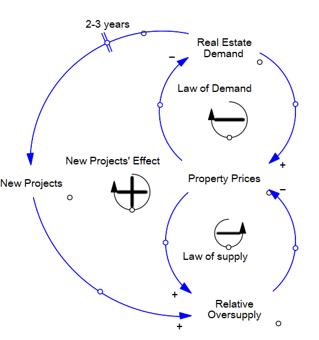

# Problema 1: Burbujas especulativas y la crisis inmobiliaria en Estados Unidos

## Preguntas del caso:
A. Toma la perspectiva de la Reserva Federal estadunidense (i.e. Banco Central). Define el problema que este tipo de burbujas representan para esta institución. Recuerda, la descripción del problema debe enfatizar la existencia de una brecha entre la situación actual y el estado futuro deseable para la institución. Investiga acerca de las funciones y objetivos de la reserva federal y de las políticas que puede implementar para intervenir en los mercados con el fin de mitigar o evitar los efectos negativos de las burbujas financieras.

*R: La Reserva Federal estadounidense trabaja para mantener la estabilidad en la economía de este país a través de la política monetaria. Específicamente, los objetivos que se persiguen con la aplicación de la política monetaria son:*

- *Tener el mayor nivel de empleo que el país pueda sostener manteniendo la inflación estable, y*
- *tener estabilidad en los precios, de forma que tanto personas como negocios no se preocupen por precios alcistas o bajistas al momento de hacer planes.*

*Relacionando los pricnipales objetivos de la Fed con las burbujas especulativas, se puede decir que las burbujas especulativas generan alta inestabilidad en la economía de EEUU. Esto debido a que las burbujas especulativas, al reventar, impactan a personas y a empresas que deciden invertir tarde en los activos cuyos precios son afectados por la burbuja (bienes raíces en el caso de la crisis inmobiliaria). El colapso inevitable de las burbujas de activos desploma el valor neto de los inversionistas, y esto ocasiona que las empresas expuestas quiebren y que además se genere un espiral de deflación de la deuda en el cual los precios de los bienes y los salarios se reducen, pero los pagos de intereses en tasas fijas no lo hacen; lo cual genera mayor presión hacia los deudores de poder pagar sus compromisos. Por estos motivos, se puede considerar que las burbujas especulativas generan condiciones indeseables para la Fed en términos de desempleo y de inestabilidad de los precios.*

B. Haz una lista de los conceptos y variables que consideres son más relevantes para entender la burbuja inmobiliaria. Mantén tu lista acotada (i.e. no más de diez variables). Agrega conceptos similares en una sola variable (e.g. no es necesario distinguir entre diferentes tipos de bienes inmobiliarios o entre diferentes tipos de hipotecas). Para este ejercicio una perspectiva macro es preferible a una perspectiva micro. Piensa críticamente sobre qué elementos o variables son endógenas y cuáles se encuentran en la frontera del sistema. Define las métricas que puedan ayudarte a monitorear el desempeño del sistema.

*R:*

1. *Política monetaria.(Política)*
2. *Dinero en circulación. (Variable endógena)*
3. *Instrumentos hipotecarios laxos. (Variable endógena)*
4. *Número de corredores de hipotecas, agentes de bienes raíces, etc. (Variable endógena)*
5. *Créditos otorgados sin documentos, con ingresos autoreportados y no verificados, etc. (Variable endógena).*
6. *Demanda de bienes raíces (Variable endógena).*
7. *Precios de bienes raíces. (Variable endógena)*
8. *Oferta de bienes raíces. (Variable endógena)*
9. *Impago de créditos hipotecarios. (Variable endógena)*
10. *Estabilidad económica (empleo, estabilidad de precios). (Métrica)*

C. Desarrolla un diagrama causal que capture los procesos de causalidad circular que consideres son responsables de la burbuja inmobiliaria. Emplea el siguiente diagrama causal como base para tu propio diagrama causal. Agrega los procesos de retroalimentación que consideres más relevantes.

D. Usa la descripción de caso y tu propio conocimiento para graficar el comportamiento de algunas de las variables que has identificado (e.g. precio, demanda y oferta). Primero, identifica el horizonte de tiempo de interés para este caso, es importante que elijas un período de tiempo que cubra la situación que dio origen a la burbuja, el período de ajuste violento de los mercados y el período de tiempo subsecuente después de la implosión de la burbuja. Segundo, grafica las variables de interés a través del horizonte de tiempo que elegiste. Es importante que denotes adecuadamente las unidades de tiempo y las unidades de las variables que se están graficando. Recuerda, en este ejercicio, los patrones cualitativos que identifiques son más relevantes que la precisión cuantitativa.

*R: El horizonte temporal que se seleccionó, considerando las estimaciones de Bob Shiller sobre la apreciación de los bienes inmuebles en Estados Unidos, es desde 1998 donde la burbuja comienza a formarse hasta el 2013, donde de acuerdo con las gráficas expuestas en el caso, ya se está llegando a una estabilidad en el precio de las casas.*

E. Combina tus respuestas de los incisos anteriores y mapea la estructura de este sistema relevante para el problema que identificaste empleando el diagrama de sistema discutido en clase. Dicho diagrama debe indicar claramente que variables o elementos del sistema se encuentran en la barrera del sistema, que políticas pueden implementarse para influir en el comportamiento del sistema y que métricas pueden emplearse para monitorear el desempeño del sistema y la efectividad de las políticas de intervención.

F. Emplea tu diagrama y responde brevemente a las siguientes preguntas. ¿Qué factores contribuyeron a la implosión de la burbuja? ¿Qué políticas hubiesen prevenido que la burbuja inmobiliaria estallara? ¿Qué políticas pudieron haber mitigado los efectos negativos de la burbuja en la economía? ¿Qué políticas pueden prevenir la generación de una burbuja similar? ¿Qué tan efectivas han sido las políticas implementadas hasta el día de hoy con respecto de los objetivos que identificaste?

*R:*
- *El principal factor que llevó a la implosión de la burbuja fue el impago de créditos hipotecarios, el cuál fue construido por la burbuja y que, al ser lo suficientemente alto,ocasionó el balance con el ciclo de implosión de la burbuja, el cuál consiste de el desplome de los precios de los bienes raíces y de los nuevos créditos otorgados.*

- *La implosión de la burbuja pudo haberse postergado con una mayor inyección de dinero a la economía por parte de la Fed, que permitiera que la demanda de bienes raíces siguiera escalando.*

- *Si la política monetaria hubies respondido de inmediato a la caída de los precios de los activos, hubiese sido probable que los efectos negativos del estallido de la burbuja de precios de los activos sobre la actividad económica derivados de la disminución de la riqueza y el aumento del costo del capital para las empresas y los hogares hubiesen sido pequeños.*

- *En la mayoría de los casos, la política monetaria no debería responder a los precios de los activos como tal, sino a cambios en la prospectiva para la inflación derivada de esta. Esto debido a que, por un lado, las burbujas especulativas son difíciles de identificar, y una política monetaria restrictiva pudiera limitar el crecimiento económico aun cuando existe la posibilidad de que no se esté presentando una burbuja como tal, o que la burbuja correspondiente no representa un problema significativo para la economía. También, y aun si las burbujas fueran fácilmente identificables, no se tiene mucha claridad en cuanto a cómo influenciará la política monetaria restrictiva (aumento de tasas de interés, por ejemplo) a una burbuja; pero se sabe que finalmente estas acciones de política monetaria afectan a los activos en general y no solamente al activo en cuestión. Por otro lado, más que considerar que la política monetaria pudiera prevenir la formación de nuevas burbujas, pudiera ser más efectivo pensar en regulaciones específicas que impidan que se formen como, por ejemplo, evitar que se otorguen créditos hipotecarios sin verificar la solidez financiera del beneficiario.*

- *Considero que existe una oportunidad importante de regulación. Se debería de aspirar a tener un marco regulatorio que considere el monitoreo contínuo del sistema financiero y que busque incidir en los ciclos de reforzamiento que actualmente generan las burbujas para prevenirlas.*

# Problema 2: Emprendedores y Transiciones Tecnológicas

## Preguntas del caso:

2.1 Desarrolla un diagrama causal del caso anterior. Identifica los ciclos de causalidad circular existentes y relevantes. Identifica su polaridad (i.e. positiva, negativa). Nombra estos ciclos de causalidad circular de tal manera que se describa su efecto apropiadamente.

2.2 Formula una hipótesis dinámica sobre el comportamiento del sistema. Enfócate en el comportamiento de las variables que consideres son más relevantes. Describe gráficamente tu hipótesis dinámica. 

*R: La hipótesis dinámica que se propone es un reforzamiento del éxito de las tecnologías a través del tiempo. Si bien en sus arranques las tecnologías exitosas no incrementan, o incrementan a tasas muy bajas debido a las dinámicas del ciclo de reforzamiento de la incertidumbre, la certidumbre se amplifica paulatinamente conforme la tecnología adquiere fondeo ya sea del mismo emprendedor o de las inversiones obtenidas, lo cuál ocasiona que las tecnologías exitosas crezcan a tasas más altas hasta llegar a un máximo en el cuál la tecnología ya tiene el suficiente fondeo para salir al mercado. *

2.3 Considera la posición de una secretaría de innovación cuyo objetivo es incrementar la tasa de desarrollo de nuevas tecnologías. Emplea el diagrama de sistema discutido en clase para identificar las variables en la barrera del sistema, las métricas para monitorear el cumplimiento de dicho objetivo y las poíticas que podrían implementarse para incrementar la tasa de desarrollo de nuevas tecnologías. Describe gráficamente el efecto en el comportamiento del sistema que consideras tendría una de las políticas que identificaste. 

*R: Las variables identificadas en la barrera del sistema serían, en cuanto a variables exógenas, los recursos que el emprendedor pudiese invertir en su proyecto, y a manera de métrica de desempeño se pudiera considerar el éxito de la tecnología. En cuanto a políticas, una secretaría de innovación pudiera otorgar créditos a la innovación tecnológica para emprendedores, los cuales se traducirían en recursos adicionales que abonan al ciclo causal para que sus tecnologías sean exitosas. Un diagrama causal incorporando esta política se vería de la siguiente forma:*

*Como resultado, se esperaría contar con un comportamiento similar a la hipótesis dinámica anterior, con la excepción de que la nueva hipótesis dinámica resultaría en una mayor tasa de desarrollo de tecnologías en un menor tiempo; así como un valor final de tecnologías exitosas más alto del que se tendría sin esta política. La gráfica se visualizaría de esta forma: *

# Problema 3: Políticas de desarrollo urbano

## Preguntas del caso:

3.1 Desarrolla un diagrama causal de este caso (10 puntos, productos: diagrama causal)

3.2 Emplea tu diagrama causal para describir gráficamente tu hipótesis dinámica inicial sobre la dinámica de los precios de las propiedades (10 puntos, productos: descripción hipótesis dinámica, gráfico de hipótesis dinámica)

*R: Tomando como condición inicial precios altos de bienes raíces, estos disminuyen a tasas altas debido a la inyección de nuevos desarrollos inmobiliarios al mercado y a la sobreoferta relativa que esto trae como consecuencia. Los precios bajos ocasionan incrementos en la demanda de bienes raíces, que a su vez reduce la sobre oferta y aumenta los precios paulatinamente. Las desarrolladoras identifican la alta demanda y se tardan 2-3 años en entregar sus proyectos simultáneamente para nuevamente desplomar los precios de los bienes raíces.*

*A partir de este comportamiento, se propone una hipótesis dinámica de un comportamiento oscilatorio del precio de las propiedades en el tiempo; el cual sufre incrementos paulatinos a tasas bajas mientras el mercado se equilibra, y se desploma a tasas altas cuando surgen nuevos desarrollos inmobiliarios.*

3.3 ¿Qué tipo de política podría seguir una compañía constructora inteligente? Emplea el diagrama de sistema visto en clase (i.e. políticas, factores exógenos, diagrama causal y métricas de comportamiento) (diapositiva 56, Seminario1) para describir el funcionamiento de dicha política y su efecto en el sistema. Grafica el comportamiento esperado de dicha política y contrástala brevemente con tu hipótesis dinámica inicial (10 puntos, productos: diagrama de sistema (diapositiva 35, Seminario2), gráfico contrastando el comportamiento de la política y la hipótesis dinámica).

*R: Una compañía constructora inteligente pudiese implementar una política basada en desfasar sus proyectos con respecto al resto de su competencia. Este desfase ocasionaría un incremento en la oferta en el sistema cuando el comportamiento del precio ya es alcista, un tiempo t determinado posterior a la inyección de proyectos al mercado por parte de su competencia. Esto ocasionaría que esta empresa se beneficie de vender sus proyectos en momentos en los cuales la oferta no es tan alta, por lo cual le sería posible venderlos en precios más altos y así generar mayoes rendimientos de sus inversiones.*

*La hipótesis dinámica es, por lo tanto, de un comportamiento oscilatorio, con una tasa de desplome de los precios un poco más baja que en la hipótesis inicial; y con una tasa de incremento de los precios que se ve menguada por la entrada de los proyectos de la compañía constructora inteligente.*

# Problema 4: Modelando la epidemia SARS

## Preguntas del caso:

4.1 Incluye tu modelo en la entrega final de la tarea, nombra tu modelo de la siguiente manera:
Tunombre_sars_model.R. Toma en cuenta que el modelo que envíes será revisado en términos de las
sintaxis del código, pero fundamentalmente en términos de su funcionalidad. Un modelo que no funcione al ser ejecutado será penalizado notablemente (30 puntos, productos: archivo con el modelo).

4.2 ¿Qué sucede cuando inicializas la variable de estado "Population infected with SARS" en cero? Explica brevemente que origina el comportamiento que observas, emplea la estructura del modelo para cimentar tu argumentación (10 puntos, productos: gráfico de simulación y breve descripción).

*R: Si la variable de población infectada con SARS es inicializada con valor de cero, no existiría un "paciente cero" en ningún punto del tiempo que diseminaría el virus, comenzando la pandemia. Por lo tanto, se puede apreciar que la población susceptible al SARS se mantiene en su valor original de 350, mientras que la población infectada con SARS en ningún punto incrementa su valor por encima de 0. *

4.3 ¿Cómo cambia la dinámica de comportamiento del modelo si inicializas esta variable de estado a un valor positivo diferente de cero?

*R: Al inicializar la variable de estado `population.infected.with.SARS` en un valor positivo diferente de cero, se tienen varios efectos:*

- *El crecimiento en el número de contagios se da de forma más ascelerada conforme se incrementa el valor inicial de la variable de estado.*
- *Considerando que no se alteró la variable de estado `population.susceptible.to.SARS`, el equilibrio en la cantidad de pacientes infectados se da en un valor que es igual a la suma de la población infectada con SARS y de la población susceptible a infectarse con SARS; ambas en tiempo cero.*

*Por ejemplo: si se inicializa la `population.infected.with.SARS` con un valor de 1, podemos apreciar en las gráficas que se llega al equilibrio más adelante en el tiempo que si esta misma variable se inicializa con un valor de 50; manteniendo la `population.susceptible.to.SARS` constante. También podemos apreciar que el valor final de equilibrio de `population.infected.with.SARS` se da en un valor de 351 en el primer caso, mientras que en el segundo caso se da en un valor de 400.*

**Gráficas inicializadas con `population.infected.with.SARS` = 1**

**Gráficas inicializadas con `population.infected.with.SARS` = 50**

4.4 ¿Cómo cambia la dinámica del sistema si aumenta el valor del parámetro "Contact Frequency"? ¿El valor de este parámetro modifica el valor final de la variable de estado "Population Infected with SARS"? Explica porque sí o porque no haciendo referencia a la estructura del modelo y a los resultados de la simulación (10 puntos, productos: gráfico con resultados de simulación y descripción de resultados).

*R: El incremento en el parámetro `Contact.frequency` cambia la dinámica del modelo, pues vuelve el crecimiento de la variable de estado `population.infected.with.SARS` más acelerado, así como el colapso de la variable de estado `population.susceptible.to.SARS`. Esto se da debido a la polaridad positiva que tiene el enlace de este parámetro con las variables subsecuentes en el ciclo de `Depletion` hasta llegar a la variable de flujo `Infection.Rate`. Sin embargo, los valores de equilibrio de ambas variables de estado no se ven alterados por los cambios en este parámetro, pues estos valores están limitados por el total de la `population.susceptible.to.SARS` con la cual se inicializa el modelo; que en este caso es una cantidad finita de 350 personas.*

**Gráficas con valor del parámetro `Contact.frequency` = 2**

**Gráficas con valor del parámetro `Contact.frequency` = 4**

**Gráficas con valor del parámetro `Contact.frequency` = 8**

4.5 ¿Cómo cambia el comportamiento del modelo si la variable de flujo "Infection Rate" cambia? Sigue los siguientes lineamientos para dar tu respuesta: Responde a esta pregunta describiendo brevemente los cambios que identificas al cambiar el valor de esta variable. Emplea un par de gráficos de comportamiento del modelo para dar soporte a tu respuesta. (10 puntos, productos: gráfico con resultados de simulación y descripción de resultados).

*R: La variable de flujo `Infection.Rate`, de acuerdo con el modelo, está influenciada positivamente por la variable `Contacts.between.Infected.and.Uninfected.People` y por el parámetro `Infectivity`; por lo que para fines de este ejercicio se alteró el parámetro `Infectivity` para incidir en `Infection.Rate` y modelar sus cambios.*

*Al duplicar el parámetro `Infectivity`, incrementando así la variable de flujo `Infection.Rate` también al doble, se aprecia un incremento en la tasa de contagios que resulta en que se llega al máximo de pacientes infectados en menor tiempo. Por otro lado, al reducir a la mitad el parámetro `Infectivity` reduciendo también a la mitad la variable de flujo `Infection.Rate`; se aprecia que hay una reducción importante en la tasa de contagios y que en el transcurso del tiempo del modelo de 120 días apenas se llega al máximo de personas infectadas. Es importante aclarar que los valores de equilibrio de las variables de estado `population.infected.with.SARS` y de `population.susceptible.to.SARS` no se ven afectados por estos cambios.*

**Gráficas con valor de la variable de flujo `Infection.Rate` inicial**

**Gráficas con valor de la variable de flujo `Infection.Rate` duplicado**

**Gráficas con valor de la variable de flujo `Infection.Rate` reducido a la mitad**

4.6 El modelo que has desarrollado siguiendo el tutorial anterior es demasiado simple. Brevemente critica la formulación y estructura del modelo y lista las suposiciones del modelo que consideras son irrealistas. Uno o dos párrafos son más que suficientes para responder este punto (10 puntos, productos: respuesta textual).

*R: El modelo, tal como está formulado, supone que aquellos que son infectados se mantienen infectados indefinidamente; en lugar de proponer que aquellos pacientes infectados pueden recuperarse o fallecer, lo cual los restaría de la variable de estado de personas infectadas con SARS y, en el segundo caso, los restaría también de la variable auxiliar de población total. Incluso, considerando a los pacientes recuperados, el modelo tampoco considera que estos pueden volverse nuevamente susceptibles a adquirir el SARS después de algún periodo promedio de inmunidad adquirida a partir de su infección.*

Después de agregar la variable de estado `population.recovered.from.SARS`, la variable de flujo `Recovery.Rate` y el parámetro `Average.Duration.of.Infectivity`:

4.7 ¿De qué manera cambia el comportamiento de la epidemia una vez que agregas estas nuevas variables al modelo? (10 puntos, productos: nueva versión del modelo, gráficos con comportamiento de las tres variables de estado).

*R:*

**Gráficas agregando la variable de estado `population.recovered.from.SARS`, la variable de flujo  `Recovery.Rate` y el parámetro `Average.Duration.of.Infectivity`**

 4.8 Describe gráficamente y con un breve texto el efecto en el sistema de cambios (i.e. incremento y decremento) de las siguientes variables: "contact frequency" y "infectivity". Enfatiza en las diferencias que percibes con respecto del comportamiento del modelo base. Se concis@ y breve en tu descripción textual y gráfica (10 puntos, productos: descripción de comportamiento, gráficos describiendo el comportamiento del modelo)
 
*R: Para fines de ilustrar el efecto de los incrementos y decrementos en los parámetros `Contact.Frequency` e `Infectivity`, se optó por duplicar y reducir ambos parámetros a la mitad en diferentes escenarios y manteniendo el otro parámetro constante, lo cuál resultó en un total de 4 escenarios además del escenario base.*

*Como se puede apreciar en las gráficas incluidas a continuación, el duplicar cualquiera de los dos parámetros resulta en un efecto duplicativo de la variable de flujo `Infection.Rate`. Esto nos da como consecuencia a su vez una caída más acelerada en la `population.susceptible.to.SARS`, un valor máximo de `population.infected.with.SARS` más alto que en el caso base que es alcanzado en menor tiempo, y una subsecuente tasa de recuperación más alta que trae consigo una mayor cantidad de `population.recovered.from.SARS` en menor tiempo que en el caso base.*

*Por otro lado, el reducir por la mitad cualquiera de los dos parámetros resulta en una reducción por la mitad de la variable de flujo `Infection.Rate`. Esto nos da como consecuencia a su vez una caída menos acelerada en la `population.susceptible.to.SARS`, un valor máximo de `population.infected.with.SARS` que no se alcanza en el transcurso del tiempo estudiado en el modelo pero que seguramente sería menor que en caso base, y una subsecuente tasa de recuperación más baja que trae consigo una menor cantidad de `population.recovered.from.SARS` en mayor tiempo que en el caso base.*

*Haciendo referencia al diagrama stock-flow y al mismo modelo, es importante resaltar que los mismos cambios en los parámetros `Contact.Frequency` e `Infectivity` tienen el mismo efecto en el comportamiento del modelo debido a la proporcionalidad de estos parámetros con la variable de flujo `Infection.Rate`.*
 
**Gráficas con valores iniciales de `Contact.Frequency` = 2 y de `Infectivity` = 0,1**

**Gráficas con valores de `Contact.Frequency` = 2 y de `Infectivity` = 0,05**

**Gráficas con valores de `Contact.Frequency` = 2 y de `Infectivity` = 0,2**

**Gráficas con valores de `Contact.Frequency` = 1 y de `Infectivity` = 0,1**

**Gráficas con valores de `Contact.Frequency` = 4 y de `Infectivity` = 0,1**

# Problema 5: Crecimiento y colapso

# Preguntas del caso

5.1 Construye un modelo de dinámica de sistemas de este caso de estudio. Nota, las variables del modelo se indican en itálicas. Emplea esta ayuda para construir tu modelo (30 puntos, productos: modelo en R, mande tu modelo con la versión final de tu tarea, emplea el siguiente formato para nombrar tu modelo: TuNombre_crecimiento_colapso.R)

5.2 Describe textualmente tu hipótesis dinámica. (10 puntos, productos: descripción hipótesis dinámica).

*R: La hipótesis consiste de un modelo de crecimiento y colapso de la población y de los recursos renovables, en el cual la variable de estado `population` crece a una tasa moderada mientras la tasa de regeneración de los recursos renovables `regeneration` es ligeramente menor al uso de recursos renovables `resource.use`; por lo cual se denota un comportamiento ligeramente bajista en la variable de estado `renewable resources`. Sin embargo, en un momento en el tiempo, la diferencia entre las varaibles de flujo `regeneration` y `resource.use` causan una caída en la variable de estado `renewable resources`; lo cual ocasiona que el proceso de regeneración sea mucho más lento. Esto genera un colapso de los `renewable resources` y un colapso subsecuente en la `population` debido a su dependencia de los recursos renovables para sobrevivir.*

5.3 Emplea tu modelo para mostrar la dinámica de comportamiento del modelo cuando la variable "minimum regeneration rate" es igual a 10% por año. (20 puntos: descripción textual y gráfica del comportamiento del sistema).

*R: Para ilustrar mejor este ejercicio, se modificó la escala de tiempo del modelo hasta 200 años.*

*La variable de flujo `regeneration` consta de dos componentes; los cuales son las variables auxiliares `resource.dependent.regeneration`, que es la regeneración de recursos que depende de la existencia de los mismos, y `minimum.regeneration` que es la regeneración de recursos que es independiente de la existencia de los mismos. Siguiendo ese principio, si se incrementa de 1% a 10% el valor de `minimum.regeneration.rate`, que es directamente proporcional a `minimum.regeneration`, se tendría una regeneración mucho más importante de recursos a pesar de su agotamiento. Esto lleva al sistema a llegar a un equilibrio en las variables de estado `population` y `renewable.resources`, en donde el crecimiento de la población es menguado por la disponibilidad de recursos; pero no hay colapsos en ninguno de los dos casos puesto que la cantidad de recursos naturales tiene una menor influencia en su tasa de regeneración.*

