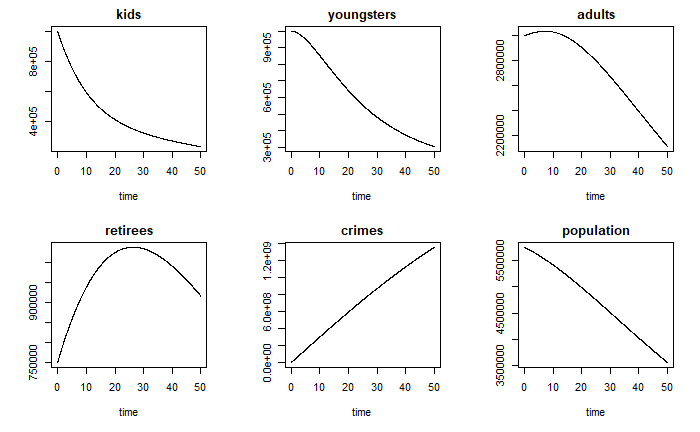
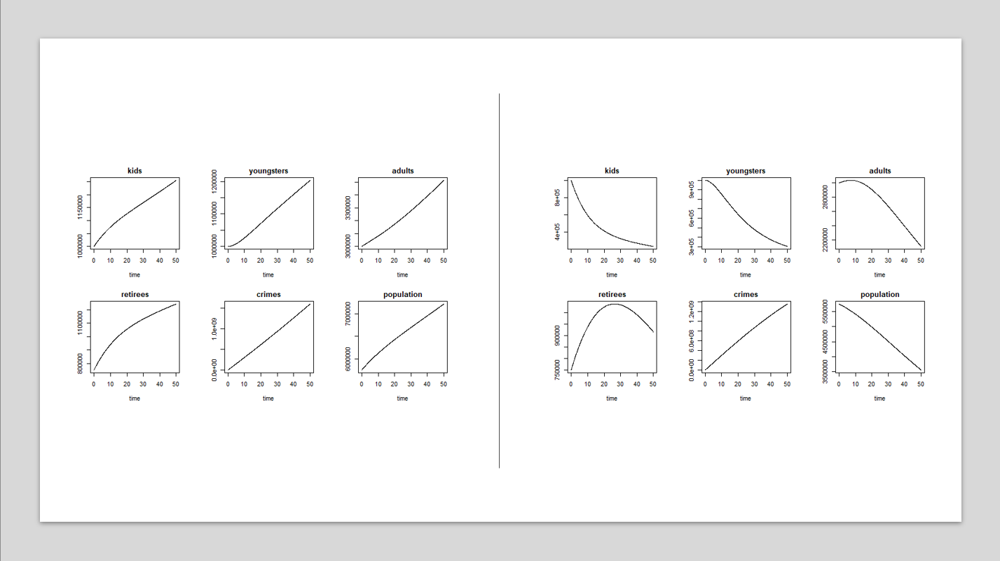
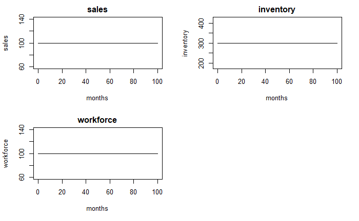
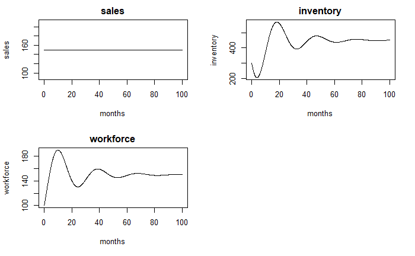
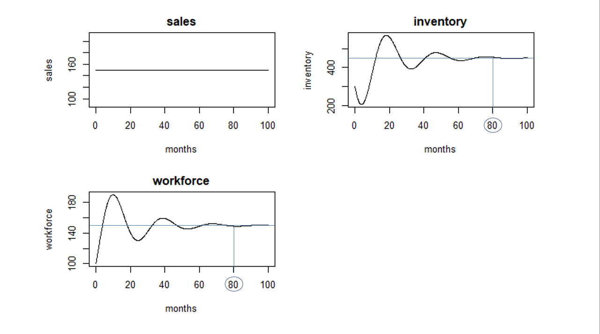
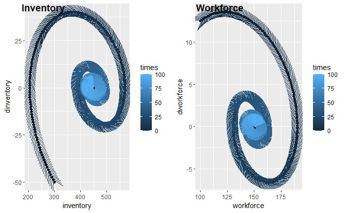
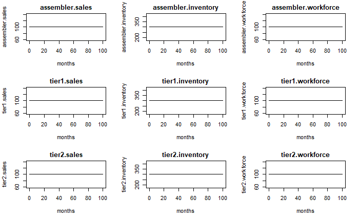
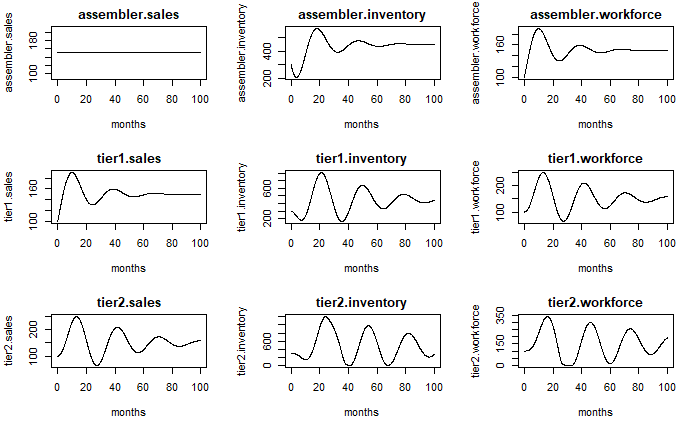
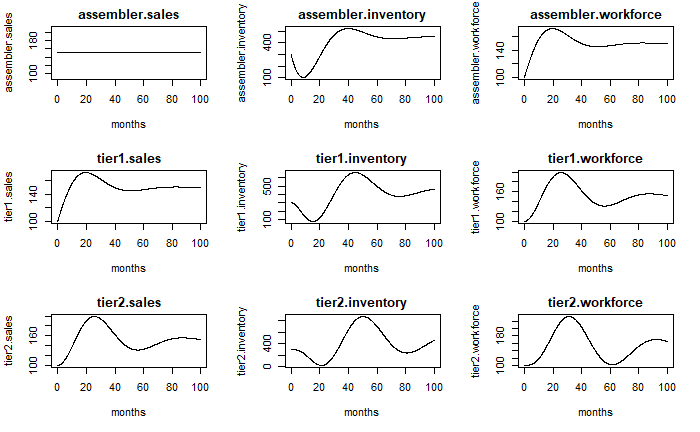

# Problema 1: Preguntas de Opción Múltiple

## Capítulo 3:
- Multiple Choice Question 1, página 69: *d*
- Multiple Choice Question 2, página 69: *b*
- Multiple Choice Question 3, página 70: *c*
- Multiple Choice Question 4, página 70: *d*
- Multiple Choice Question 5, página 70: *c*
- Multiple Choice Question 6, página 71: *d*
- Multiple Choice Question 7, página 72: *a*
- Multiple Choice Question 8, página 72: *b*
- Multiple Choice Question 9, página 72: *d*
- Multiple Choice Question 10, página 73: *a*
- Multiple Choice Question 11, página 73: *b*
- Multiple Choice Question 12, página 74: *b*
- Multiple Choice Question 13, página 74: *a*
- Multiple Choice Question 14, página 75: *a*
- Multiple Choice Question 16, página 76: *c*
- Multiple Choice Question 19, página 78: *d*

## Capítulo 7:
- Multiple Choice Question 1, página 104: *d*
- Multiple Choice Question 2, página 104: *a*
- Multiple Choice Question 3, página 104: *c*
- Multiple Choice Question 6, página 106: *d*
- Multiple Choice Question 8, página 107: *a*
- Multiple Choice Question 11, página 108: *c*
- Multiple Choice Question 12, página 109: *a*
- Multiple Choice Question 14, página 110: *b*

# Problema 2: Política de Crimen y Planificación Familiar

## Preguntas del caso:
1. Construye un modelo de dinámica de sistemas de este caso de estudio. Corre el caso base por un periodo de 50 años. Nota, las variables del modelo se indican en itálicas. Emplea esta ayuda para construir tu modelo (30 puntos, productos: modelo en R, envía tu modelo con la versión final de tu tarea.)

```{r}
#Problema 2
#Política de Crimen y Planificación Familiar

#Paso 1: cargar la libreria "deSolve" empleando la funcion library()
 library("deSolve")

#Considera a los parametros como variables exogenas que no pueden ser modificadas
 parameters<-c(average.time.as.kid =  12,#[years]
               average.time.as.youngster =  12, #[years]
               average.time.as.adult = 40, # [years]
               average.time.as.retiree = 15,  #[years]
               annual.fertility.rate.of.adults = 3/100,  #[births/(adult*year)]
               annual.fertility.rate.of.youngsters = 0.3/100,  #[births/(youngster*year)]
               crimes.by.others = 6e6,  #[crimes/year]
               criminal.acts.per.criminal.kid = 2,  #[crimes/(criminal kid*year)]
               criminal.acts.per.criminal.youngster = 4,  #[crimes/(criminal youngster*year)]
               criminal.acts.per.criminal.adult = 12,  #[crimes/(criminal adult*year)]
               criminal.acts.per.criminal.retiree = 4,  #[crimes/(criminal retiree*year)]
               percentaje.of.kids.with.criminal.behavior = 0.05,  #[criminal kids/kids]
               percentaje.of.youngsters.with.criminal.behavior = 0.5,  #[criminal youngsters/youngsters]
               percentaje.of.adults.with.criminal.behavior = 0.6,  #[criminal adults/adults]
               percentaje.of.retirees.with.criminal.behavior = 0.1  #[criminal retirees/retirees]
               )
 
 #para definir tus condiciones iniciales utiiza tus variables de estado
 InitialConditions <- c( kids = 1e6, #[kids]
                         youngsters = 1e6, #[youn[gsters]
                         adults = 3e6, #[adults]
                         retirees = 750000, #[retirees]
                         crimes = 0 #[crimes]
                         ) 

 times <- seq(0, #tiempo inicial
              50, #tiempo final #[years]
              0.05 )#número de repetición de puntos #[years]

# Definimos método de integración
 intg.method<-c("rk4")

#Especificamos modelo
Crime.Policy.Family.Planning<- function(t, state, parameters) {
  with(as.list(c(state,parameters)), {
    
#auxiliary variables
    criminal.kids <- kids*percentaje.of.kids.with.criminal.behavior #[criminal kids]
    criminal.youngsters <- youngsters*percentaje.of.youngsters.with.criminal.behavior #[criminal youngsters]
    criminal.adults <- adults*percentaje.of.adults.with.criminal.behavior #[criminal adults]
    criminal.retirees <- retirees*percentaje.of.retirees.with.criminal.behavior #[criminal retirees]
    population <- kids + youngsters + adults + retirees #[people]

#flow variables
    birth.inflow <- annual.fertility.rate.of.adults*adults + 
      annual.fertility.rate.of.youngsters*youngsters #[births/year]
    becoming.a.youngster.rate <- kids/average.time.as.kid #[youngsters/year]
    becoming.an.adult.rate <- youngsters/average.time.as.youngster #[adults/year]
    becoming.a.retiree.rate <- adults/average.time.as.adult #[retirees/year]
    deaths <- retirees/average.time.as.retiree #[retirees/year]
    crimes.by.kids <- criminal.kids*criminal.acts.per.criminal.kid #[crimes/year]
    crimes.by.youngsters <- criminal.youngsters*criminal.acts.per.criminal.youngster #[crimes/year]
    crimes.by.adults <- criminal.adults*criminal.acts.per.criminal.adult #[crimes/year]
    crimes.by.retirees <- criminal.retirees*criminal.acts.per.criminal.retiree #[crimes/year]

#state variables
    dkids <- birth.inflow - becoming.a.youngster.rate #[kids/year]
    dyoungsters <- becoming.a.youngster.rate - becoming.an.adult.rate #[youngsters/year]
    dadults <- becoming.an.adult.rate - becoming.a.retiree.rate #[adults/year]
    dretirees <- becoming.a.retiree.rate - deaths #[retirees/year]
    dcrimes <- crimes.by.others + crimes.by.kids + crimes.by.youngsters + 
      crimes.by.adults + crimes.by.retirees #[crimes/year]

    
    list(c(dkids,dyoungsters,dadults,dretirees,dcrimes),
         population = population)

  })
}

out <- ode(y = InitialConditions,
           times = times,
           func = Crime.Policy.Family.Planning,
           parms = parameters,
           method =intg.method)

tail(out)

#Graficas de todo
plot(out)

```

2. Ahora asume que debido al éxito de la planificación familiar (successful voluntary family planning measures) la variable birth flow es 75% menor, eso es: 25% de la suma de las variables adults x annual fertility rate of adults y youngsters x annual fertility rate of youngsters. Expande tu modelo y grafica los nuevos resultados (30 puntos, productos: modelo en R, envía tu modelo con la versión final de tu tarea, gráficos con nuevos resultados).

```{r}
#Problema 2
#Política de Crimen y Planificación Familiar

#Paso 1: cargar la libreria "deSolve" empleando la funcion library()
 library("deSolve")

#Considera a los parametros como variables exogenas que no pueden ser modificadas
 parameters<-c(average.time.as.kid =  12,#[years]
               average.time.as.youngster =  12, #[years]
               average.time.as.adult = 40, # [years]
               average.time.as.retiree = 15,  #[years]
               annual.fertility.rate.of.adults = 3/100,  #[births/(adult*year)]
               annual.fertility.rate.of.youngsters = 0.3/100,  #[births/(youngster*year)]
               crimes.by.others = 6e6,  #[crimes/year]
               criminal.acts.per.criminal.kid = 2,  #[crimes/(criminal kid*year)]
               criminal.acts.per.criminal.youngster = 4,  #[crimes/(criminal youngster*year)]
               criminal.acts.per.criminal.adult = 12,  #[crimes/(criminal adult*year)]
               criminal.acts.per.criminal.retiree = 4,  #[crimes/(criminal retiree*year)]
               percentaje.of.kids.with.criminal.behavior = 0.05,  #[criminal kids/kids]
               percentaje.of.youngsters.with.criminal.behavior = 0.5,  #[criminal youngsters/youngsters]
               percentaje.of.adults.with.criminal.behavior = 0.6,  #[criminal adults/adults]
               percentaje.of.retirees.with.criminal.behavior = 0.1,  #[criminal retirees/retirees]
               successful.voluntary.family.planning.measures = 0.75
               )
 
 #para definir tus condiciones iniciales utiiza tus variables de estado
 InitialConditions <- c( kids = 1e6, #[kids]
                         youngsters = 1e6, #[youn[gsters]
                         adults = 3e6, #[adults]
                         retirees = 750000, #[retirees]
                         crimes = 0 #[crimes]
                         ) 

 times <- seq(0, #tiempo inicial
              50, #tiempo final #[years]
              0.05 )#número de repetición de puntos #[years]

# Definimos método de integración
 intg.method<-c("rk4")

#Especificamos modelo
Crime.Policy.Family.Planning<- function(t, state, parameters) {
  with(as.list(c(state,parameters)), {
    
#auxiliary variables
    criminal.kids <- kids*percentaje.of.kids.with.criminal.behavior #[criminal kids]
    criminal.youngsters <- youngsters*percentaje.of.youngsters.with.criminal.behavior #[criminal youngsters]
    criminal.adults <- adults*percentaje.of.adults.with.criminal.behavior #[criminal adults]
    criminal.retirees <- retirees*percentaje.of.retirees.with.criminal.behavior #[criminal retirees]
    population <- kids + youngsters + adults + retirees #[people]

#flow variables
    birth.inflow <- (1-successful.voluntary.family.planning.measures)*
      (annual.fertility.rate.of.adults*adults + 
      annual.fertility.rate.of.youngsters*youngsters) #[births/year]
    becoming.a.youngster.rate <- kids/average.time.as.kid #[youngsters/year]
    becoming.an.adult.rate <- youngsters/average.time.as.youngster #[adults/year]
    becoming.a.retiree.rate <- adults/average.time.as.adult #[retirees/year]
    deaths <- retirees/average.time.as.retiree #[retirees/year]
    crimes.by.kids <- criminal.kids*criminal.acts.per.criminal.kid #[crimes/year]
    crimes.by.youngsters <- criminal.youngsters*criminal.acts.per.criminal.youngster #[crimes/year]
    crimes.by.adults <- criminal.adults*criminal.acts.per.criminal.adult #[crimes/year]
    crimes.by.retirees <- criminal.retirees*criminal.acts.per.criminal.retiree #[crimes/year]

#state variables
    dkids <- birth.inflow - becoming.a.youngster.rate #[kids/year]
    dyoungsters <- becoming.a.youngster.rate - becoming.an.adult.rate #[youngsters/year]
    dadults <- becoming.an.adult.rate - becoming.a.retiree.rate #[adults/year]
    dretirees <- becoming.a.retiree.rate - deaths #[retirees/year]
    dcrimes <- crimes.by.others + crimes.by.kids + crimes.by.youngsters + 
      crimes.by.adults + crimes.by.retirees #[crimes/year]

    
    list(c(dkids,dyoungsters,dadults,dretirees,dcrimes),
         population = population)

  })
}

out <- ode(y = InitialConditions,
           times = times,
           func = Crime.Policy.Family.Planning,
           parms = parameters,
           method =intg.method)

tail(out)

#Graficas de todo
plot(out)

```



3. Compara el comportamiento de esta modificación con respecto del caso base. ¿Qué diferencias encuentras? Explica por qué estas diferencias son relevantes en este sistema. (30, gráficos comparando el comportamiento de los dos modelos de manera simultánea, explicación de comportamiento)

*R: En el primer modelo, se puede apreciar que existe una tendencia alcista para las personas en todos los grupos de edad correspondientes durante el plazo evaluado de 50 años, lo cuál se refleja de igual forma en una tendencia alcista de la variable `population` que se incorporó para detallar más el análisis, la cuál representa la suma de la población en su conjunto. Los crímenes, por su parte, tienen también una pendiente positiva marcada durante todo el periodo de análisis. Finalmente, para hacer una comparativa con base en índices de criminalidad por habitante, se dividieron los nuevos crímenes cometidos entre los años 49 y 50 entre la población en el año 49 para obtener un índice de 24 crímenes por cada 100 habitantes por año.*

*En cuanto al segundo modelo, efectivamente se denota una tendencia bajista en todos los grupos poblacionales, la cuál se refleja más rápidamente en la variable `kids` por ser la primera afectada por el cambio de política. Dicha reducción en `kids` eventualmente permea en los demás grupos de edad en tiempos más avanzados. En cuanto a los crímenes, se denota que finalmente el ascenso en los mismos de igual forma mantiene una pendiente positiva, aunque ésta pendiente se demuestra más baja que la pendiente del caso base. Sin embargo, al comparar los índices de criminalidad por cada 100 habitantes en cada caso, se puede denotar que éste incrementa desde 24 crímenes por cada 100 habitantes por año al final del periodo de análisis del caso base hasta 31 crímenes por cada 100 habitantes por año al final del periodo de análisis del caso que contempla la política de planificación familiar.*



# Problema 3: Administración de Cadena de Suministro 

## Preguntas Iniciales del caso:

1. Construye un modelo de dinámica de sistemas basado en el anterior, simula el modelo por un periodo de 100 meses. Asegúrate que el modelo esté en equilibrio (30 puntos, productos: modelo en R, envía tu modelo con la versión final de tu tarea.)

```{r}
#Problema 3
#Administración de Cadena de Suministro

#Paso 1: cargar la libreria "deSolve" empleando la funcion library()
library("deSolve")
library("ggplot2")
library("ggpubr")


#Considera a los parametros como variables exogenas que no pueden ser modificadas
 parameters<-c(sales = 150 ,#[cars/month]
               time.to.correct.inventory = 2 , #[months]
               inventory.coverage = 3, # [months]
               time.to.adjust.workforce = 10,  #[months]
               productivity = 1 #[cars/(person.month)]
               )
 
 #para definir tus condiciones iniciales utiiza tus variables de estado
 InitialConditions <- c( inventory = 300, #[cars]
                         workforce = 100) #[people]

 times <- seq(0, #tiempo inicial
              100, #tiempo final #[months]
              0.1 )#número de repetición de puntos #[months]

# Definimos método de integración
 intg.method<-c("rk4")

#Especificamos modelo
Supply.Chain<- function(t, state, parameters) {
  with(as.list(c(state,parameters)), {
    
#auxiliary variables
    target.inventory <- sales*inventory.coverage #[cars]
    inventory.correction <- (target.inventory-inventory)/time.to.correct.inventory #[cars/month]
    target.production <- sales + inventory.correction #[cars/month]
    target.workforce <- target.production/productivity #[people]

#flow variables
    production <- productivity * workforce #[cars/month]
    net.hire.rate <- (target.workforce - workforce)/
      time.to.adjust.workforce #[people/month]

#state variables
    dinventory <- production - sales #[cars/month]
    dworkforce <- net.hire.rate #[people/month]
    
    list(c(dinventory,dworkforce),
         sales=sales,
         dinventory = dinventory,
         dworkforce = dworkforce)

  })
}

out <- ode(y = InitialConditions,
           times = times,
           func = Supply.Chain,
           parms = parameters,
           method =intg.method)

#Graficas solo variables de interés
plot(out, which=c("sales", "inventory", "workforce"),
     xlab = "months",
     ylab =c("sales","inventory","workforce"))

out <- data.frame(out)

inventory.phase.diagram <-
  ggplot(out, aes(x=inventory, y=dinventory)) +
  geom_point()+
  geom_path(aes(colour = times), 
            arrow = arrow()
            )

workforce.phase.diagram <-
  ggplot(out, aes(x=workforce, y=dworkforce)) +
  geom_point()+
  geom_path(aes(colour = times), 
            arrow = arrow()
            )

ggarrange(inventory.phase.diagram, workforce.phase.diagram, 
          labels = 
            c("Inventory", "Workforce"),
          ncol = 2, nrow = 1)

```

2. Ahora corre el modelo especificando que la variable sales cambie de 100 cars per month a 150 cars per month. Muestra y describe el comportamiento del modelo para las siguientes variables: sales, inventory y workforce (30 puntos, productos: gráficos describiendo el comportamiento del sistema, comentarios que describan el comportamiento del sistema).

*R: En el primer caso, donde la variable `sales` corresponde a un flujo de 100 carros por mes, se puede apreciar que la variable `inventory` no sufre variaciones ni fluctuaciones en el tiempo. Esto significa que la variable de flujo `production` es igual a la variable de flujo `sales`, lo cuál implica que no es necesario realizar cambios en la fuerza laboral para poder mantener un inventario estable. Sin embargo, cuando la variable de flujo `sales` se incrementa a 150 carros por mes, el sistema no tiene la suficiente capacidad para mantener una producción equivalente, por lo que se aprecian caídas en la variable `inventory`, las cuales buscan estabilizarse con incrementos en la fuerza de trabajo. Finalmente, después de un periodo de ajuste en donde hay fluctuaciones significativas en `inventory` y en `workforce`, se llega nuevamente al equilibrio dinámico.*




3. ¿Cuánto tiempo toma para que el sistema vuelva al equilibrio dinámico? (10 puntos, productos: gráfico con anotaciones describiendo el tiempo que tarda el sistema en volver al equilibrio.)

*R: El sistema vuelve al equilibrio dinámico aproximadamente después de 80 meses de mantener ventas de 150 carros por mes.*



4. Construye el diagrama de fase del sistema y describe el comportamiento esperado empleando este diagrama de fase (20 puntos, productos: diagrama de fase y explicación de comportamiento).

*R: El comportamiento de los diagramas de fase, tanto de las variables de `inventory` como de `workforce`, demuestra fluctuaciones significativas desde sus posiciones iniciales derivadas de las políticas de la empresa que buscan estabilizar la cantidad de carros en inventario manteniendo una tasa de ventas de 150 carros por mes. En cuanto a la variable `inventory`, se aprecia en este diagrama de fase que el incremento de ventas a 150 carros por mes ocasiona un declive importante que baja desde 300 carros hasta 200 carros mientras el cambio neto se acerca a cero, después de cuando el cambio neto se vuelve muy positivo hasta llegar a un inventario de aproximadamente 600 carros. Finalmente, se aprecia en el diagrama que la variable llega al equilibrio en 450 unidades de inventario con una tasa de cambio neto de 0 carros por mes. Por esto, se puede decir que el punto de equilibrio estable en este diagrama de fase se encuentra en 450 carros en inventario.*

*La variable de `workforce`, por su parte, comienza con un alza significativa en la misma que la eleva desde 100 trabajadores hasta casi 200 con lo cuál se busca cambiar la tendencia de los inventarios. Una vez que los incrementos en los inventarios llegan a su máximo, se procede a una tasa de recortes de personal que los reduce hasta aproximadamente 125. A partir de esto, se vislumbra que los cambios de la fuerza laboral en el tiempo, igual que de los inventarios, tienden a un equilibrio en un valor de 0 de cambio neto con una cantidad fija de 150 trabajadores; lo cuál indica que se llegó a un estado estable de fuerza laboral necesaria para cumplir con las ventas de 150 carros por mes.Por esto, se puede decir que el punto de equilibrio estable en este diagrama de fase se encuentra en 150 personas trabajando en la armadora.*



5. Asume que la producción del ensamblador (i.e. assembler) constituye la demanda de la firma en el primer nivel de suministro (i.e. tier 1 supplier), y que la producción de la firma en la primera línea de suministro constituye la demanda de la firma en el segundo nivel de suministro (i.e. tier 2 supplier). Expande tu modelo original, asume que la estructura interna de estas firmas adicionales es identica a la estructura de la firma ensambladora (30 puntos, productos: modelo en R, envía tu modelo con la versión final de tu tarea).

```{r}
#Problema 3
#Administración de Cadena de Suministro

#Paso 1: cargar la libreria "deSolve" empleando la funcion library()
 library("deSolve")

#Considera a los parametros como variables exogenas que no pueden ser modificadas
 parameters<-c(assembler.sales = 150 ,#[cars/month]
               assembler.time.to.correct.inventory = 8 , #[months]
               assembler.inventory.coverage = 3, # [months]
               assembler.time.to.adjust.workforce = 10,  #[months]
               assembler.productivity = 1, #[cars/(person.month)]
               tier1.time.to.correct.inventory = 8 , #[months]
               tier1.inventory.coverage = 3, # [months]
               tier1.time.to.adjust.workforce = 10,  #[months]
               tier1.productivity = 1, #[cars/(person.month)]
               tier2.time.to.correct.inventory = 8 , #[months]
               tier2.inventory.coverage = 3, # [months]
               tier2.time.to.adjust.workforce = 10,  #[months]
               tier2.productivity = 1 #[cars/(person.month)]
               )
 
 #para definir tus condiciones iniciales utiiza tus variables de estado
 InitialConditions <- c( assembler.inventory = 300, #[cars]
                         assembler.workforce = 100, #[people]
                         tier1.inventory = 300, #[cars]
                         tier1.workforce = 100, #[people]
                         tier2.inventory = 300, #[cars]
                         tier2.workforce = 100 #[people]
                         )

 times <- seq(0, #tiempo inicial
              100, #tiempo final #[months]
              0.1 )#número de repetición de puntos #[months]

# Definimos método de integración
 intg.method<-c("rk4")

#Especificamos modelo
Supply.Chain<- function(t, state, parameters) {
  with(as.list(c(state,parameters)), {
    
#assembler auxiliary variables
    assembler.target.inventory <- assembler.sales*assembler.inventory.coverage #[cars]
    assembler.inventory.correction <- (assembler.target.inventory-assembler.inventory)/assembler.time.to.correct.inventory #[cars/month]
    assembler.target.production <- assembler.sales + assembler.inventory.correction #[cars/month]
    assembler.target.workforce <- assembler.target.production/assembler.productivity #[people]
    
#assembler flow variables
    assembler.production <- assembler.productivity * assembler.workforce #[cars/month]
    assembler.net.hire.rate <- (assembler.target.workforce - assembler.workforce)/
      assembler.time.to.adjust.workforce #[people/month]
    
#assembler state variables
    dassembler.inventory <- assembler.production - assembler.sales #[cars/month]
    dassembler.workforce <- assembler.net.hire.rate #[people/month]
    
#tier 1 sales
    tier1.sales <- assembler.production #[cars/month]
    
#tier 1 auxiliary variables
    tier1.target.inventory <- tier1.sales*tier1.inventory.coverage #[cars]
    tier1.inventory.correction <- 
      (tier1.target.inventory-tier1.inventory)/tier1.time.to.correct.inventory #[cars/month]
    tier1.target.production <- tier1.sales + tier1.inventory.correction #[cars/month]
    tier1.target.workforce <- tier1.target.production/tier1.productivity #[people]

#tier 1 flow variables
    tier1.production <- tier1.productivity * tier1.workforce #[cars/month]
    tier1.net.hire.rate <- (tier1.target.workforce - tier1.workforce)/
      tier1.time.to.adjust.workforce #[people/month]

#tier 1 state variables
    dtier1.inventory <- tier1.production - tier1.sales #[cars/month]
    dtier1.workforce <- tier1.net.hire.rate #[people/month]
    
#tier 2 sales
    tier2.sales <- tier1.production #[cars/month]
    
#tier 2 auxiliary variables
    tier2.target.inventory <- tier2.sales*tier2.inventory.coverage #[cars]
    tier2.inventory.correction <- 
      (tier2.target.inventory-tier2.inventory)/tier2.time.to.correct.inventory #[cars/month]
    tier2.target.production <- tier2.sales + tier2.inventory.correction #[cars/month]
    tier2.target.workforce <- tier2.target.production/tier2.productivity #[people]

#tier 2 flow variables
    tier2.production <- tier2.productivity * tier2.workforce #[cars/month]
    tier2.net.hire.rate <- (tier2.target.workforce - tier2.workforce)/
      tier2.time.to.adjust.workforce #[people/month]

#tier 2 state variables
    #dtier2.inventory <- tier2.production - tier2.sales #[cars/month]
    #dtier2.workforce <- tier2.net.hire.rate #[people/month]
    
    dtier2.inventory <- max(c(tier2.production-tier1.production,-1*(tier2.inventory))) #[cars/month]
    dtier2.workforce <- max(c(tier2.net.hire.rate,-1*(tier2.workforce))) #[people/month]
    
    list(c(dassembler.inventory,dassembler.workforce,
           dtier1.inventory,dtier1.workforce,
           dtier2.inventory,dtier2.workforce),
         assembler.sales=assembler.sales,
         tier1.sales=tier1.sales,
         tier2.sales=tier2.sales)

  })
}

out <- ode(y = InitialConditions,
           times = times,
           func = Supply.Chain,
           parms = parameters,
           method =intg.method)

#Graficas solo variables de interés
plot(out, which=c("assembler.sales", "assembler.inventory", "assembler.workforce",
                  "tier1.sales", "tier1.inventory", "tier1.workforce",
                  "tier2.sales", "tier2.inventory", "tier2.workforce"),
     xlab = "months",
     ylab =c("assembler.sales", "assembler.inventory", "assembler.workforce",
                  "tier1.sales", "tier1.inventory", "tier1.workforce",
                  "tier2.sales", "tier2.inventory", "tier2.workforce"))

```

6. Describe la dinámica de comportamiento que resulta de integrar estas nuevas firmas al modelo para las siguientes variables: sales, inventory y workforce (30 puntos, productos: gráficos describiendo el comportamiento del sistema para las tres firmas, comentarios que describan el comportamiento del sistema).

*R: Al considerar la integración de las tres firmas, y mientras las ventas de la armadora `assembler.sales` se mantengan en 100 carros al mes, el sistema se mantiene en equilibrio; pues las producciones tanto de la armadora como de sus proveedores tier 1 y tier 2 están estructuradas para mantener ese flujo de ventas, y por lo tanto no hay afectación en las ventas de ninguna empresa, ni en sus inventarios, ni en su fuerza laboral.*

*Sin embargo, al elevar las `assembler.sales` a 150 unidades por mes, se puede apreciar que las fluctuaciones de los inventarios de la armadora `assembler.inventory` son trasladadas a las ventas de la empresa tier 1; lo cuál provoca mayor variabilidad en sus inventarios `tier1.inventory` y en su fuerza laboral `tier1.workforce`; y que el efecto se amplifica nuevamente en las variables de la empresa tier 2 dejando fluctuaciones muy pronunciadas y recurrentes en su flujo de ventas, en su inventario y en su fuerza laboral.*




7. Describe e implementa una política que ayude a disminuir la inestabilidad de la cadena de suministro. Compara en un mismo gráfico el comportamiento del sistema con y sin política (30 puntos, productos: gráficas describiendo el comportamiento del sistema para las tres firmas con y sin política, comentarios que describan el comportamiento del sistema.)

*R: Una política que reduce la inestabilidad de la cadena de suministro puede ser el incremento en las variables de tiempo para corregir el inventario en las tres empresas (`time.to.correct.inventory`). En las gráficas que muestro a continuación, se incrementó el tiempo para corregir inventario para las tres empresas desde 2 hasta 8 meses; lo cual resultó en fluctuaciones mucho menos pronunciadas. Este efecto se da debido a que, desde la armadora y aguas arriba en la cadena de suministro, las correcciones en los inventarios se vuelven más paulatinas. Esto permite que las fluctuaciones tengan mayor longitud de onda y menor amplitud, y que en consecuencia se tengan fluctuaciones más fáciles de manejar para las tres empresas y que se encuentren dentro de los límites de lo posible.*





