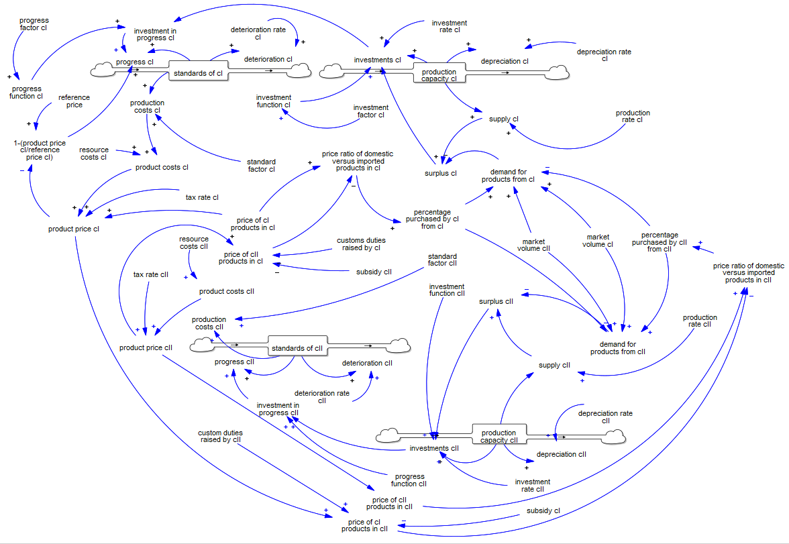

# Problema 1: Globalización y liberalización

1. Construye un modelo de dinámica de sistemas basado en el caso anterior, simula el modelo por un periodo de 50 años. Asegúrate que el modelo este en equilibrio (Envía tu modelo con la versión final de tu tarea.)

Escenario Sin Globalización

```{r}
#Problema 1
#Globalización y liberalización

#Paso 1: cargar la libreria "deSolve" empleando la funcion library()
 library("deSolve")

#Considera a los parametros como variables exogenas que no pueden ser modificadas

 parameters1.SG<-c(depreciation.rate.cI = 5/100, #[%/year]
               depreciation.rate.cII = 5/100, #[%/year]
               investment.rate.cI = 10/100, #[%/year]
               investment.rate.cII = 10/100, #[%/year]
               investment.factor.cI = 2, #[dimensionless]
               production.rate.cI = 100/100,  #[]
               production.rate.cII = 100/100,  #[]
               market.volume.cI = 100/100, #[]
               market.volume.cII = 100/100, #[]
               tax.rate.cI = 20/100, #[%]
               tax.rate.cII = 20/100, #[%]
               resource.costs.cI = 100/100, #[%]
               resource.costs.cII = 100/100, #[%]
               standard.factor.cI = 100/100, #[%]
               standard.factor.cII = 100/100, #[%]
               deterioration.rate.cI = 5/100, #[%]
               deterioration.rate.cII = 5/100, #[%]
               reference.price.cI = 5,
               reference.price.cII = 5,
               progress.factor.cI = 2,
               subsidy.cII = 0,
               customs.duties.raised.by.cII = 0
               )
 
 #para definir tus condiciones iniciales utiiza tus variables de estado
 InitialConditions1 <- c(production.capacity.cI = 100/100, #[%]
                        standards.of.cI = 100/100, #[%]
                        production.capacity.cII = 10/100, #[%]
                        standards.of.cII = 10/100
                        ) 

 times1 <- seq(0, #tiempo inicial
              50, #tiempo final #[years]
              1 )#número de repetición de puntos #[years]

# Definimos método de integración
 intg.method<-c("rk4")
 
#Especificamos modelo
Globalizacion.y.Liberalizacion.SG <- function(t, state, parameters) {
  with(as.list(c(state,parameters)), {
    
#auxiliary variables
    subsidy.cI <- 
      ifelse(t >= 10,
             0.75,
             0.75)
    
    customs.duties.raised.by.cI <- 
      ifelse(t >= 10,
             0.5,
             0.5)
    
    investment.function.cI <- 
      ifelse(t >= 10,
             investment.factor.cI,
             2) #[]
    
    investment.function.cII <- 
      ifelse(t >= 10,
             0.2,
             0.2) #[]
    
    production.costs.cI <- 
      standards.of.cI * 
      standard.factor.cI
    
    production.costs.cII <- 
      standards.of.cII * 
      standard.factor.cII
    
    product.costs.cI <- 
      resource.costs.cI + 
      production.costs.cI
    
    product.costs.cII <- 
      resource.costs.cII + 
      production.costs.cII
    
    product.price.cI <- 
      product.costs.cI *
      (1 + tax.rate.cI)
    
    product.price.cII <- 
      product.costs.cII *
      (1 + tax.rate.cII)
    
    price.of.cI.products.in.cI <- product.price.cI
    
    price.of.cII.products.in.cII <- product.price.cII
    
    price.of.cII.products.in.cI <- 
      product.price.cII *
      (1-subsidy.cII + customs.duties.raised.by.cI)
    
    price.of.cI.products.in.cII <- 
      product.price.cI *
      (1-subsidy.cI + customs.duties.raised.by.cII)
    
    price.ratio.of.domestic.versus.imported.products.in.cI <- 
      price.of.cI.products.in.cI /
      price.of.cII.products.in.cI
    
    price.ratio.of.domestic.versus.imported.products.in.cII <- 
      price.of.cII.products.in.cII /
      price.of.cI.products.in.cII

    percentage.purchased.by.cI.from.cI <- 
      ifelse(price.ratio.of.domestic.versus.imported.products.in.cI <= 0.5, 1,
             ifelse(price.ratio.of.domestic.versus.imported.products.in.cI > 0.5 &
                      price.ratio.of.domestic.versus.imported.products.in.cI < 1.5, 
                    -1* price.ratio.of.domestic.versus.imported.products.in.cI + 1.5,
                    ifelse(price.ratio.of.domestic.versus.imported.products.in.cI >= 1.5, 0)))
    
    percentage.purchased.by.cII.from.cII <- 
      ifelse(price.ratio.of.domestic.versus.imported.products.in.cII <= 0.5, 1,
             ifelse(price.ratio.of.domestic.versus.imported.products.in.cII > 0.5 &
                      price.ratio.of.domestic.versus.imported.products.in.cII < 1.5, 
                    -1* price.ratio.of.domestic.versus.imported.products.in.cII + 1.5,
                    ifelse(price.ratio.of.domestic.versus.imported.products.in.cII >= 1.5, 0)))
    
    demand.for.products.cI <- 
      percentage.purchased.by.cI.from.cI *
      market.volume.cI + 
      market.volume.cII *
      (1-percentage.purchased.by.cII.from.cII)
    
    demand.for.products.cII <- 
      percentage.purchased.by.cII.from.cII *
      market.volume.cII + 
      market.volume.cI *
      (1-percentage.purchased.by.cI.from.cI)
    
    supply.cI <- 
      production.capacity.cI *
      production.rate.cI
    
    supply.cII <- 
      production.capacity.cII *
      production.rate.cII
    
    surplus.cI <- 
      supply.cI -
      demand.for.products.cI
    
    surplus.cII <- 
      supply.cII -
      demand.for.products.cII
    
    progress.function.cI <- 
      ifelse(t <= 10/12,
             2,
             progress.factor.cI)
    
    progress.function.cII <- 
      ifelse(t <= 10/12,
             1,
             1)
    
    investment.in.progress.cI <- 
      ifelse(surplus.cI<0,
             investment.rate.cI *
               production.capacity.cI *
               investment.function.cI,
             0) * 
      progress.function.cI
    
    investment.in.progress.cII <- 
      ifelse(surplus.cII<0,
             investment.rate.cII *
               production.capacity.cII *
               investment.function.cII,
             0) * 
      progress.function.cII
      
#flow variables
    investments.cI <- ifelse(surplus.cI<0,
                             investment.rate.cI * 
                               production.capacity.cI *
                               investment.function.cI,
                             0) #[%/year]
    
    investments.cII <- ifelse(surplus.cII<0,
                             investment.rate.cII * 
                               production.capacity.cII *
                               investment.function.cII,
                             0) #[%/year]
    
    depreciation.cI <- 
      depreciation.rate.cI *
      production.capacity.cI #[%/year]
    
    depreciation.cII <- 
      depreciation.rate.cII *
      production.capacity.cII #[%/year]
    
    progress.cI <- 
      standards.of.cI *
      investment.in.progress.cI *
      (1 - (price.of.cI.products.in.cI)/reference.price.cI) #[]
    
    progress.cII <- 
      standards.of.cII *
      investment.in.progress.cII *
      (1 - (price.of.cII.products.in.cII)/reference.price.cII) #[]
    
    deterioration.cI <- 
      standards.of.cI *
      deterioration.rate.cI #[]
    
    deterioration.cII <- 
      standards.of.cII *
      deterioration.rate.cII #[]

#state variables
    dproduction.capacity.cI <- 
      investments.cI -
      depreciation.cI #[%/year]
    
    dproduction.capacity.cII <- 
      investments.cII -
      depreciation.cII #[%/year]
    
    dstandards.of.cI <- 
      progress.cI - 
      deterioration.cI #[%/year]
    
    dstandards.of.cII <- 
      progress.cII - 
      deterioration.cII #[%/year]
    
    
    list(c(dproduction.capacity.cI,
             dstandards.of.cI,
             dproduction.capacity.cII,
             dstandards.of.cII),
         dproduction.capacity.cI = dproduction.capacity.cI,
         dstandards.of.cI = dstandards.of.cI,
         dproduction.capacity.cII = dproduction.capacity.cII,
         dstandards.of.cII = dstandards.of.cII,
         price.of.cI.products.in.cI = price.of.cI.products.in.cI,
         price.of.cII.products.in.cI = price.of.cII.products.in.cI,
         price.of.cI.products.in.cII = price.of.cI.products.in.cII,
         price.of.cII.products.in.cII = price.of.cII.products.in.cII,
         percentage.purchased.by.cI.from.cI = percentage.purchased.by.cI.from.cI,
         percentage.purchased.by.cII.from.cII = percentage.purchased.by.cII.from.cII,
         demand.for.products.cI = demand.for.products.cI,
         demand.for.products.cII = demand.for.products.cII,
         investment.in.progress.cI = investment.in.progress.cI,
         investment.in.progress.cII = investment.in.progress.cII,
         surplus.cI = surplus.cI,
         surplus.cII =  surplus.cII
         )

  })
}

out1.SG <- ode(y = InitialConditions1,
           times = times1,
           func = Globalizacion.y.Liberalizacion.SG,
           parms = parameters1.SG,
           method =intg.method)

```

Escenario Con Globalización

```{r}
#Problema 1
#Globalización y liberalización

#Paso 1: cargar la libreria "deSolve" empleando la funcion library()
 library("deSolve")

#Considera a los parametros como variables exogenas que no pueden ser modificadas

 parameters1.CG<-c(depreciation.rate.cI = 5/100, #[%/year]
               depreciation.rate.cII = 5/100, #[%/year]
               investment.rate.cI = 10/100, #[%/year]
               investment.rate.cII = 10/100, #[%/year]
               investment.factor.cI = 2, #[dimensionless]
               production.rate.cI = 100/100,  #[]
               production.rate.cII = 100/100,  #[]
               market.volume.cI = 100/100, #[]
               market.volume.cII = 100/100, #[]
               tax.rate.cI = 20/100, #[%]
               tax.rate.cII = 20/100, #[%]
               resource.costs.cI = 100/100, #[%]
               resource.costs.cII = 100/100, #[%]
               standard.factor.cI = 100/100, #[%]
               standard.factor.cII = 100/100, #[%]
               deterioration.rate.cI = 5/100, #[%]
               deterioration.rate.cII = 5/100, #[%]
               reference.price.cI = 5,
               reference.price.cII = 5,
               progress.factor.cI = 2,
               subsidy.cII = 0,
               customs.duties.raised.by.cII = 0
               )
 
 #para definir tus condiciones iniciales utiiza tus variables de estado
 InitialConditions1 <- c(production.capacity.cI = 100/100, #[%]
                        standards.of.cI = 100/100, #[%]
                        production.capacity.cII = 10/100, #[%]
                        standards.of.cII = 10/100
                        ) 

 times1 <- seq(0, #tiempo inicial
              50, #tiempo final #[years]
              1 )#número de repetición de puntos #[years]

# Definimos método de integración
 intg.method<-c("rk4")
 
#Especificamos modelo
Globalizacion.y.Liberalizacion.CG <- function(t, state, parameters) {
  with(as.list(c(state,parameters)), {
    
#auxiliary variables
    subsidy.cI <- 
      ifelse(t >= 10,
             0,
             0.75)
    
    customs.duties.raised.by.cI <- 
      ifelse(t >= 10,
             0,
             0.5)
    
    investment.function.cI <- 
      ifelse(t >= 10,
             investment.factor.cI,
             2) #[]
    
    investment.function.cII <- 
      ifelse(t >= 10,
             2,
             0.2) #[]
    
    production.costs.cI <- 
      standards.of.cI * 
      standard.factor.cI
    
    production.costs.cII <- 
      standards.of.cII * 
      standard.factor.cII
    
    product.costs.cI <- 
      resource.costs.cI + 
      production.costs.cI
    
    product.costs.cII <- 
      resource.costs.cII + 
      production.costs.cII
    
    product.price.cI <- 
      product.costs.cI *
      (1 + tax.rate.cI)
    
    product.price.cII <- 
      product.costs.cII *
      (1 + tax.rate.cII)
    
    price.of.cI.products.in.cI <- product.price.cI
    
    price.of.cII.products.in.cII <- product.price.cII
    
    price.of.cII.products.in.cI <- 
      product.price.cII *
      (1-subsidy.cII + customs.duties.raised.by.cI)
    
    price.of.cI.products.in.cII <- 
      product.price.cI *
      (1-subsidy.cI + customs.duties.raised.by.cII)
    
    price.ratio.of.domestic.versus.imported.products.in.cI <- 
      price.of.cI.products.in.cI /
      price.of.cII.products.in.cI
    
    price.ratio.of.domestic.versus.imported.products.in.cII <- 
      price.of.cII.products.in.cII /
      price.of.cI.products.in.cII
    
    percentage.purchased.by.cI.from.cI <- 
      ifelse(price.ratio.of.domestic.versus.imported.products.in.cI <= 0.5, 1,
             ifelse(price.ratio.of.domestic.versus.imported.products.in.cI > 0.5 &
                      price.ratio.of.domestic.versus.imported.products.in.cI < 1.5, 
                    -1* price.ratio.of.domestic.versus.imported.products.in.cI + 1.5,
                    ifelse(price.ratio.of.domestic.versus.imported.products.in.cI >= 1.5, 0)))
    
    percentage.purchased.by.cII.from.cII <- 
      ifelse(price.ratio.of.domestic.versus.imported.products.in.cII <= 0.5, 1,
             ifelse(price.ratio.of.domestic.versus.imported.products.in.cII > 0.5 &
                      price.ratio.of.domestic.versus.imported.products.in.cII < 1.5, 
                    -1* price.ratio.of.domestic.versus.imported.products.in.cII + 1.5,
                    ifelse(price.ratio.of.domestic.versus.imported.products.in.cII >= 1.5, 0)))
    
    demand.for.products.cI <- 
      percentage.purchased.by.cI.from.cI *
      market.volume.cI + 
      market.volume.cII *
      (1-percentage.purchased.by.cII.from.cII)
    
    demand.for.products.cII <- 
      percentage.purchased.by.cII.from.cII *
      market.volume.cII + 
      market.volume.cI *
      (1-percentage.purchased.by.cI.from.cI)
    
    supply.cI <- 
      production.capacity.cI *
      production.rate.cI
    
    supply.cII <- 
      production.capacity.cII *
      production.rate.cII
    
    surplus.cI <- 
      supply.cI -
      demand.for.products.cI
    
    surplus.cII <- 
      supply.cII -
      demand.for.products.cII
    
    progress.function.cI <- 
      ifelse(t <= 10/12,
             2,
             progress.factor.cI)
    
    progress.function.cII <- 
      ifelse(t <= 10/12,
             1,
             2)
    
    investment.in.progress.cI <- 
      ifelse(surplus.cI<0,
             investment.rate.cI *
               production.capacity.cI *
               investment.function.cI,
             0) * 
      progress.function.cI
    
    investment.in.progress.cII <- 
      ifelse(surplus.cII<0,
             investment.rate.cII *
               production.capacity.cII *
               investment.function.cII,
             0) * 
      progress.function.cII
      
#flow variables
    investments.cI <- ifelse(surplus.cI<0,
                             investment.rate.cI * 
                               production.capacity.cI *
                               investment.function.cI,
                             0) #[%/year]
    
    investments.cII <- ifelse(surplus.cII<0,
                             investment.rate.cII * 
                               production.capacity.cII *
                               investment.function.cII,
                             0) #[%/year]
    
    depreciation.cI <- 
      depreciation.rate.cI *
      production.capacity.cI #[%/year]
    
    depreciation.cII <- 
      depreciation.rate.cII *
      production.capacity.cII #[%/year]
    
    progress.cI <- 
      standards.of.cI *
      investment.in.progress.cI *
      (1 - (price.of.cI.products.in.cI)/reference.price.cI) #[]
    
    progress.cII <- 
      standards.of.cII *
      investment.in.progress.cII *
      (1 - (price.of.cII.products.in.cII)/reference.price.cII) #[]
    
    deterioration.cI <- 
      standards.of.cI *
      deterioration.rate.cI #[]
    
    deterioration.cII <- 
      standards.of.cII *
      deterioration.rate.cII #[]

#state variables
    dproduction.capacity.cI <- 
      investments.cI -
      depreciation.cI #[%/year]
    
    dproduction.capacity.cII <- 
      investments.cII -
      depreciation.cII #[%/year]
    
    dstandards.of.cI <- 
      progress.cI - 
      deterioration.cI #[%/year]
    
    dstandards.of.cII <- 
      progress.cII - 
      deterioration.cII #[%/year]
    
    
    list(c(dproduction.capacity.cI,
             dstandards.of.cI,
             dproduction.capacity.cII,
             dstandards.of.cII),
         dproduction.capacity.cI = dproduction.capacity.cI,
         dstandards.of.cI = dstandards.of.cI,
         dproduction.capacity.cII = dproduction.capacity.cII,
         dstandards.of.cII = dstandards.of.cII,
         price.of.cI.products.in.cI = price.of.cI.products.in.cI,
         price.of.cII.products.in.cI = price.of.cII.products.in.cI,
         price.of.cI.products.in.cII = price.of.cI.products.in.cII,
         price.of.cII.products.in.cII = price.of.cII.products.in.cII,
         percentage.purchased.by.cI.from.cI = percentage.purchased.by.cI.from.cI,
         percentage.purchased.by.cII.from.cII = percentage.purchased.by.cII.from.cII,
         demand.for.products.cI = demand.for.products.cI,
         demand.for.products.cII = demand.for.products.cII,
         investment.in.progress.cI = investment.in.progress.cI,
         investment.in.progress.cII = investment.in.progress.cII,
         surplus.cI = surplus.cI,
         surplus.cII =  surplus.cII,
         investments.cI = investments.cI
         )

  })
}

out1.CG <- ode(y = InitialConditions1,
           times = times1,
           func = Globalizacion.y.Liberalizacion.CG,
           parms = parameters1.CG,
           method =intg.method)

```

2. Grafica los efectos sobre production capacity y standards para los dos países.

```{r}
#Escenario Sin Globalización

#Graficas solo variables de interés
plot(out1.SG, which = c("production.capacity.cI", 
                    "production.capacity.cII", 
                    "standards.of.cI",
                    "standards.of.cII"),
     xlab = "years",
     ylab = c("production capacity cI", 
                    "production capacity cII", 
                    "standards of cI",
                    "standards of cII")
     )

#Escenario Con Globalización

#Graficas solo variables de interés
plot(out1.CG, which = c("production.capacity.cI", 
                    "production.capacity.cII", 
                    "standards.of.cI",
                    "standards.of.cII"),
     xlab = "years",
     ylab = c("production capacity cI", 
                    "production capacity cII", 
                    "standards of cI",
                    "standards of cII")
     )

```

3. Asume que en t=10 el comercio se liberaliza. ¿Qué sucede en los dos países? Explica.

```{r}
# Escenario Sin Globalización
#Graficas solo variables de interés
plot(out1.SG, which = c("price.of.cI.products.in.cI",
                    "price.of.cII.products.in.cI",
                    "price.of.cII.products.in.cII",
                    "price.of.cI.products.in.cII"
                    ),
     xlab = "years",
     ylab = c("Price of cI products in cI", 
              "Price of cII products in cI", 
              "Price of cII products in cII",
              "Price of cI products in cII"
              )
     )

#Graficas solo variables de interés
plot(out1.SG, which = c("percentage.purchased.by.cI.from.cI",
                    "percentage.purchased.by.cII.from.cII",
                    "demand.for.products.cI",
                    "demand.for.products.cII"
                     ),
     xlab = "years",
     ylab = c("Percentage Purchased by cI from cI", 
              "Percentage Purchased by cII from cII",
              "Demand for products cI",
              "Demand for products cII"
              )
     )

#Graficas solo variables de interés
plot(out1.SG, which = c("surplus.cI",
                        "surplus.cII",
                        "investment.in.progress.cI",
                        "investment.in.progress.cII"
                        ),
     xlab = "years",
     ylab = c("Surplus cI", 
              "Surplus cII",
              "Investment in Progress cI",
              "Investment in Progress cII"
              )
     )

# Escenario Con Globalización
#Graficas solo variables de interés

plot(out1.CG, which = c("price.of.cI.products.in.cI",
                    "price.of.cII.products.in.cI",
                    "price.of.cII.products.in.cII",
                    "price.of.cI.products.in.cII"
                    ),
     xlab = "years",
     ylab = c("Price of cI products in cI", 
              "Price of cII products in cI", 
              "Price of cII products in cII",
              "Price of cI products in cII"
              )
     )

#Graficas solo variables de interés
plot(out1.CG, which = c("percentage.purchased.by.cI.from.cI",
                    "percentage.purchased.by.cII.from.cII",
                    "demand.for.products.cI",
                    "demand.for.products.cII"
                     ),
     xlab = "years",
     ylab = c("Percentage Purchased by cI from cI", 
              "Percentage Purchased by cII from cII",
              "Demand for products cI",
              "Demand for products cII"
              )
     )

#Graficas solo variables de interés
plot(out1.CG, which = c("surplus.cI",
                        "surplus.cII",
                        "investment.in.progress.cI",
                        "investment.in.progress.cII"
                        ),
     xlab = "years",
     ylab = c("Surplus cI", 
              "Surplus cII",
              "Investment in Progress cI",
              "Investment in Progress cII"
              )
     )

```

*R: Analizando primeramente a cI en el escenario en el cual no hay liberalización del comercio, se aprecia que existe un incremento importante en la capacidad de producción del país, la cual se estabiliza posteriormente a la baja en un valor de aproximadamente 106% desde el 100% de las condiciones iniciales; mientras que los estándares de cI incrementan desde 100% hasta un aproximado de 118% en los primeros años del periodo modelado. Estos cambios se pueden explicar con la estabilización del sistema a partir de las condiciones iniciales, donde los consumidores de cI se ven ampliamente beneficiados por los precios progresivamente bajos de los productos de cII en cI y  que, por lo tanto, incrementan de forma importante la demanda de productos de cII en el tiempo. En cII, por otro lado, se aprecia que tanto su capacidad de producción como sus estándares se vislumbran en decrementos progresivos hasta valores aproximados de 2% y 0.8% respectivamente desde sus condiciones iniciales de 10%. Estas caídas en las variables de estado de cII se reflejan asimismo en los precios de los productos de cII, los cuales siguen sin ser competitivos contra los productos de cI gracias a la existencia de enormes subsidios a los productos de exportación por parte de cI. Esto ocasiona que prácticamente, durante todo el periodo de modelación, no se compren productos de cII en cII, sino que todos estos productos son exportados a cI, donde sí se mantienen competitivos; y por lo tanto la totalidad de la demanda de cII sea cubierta a partir de productos de cI.*

*Analizando posteriormente a cI en el escenario en el cual si hay liberalización del comercio, se aprecia que a partir del t = 10 se vislumbran caídas progresivas de su capacidad de producción y de sus estándares. Esto responde al hecho de que la liberalización del comercio desploma los precios de los productos de cII en cI gracias al retiro de los aranceles recaudados por cI, y por lo tanto las preferencias de la población de cI se inclinan de manera prácticamente total por los productos de cII. En cII, por su parte, la liberalización del comercio ocasiona que se retiren los subsidios que mantenían sumamente competitivos los precios de los productos de cI en cII, y por lo tanto la demanda de productos también se inclina hacia los productos producidos en el mismo cII. El incremento en la demanda de productos de cII ocasiona que se tenga un déficit, o un surplus negativo, de oferta para satisfacer la demanda de productos de cII en ambos países, lo cual ocasiona un incremento importante en las inversiones en progreso en este país y un subsecuente incremento en sus estándares. Estas inversiones finalmente se reflejan también en incrementos en la capacidad de producción de cII, y el incremento en los estándares ocasiona que haya también un incremento progresivo en los precios de los productos de cII. Este incremento en los precios de cII, finalmente, ocasiona que la demanda de productos de cI se recupere progresivamente; reemplazando una parte de la participación de mercado que había ganado cII. Al final del periodo de modelación, se aprecia que la capacidad de producción de cI se estabiliza en un valor cercano al 80% desde el 100% de su condicion inicial, que los estándares de cI terminan en un 64% desde el 100% de su condición inicial, que la capacidad de producción de cII asciende hasta un 120% desde el 10% de su condición inicial y que los estándares de cII ascienden a un 49% desde el 10% de su condición inicial.*

4. Construye un diagrama causal del modelo o un diagrama stock-and-flow simplificado. Emplea este diagrama para describir el comportamiento que observas.

*R: Al visualizar este diagrama, podemos observar que existen relaciones importantes entre el comercio de cI y cII; principalmente en términos de la demanda de productos importados desde un país hacia otro, la cual depende de la relación de los precios de los productos domésticos contra los productos importados en un país y en el otro. Finalmente, al liberalizar el comercio entre ambos países, se eliminan los subsidios y la recaudación de aranceles en ambos países, lo cual habilita la competencia entre los productos producidos en cI y cII. Esto resulta en un comportamiento de crecimiento productivo para cII y en un decrecimiento para cI, lo cuál deja a ambos países en condiciones de competencia más parejas.*



5. Construye un diagrama de fase que englobe los principales elementos dinámicos del modelo. ¿Qué trayectoria sigue el sistema si inicia bajo diferentes condiciones iniciales? ¿Cuántos puntos de equilibrio identificas? ¿Son estables o inestables?

Escenarios Base: Sin Globalización y Con Globalización

```{r}
# Diagramas de fase

 library("ggplot2")
 library("ggpubr")

#Escenario Sin Globalización

out1.SGdf <- data.frame(out1.SG)

production.capacity.cI.phase.diagram.SG <-
  ggplot(out1.SGdf, aes(x=production.capacity.cI, y=dproduction.capacity.cI)) +
  geom_point() +
  geom_path(aes(colour = times1), 
            arrow = arrow()
            )

production.capacity.cII.phase.diagram.SG <-
  ggplot(out1.SGdf, aes(x=production.capacity.cII, y=dproduction.capacity.cII)) +
  geom_point()+
  geom_path(aes(colour = times1), 
            arrow = arrow()
            )

standards.of.cI.phase.diagram.SG <-
  ggplot(out1.SGdf, aes(x=standards.of.cI, y=dstandards.of.cI)) +
  geom_point()+
  geom_path(aes(colour = times1), 
            arrow = arrow()
            )

standards.of.cII.phase.diagram.SG <-
  ggplot(out1.SGdf, aes(x=standards.of.cII, y=dstandards.of.cII)) +
  geom_point()+
  geom_path(aes(colour = times1), 
            arrow = arrow()
            )

ggarrange(production.capacity.cI.phase.diagram.SG,
          production.capacity.cII.phase.diagram.SG,
          standards.of.cI.phase.diagram.SG,
          standards.of.cII.phase.diagram.SG,
          labels = 
            c("Production Capacity cI", "Production Capacity cII",
              "Standards of cI", "Standards of cII"),
          ncol = 2, nrow = 2)

#Escenario Con Globalización

out1.CGdf <- data.frame(out1.CG)

production.capacity.cI.phase.diagram.CG <-
  ggplot(out1.CGdf, aes(x=production.capacity.cI, y=dproduction.capacity.cI)) +
  geom_point() +
  geom_path(aes(colour = times1), 
            arrow = arrow()
            )

production.capacity.cII.phase.diagram.CG <-
  ggplot(out1.CGdf, aes(x=production.capacity.cII, y=dproduction.capacity.cII)) +
  geom_point()+
  geom_path(aes(colour = times1), 
            arrow = arrow()
            )

standards.of.cI.phase.diagram.CG <-
  ggplot(out1.CGdf, aes(x=standards.of.cI, y=dstandards.of.cI)) +
  geom_point()+
  geom_path(aes(colour = times1), 
            arrow = arrow()
            )

standards.of.cII.phase.diagram.CG <-
  ggplot(out1.CGdf, aes(x=standards.of.cII, y=dstandards.of.cII)) +
  geom_point()+
  geom_path(aes(colour = times1), 
            arrow = arrow()
            )

ggarrange(production.capacity.cI.phase.diagram.CG,
          production.capacity.cII.phase.diagram.CG,
          standards.of.cI.phase.diagram.CG,
          standards.of.cII.phase.diagram.CG,
          labels = 
            c("Production Capacity cI", "Production Capacity cII",
              "Standards of cI", "Standards of cII"),
          ncol = 2, nrow = 2)


```

*R: Analizando primeramente a cI en el escenario en el cual no hay liberalización del comercio, se aprecia que tanto la capacidad de producción como los estándares del país se mantienen a la alza en los primeros años a tasas incrementales y posteriormente hay una caída en el diferencial de ambos con respecto al tiempo. Después de esta caída, se vislumbran ligeros incrementos en el valor del diferencial, el cual sin embargo no llega a un valor de cero ni mucho menos positivo para ninguno de los dos casos. Esto nos indica que para el periodo de modelación que se está considerando de 50 años, el sistema no llega a un punto de equilibrio estable. Por otro lado, tenemos un solo punto de equilibrio inestable en cada gráfica de Production Capacity cI y de Standards of cI, el cual se encuentra en la intersección de la gráfica con el eje x y se da en los primeros años de simulación del modelo. Al liberalizar el mercado, se aprecia en los diagramas de fase que las escalas contempladas en los ejes x de ambas gráficas se amplían hacia valores más bajos que en el escenario sin globalización, lo cual nos indica que las capacidades de producción y los estándares de cI en este escenario llegan a valores más bajos que cuando se mantienen los mercados cerrados. Analizando el comportamiento del diagrama de fase, vemos que a partir de la liberalización, se tiende a una pendiente negativa en la capacidad de producción y en los estándares de cI y que, al llegar a valores bajos, comienza a estabilizarse con algunos puntos en pendientes positivas. Esto nos indica que, en el periodo de modelación, se alcanzan a percibir flctuaciones que tienden a a un punto de equilibrio estable pero este no se llega a tocar, y en cuanto a puntos de equilibrio inestables, tenemos varios cruces del eje x con estos diagrama de fase, por lo que cada cruce corresponde a un punto de equilibrio inestable.*

*Analizando posteriormente a cII en este mismo escenario, se aprecia en los diagramas de fase que conforme la capacidad de producción y los estándares del país se reducen, la tasa de cambio de reducción de estos mismos es cada vez más cercana a cero. Esta tendencia es consistente con lo que vemos en las gráficas iniciales de este escenario con respecto al tiempo, en donde vemos que los valores de production.capacity.cII y standards.of.cII convergen en aproximadamente 0.02 y 0.01 respectivamente. Al liberalizar el mercado de ambos países, se aprecia que las escalas contempladas en los ejes x de ambas gráficas se amplían hacia valores más altos que en el escenario sin globalización, lo cual nos indica que las capacidades de producción y los estándares de cI en este escenario llegan a valores más altos que cuando se mantienen los mercados cerrados. Analizando el comportamiento de los diagramas de fase, se puede apreciar que ambos diagramas parten de un punto de equilibrio inestable, y posteriormente tienen un incremento importante en sus tasas de cambio. A partir de aquí, en cuanto a la capacidad de producción del país, se aprecia que hay fluctuaciones en las diferenciales de capacidad con respecto al tiempo hacia el final del periodo de modelación, lo cual nos indica que está cercano al equilibrio estable. Por otro lado, se aprecia que los estándares de cII aún no se encuentran cercanos a un punto de equilibrio estable, pues apenas muestran una fluctuación hacia el final del periodo de modelación, que sin embargo es hasta cierto punto compensada por un declive en la tasa de cambio hasta un valor negativo muy cercano a cero. Esto nos indica que el modelo balanceó su incremento a partir de los estándares de 0.3.*


Escenario Con Globalización con nuevas condiciones iniciales

```{r}

 library("deSolve")
 library("ggplot2")
 library("ggpubr")

#Escenario Con Globalización con nuevas condiciones iniciales

InitialConditions1.5 <- c(production.capacity.cI = 50/100, #[%]
                        standards.of.cI = 50/100, #[%]
                        production.capacity.cII = 50/100, #[%]
                        standards.of.cII = 50/100
                        ) 

out1.5CG <- ode(y = InitialConditions1.5,
           times = times1,
           func = Globalizacion.y.Liberalizacion.CG,
           parms = parameters1.CG,
           method =intg.method)

#Graficas solo variables de interés
plot(out1.5CG, which = c("production.capacity.cI", 
                    "production.capacity.cII", 
                    "standards.of.cI",
                    "standards.of.cII"),
     xlab = "years",
     ylab = c("production capacity cI", 
                    "production capacity cII", 
                    "standards of cI",
                    "standards of cII")
     )

# Diagramas de fase

out1.5CGdf <- data.frame(out1.5CG)

production.capacity.cI.phase.diagram1.5CG <-
  ggplot(out1.5CGdf, aes(x=production.capacity.cI, y=dproduction.capacity.cI)) +
  geom_point() +
  geom_path(aes(colour = times1), 
            arrow = arrow()
            )

production.capacity.cII.phase.diagram1.5CG <-
  ggplot(out1.5CGdf, aes(x=production.capacity.cII, y=dproduction.capacity.cII)) +
  geom_point()+
  geom_path(aes(colour = times1), 
            arrow = arrow()
            )

standards.of.cI.phase.diagram1.5CG <-
  ggplot(out1.5CGdf, aes(x=standards.of.cI, y=dstandards.of.cI)) +
  geom_point()+
  geom_path(aes(colour = times1), 
            arrow = arrow()
            )

standards.of.cII.phase.diagram1.5CG <-
  ggplot(out1.5CGdf, aes(x=standards.of.cII, y=dstandards.of.cII)) +
  geom_point()+
  geom_path(aes(colour = times1), 
            arrow = arrow()
            )

ggarrange(production.capacity.cI.phase.diagram1.5CG,
          production.capacity.cII.phase.diagram1.5CG,
          standards.of.cI.phase.diagram1.5CG,
          standards.of.cII.phase.diagram1.5CG,
          labels = 
            c("Production Capacity cI", "Production Capacity cII",
              "Standards of cI", "Standards of cII"),
          ncol = 2, nrow = 2)


```

*R: Comparando los comportamientos de los diagramas de fase con globalización y con las condiciones iniciales originales con el comportamiento de los diagramas de fase con las nuevas condiciones iniciales, en las cuales consideramos que ambos países comienzan con 50% tanto en Production Capacity como en Standards, se aprecia que el comportamiento a largo plazo del modelo se mantiene prácticamente igual en buena medida. En cuanto a production.capacity.cI, se denota que al iniciar de un punto de partida menor, el modelo tarda algunos periodos más en llegar a su punto máximo de diferencial en el tiempo, para luego descender y finalmente comenzar a fluctuar. Los valores finales de production.capacity.cI a los que llega el modelo son ligeramente más altos si se inicializa desde 50% que inicializando en 100%, siendo que en el primer caso convergen en alrededor del 100% y en el segundo caso en alrededor del 80%. Hablando de los standards.of.cI, se aprecia que de igual forma el modelo tarda unos periodos más en llegar a su punto máximo de diferencial, y que posterior a esto hay un declive importante, aunque menor al original, en el valor de esta tasa de cambio. De igual forma, los standards se comienzan a estabilizar en valores cercanos al 100%, a comparación del caso original, en donde se comienza a ver la estabilización en valores de alrededor de 70%. Hablando posteriormente de la production.capacity.cII, se aprecia que esta variable de estado sigue un comportamiento muy similar que en el caso de condiciones inciales originales, sin embargo termina en un valor final menor que en el valor original, los cuales corresponden a 124% contra 108% respectivamente. Finalmente, hablando de los estándares de cII, se denota que igual siguen comportamientos muy similares en ambos casos, sin embargo en el nuevo escenario cII llega a estándares considerablemente mayores, de aproximadamente 100% contra el 50% del modelo original.*

# Problema 2: Colapso de Civilizaciones

1. Construye un modelo de dinámica de sistemas basado en el caso anterior. Calcula el valor de los exponentes y las variables de flujo omitidas de tal manera que el colapso de la población Maya ocurra en el año 800. Simula 2000 años de evolución iniciando en el año 1,000 A.C.

```{r}
#Problema 2
# Colapso de Civilizacioes

#Paso 1: cargar la libreria "deSolve" empleando la funcion library()
 library("deSolve")

#Considera a los parametros como variables exogenas que no pueden ser modificadas

 parameters2.1<-c(consumed.food.per.person = 400, #[kg/(person * year)]
               emigration.ratio = 5/100, #[%]
               intensity = 1, #[year]
               x = 1.84
               )
 
 #para definir tus condiciones iniciales utiiza tus variables de estado
 InitialConditions2 <- c(fertility.of.agricultural.land = 5000000, #[kg/(km2 * year)]
                        agricultural.land = 8, #[km2]
                        forest = 5000, #[km2]
                        population = 100000 #[people]
                        ) 

 times2 <- seq(-1000, #tiempo inicial [years]
              1000, #tiempo final [years]
              1)# número de repetición de puntos [years]

# Definimos método de integración
 intg.method<-c("rk4")
 
#Especificamos modelo
Colapso.De.Civilizaciones2.1 <- function(t, state, parameters) {
  with(as.list(c(state,parameters)), {
    
#auxiliary variables
    food.produced <- #[kg/year]
      fertility.of.agricultural.land * 
      agricultural.land 
    
    demand.of.food <- #[kg/year]
      population * 
      consumed.food.per.person 
    
    gap <- #[kg/year]
      demand.of.food - 
      food.produced 
    
    number.of.people.without.food <- #[people/year]
      gap/
      consumed.food.per.person 

#flow variables
    deforestation <- #[km2/year]
      min(gap/max(fertility.of.agricultural.land,1),forest/4)/
      intensity 
    
    fertility.losses <- #[kg/(km2*year)/year]
      fertility.of.agricultural.land * 
      min(2,(agricultural.land/forest)^x)/
      intensity 
      
    net.natural.population.increase <- #[people/year]
      population * 
      (exp(log(2)/408)-1) 
    
    emigration <- #[people/year]
      emigration.ratio * 
      number.of.people.without.food 
      
#state variables
    dfertility.of.agricultural.land <- #[kg/(km2*year)]
      -fertility.losses 
      
    dforest <- #[km2/year]
      -deforestation 
    
    dagricultural.land <- #[km2/year]
      deforestation 
    
    dpopulation <- #[people/year]
      net.natural.population.increase - 
      emigration 
    
    list(c(dfertility.of.agricultural.land,
             dagricultural.land,
             dforest,
             dpopulation),
         population.density = population/(agricultural.land + forest)
         )

  })
}

out2.1 <- ode(y = InitialConditions2,
           times = times2,
           func = Colapso.De.Civilizaciones2.1,
           parms = parameters2.1,
           method =intg.method)

out2.1df <- data.frame(out2.1)

```

2. ¿Qué pasa con la población? Grafica el comportamiento de esta variable, ¿corresponde el comportamiento de tu modelo al comportamiento observado?

```{r}
#Graficas solo variables de interés
plot(out2.1, which = c("population"),
     xlab = "years",
     ylab = c("population")
     )

#Graficas solo variables de interés
plot(out2.1, which = c("population.density"),
     xlab = "years",
     ylab = c("population.density")
     )

```

*R: Se aprecia que existe un crecimiento exponencial en la población hasta el año 800 d.C. que eleva la densidad poblacional hasta los 340 personas por km2, lo cual coincide con lo establecido en el problema en donde se menciona que la densidad poblacional se llega a encontrar en máximos de entre 200 y 500 personas por km2. Posterior a esto, se observa un colapso en la población que la lleva a una densidad poblacional menor a 20 personas por km2 después de 70 años, lo cual coincide también con los valores y plazos establecidos en el problema. Por esto, se podría considerar que efectivamente el comportamiento del modelo coincide con el observado.*

3. Introduce cambios en el modelo que hagan más realista su comportamiento.

```{r}
#Problema 2.3
# Colapso de Civilizacioes

#Paso 1: cargar la libreria "deSolve" empleando la funcion library()
 library("deSolve")

#Considera a los parametros como variables exogenas que no pueden ser modificadas

 parameters2.3<-c(consumed.food.per.person = 400, #[kg/(person * year)]
               emigration.ratio = 5/100, #[%]
               x = 1.84
               )
 
 #para definir tus condiciones iniciales utiiza tus variables de estado
 InitialConditions2 <- c(fertility.of.agricultural.land = 5000000, #[kg/(km2 * year)]
                        agricultural.land = 8, #[km2]
                        forest = 5000, #[km2]
                        population = 100000 #[people]
                        ) 

 times2 <- seq(-1000, #tiempo inicial [years]
              1000, #tiempo final [years]
              1)# número de repetición de puntos [years]

# Definimos método de integración
 intg.method<-c("rk4")
 
#Especificamos modelo
Colapso.De.Civilizaciones2.3 <- function(t, state, parameters) {
  with(as.list(c(state,parameters)), {
    
#auxiliary variables
    intensity <- approx( #[year]
      c(-1000,-500,0,500,800,1000),
      c(1,0.9,0.85,0.8,0.775,0.75),
      xout = t)$y
    
    food.produced <- #[kg/year]
      fertility.of.agricultural.land * 
      agricultural.land 
    
    demand.of.food <- #[kg/year]
      population * 
      consumed.food.per.person 
    
    gap <- #[kg/year]
      demand.of.food - 
      food.produced 
    
    number.of.people.without.food <- #[people/year]
      gap/
      consumed.food.per.person 

#flow variables
    deforestation <- #[km2/year]
      min(gap/max(fertility.of.agricultural.land,1),forest/4)/
      intensity 
    
    fertility.losses <- #[kg/(km2*year)/year]
      fertility.of.agricultural.land * 
      min(2,(agricultural.land/forest)^x)/
      intensity 
      
    net.natural.population.increase <- #[people/year]
      population * 
      (exp(log(2)/408)-1) 
    
    emigration <- #[people/year]
      emigration.ratio * 
      number.of.people.without.food 
      
#state variables
    dfertility.of.agricultural.land <- #[kg/(km2*year)]
      -fertility.losses 
      
    dforest <- #[km2/year]
      -deforestation 
    
    dagricultural.land <- #[km2/year]
      deforestation 
    
    dpopulation <- #[people/year]
      net.natural.population.increase - 
      emigration 
    
    list(c(dfertility.of.agricultural.land,
             dagricultural.land,
             dforest,
             dpopulation),
         intensity = intensity,
         dpopulation = dpopulation,
         dfertility.of.agricultural.land = dfertility.of.agricultural.land,
         dforest = dforest,
         dagricultural.land = dagricultural.land)

  })
}

out2.3 <- ode(y = InitialConditions2,
           times = times2,
           func = Colapso.De.Civilizaciones2.3,
           parms = parameters2.3,
           method =intg.method)

out2.3df <- data.frame(out2.3)

#Graficas solo variables de interés
plot(out2.3, which = c("intensity"),
     xlab = "years",
     ylab = c("intensity")
     )

#Graficas de variables de estado
plot(out2.3, which = c("population",
                       "fertility.of.agricultural.land",
                       "forest",
                       "agricultural.land"
                       ),
     xlab = "years",
     ylab = c("Population [people]",
                       "Fertility of Agricultural Land [kg/km2]",
                       "Forest [km2]",
                       "Agricultural Land [km2]"
              )
     )

```

*R: Para volver más realista el comportamiento del modelo, se propuso una reducción gradual en el valor de la intensidad de la agricultura a través del tiempo hasta un valor de 0.75; lo cual se podría atribuir a que mejores técnicas de cultivo permitieron a los mayas alcanzar sus objetivos de producción de alimentos en menores plazos. Estas modificaciones, si bien conservan el comportamiento de crecimiento-colapso del modelo, lo alteran de forma que el colapso se da desde el año 725 d.C. en lugar de en el año 800 d.C.; es decir, 75 años antes de lo inicialmente planteado.*

4. ¿Qué tan sensible es el modelo a cambios marginales en los parámetros o a cambios estructurales? Presenta al menos dos ejemplos.

```{r}
#Problema 2.4
# Colapso de Civilizacioes

#Paso 1: cargar la libreria "deSolve" empleando la funcion library()
 library("deSolve")

#Considera a los parametros como variables exogenas que no pueden ser modificadas

 parameters2.4.0 <- # Caso Base
   c(consumed.food.per.person = 400, #[kg/(person * year)]
     emigration.ratio = 5/100, #[%]
     x = 1.84
     )
 
parameters2.4.1 <- # Escenario 1: Cambio márginal en los parámetros - Consumo de alimento por persona
   c(consumed.food.per.person = 360, #[kg/(person * year)]
     emigration.ratio = 5/100, #[%]
     x = 1.84
     )

parameters2.4.2 <- # Escenario 2: Cambio márginal en los parámetros - Cambio de razón de migración
   c(consumed.food.per.person = 400, #[kg/(person * year)]
     emigration.ratio = 5.5/100, #[%]
     x = 1.84
     )

Colapso.De.Civilizaciones2.4.3 <- function(t, state, parameters) { # Escenario 3: Cambio estructural - Deforestación ilimitada
  with(as.list(c(state,parameters)), {
    
#auxiliary variables
    intensity <- approx( #[year]
      c(-1000,-500,0,500,800,1000),
      c(1,0.9,0.85,0.8,0.775,0.75),
      xout = t)$y
    
    food.produced <- #[kg/year]
      fertility.of.agricultural.land * 
      agricultural.land 
    
    demand.of.food <- #[kg/year]
      population * 
      consumed.food.per.person 
    
    gap <- #[kg/year]
      demand.of.food - 
      food.produced 
    
    number.of.people.without.food <- #[people/year]
      gap/
      consumed.food.per.person 

#flow variables
    deforestation <- #[km2/year]
      gap/max(fertility.of.agricultural.land,1)/
      intensity
    
    fertility.losses <- #[kg/(km2*year)/year]
      fertility.of.agricultural.land * 
      min(2,(agricultural.land/forest)^x)/
      intensity 
      
    net.natural.population.increase <- #[people/year]
      population * 
      (exp(log(2)/408)-1) 
    
    emigration <- #[people/year]
      emigration.ratio * 
      number.of.people.without.food 
      
#state variables
    dfertility.of.agricultural.land <- #[kg/(km2*year)]
      -fertility.losses 
      
    dforest <- #[km2/year]
      ifelse(forest-deforestation <=1,
             0,
             -deforestation)
    
    dagricultural.land <- #[km2/year]
      ifelse(forest-deforestation <=1,
             0,
             deforestation)
    
    dpopulation <- #[people/year]
      ifelse(population + net.natural.population.increase - emigration <= 0,
             -population,
             net.natural.population.increase - 
      emigration)
    
    list(c(dfertility.of.agricultural.land,
             dagricultural.land,
             dforest,
             dpopulation),
         intensity = intensity,
         dpopulation = dpopulation)

  })
}
 
# Resultados

## Caso Base

out2.4.0 <- ode(y = InitialConditions2,
           times = times2,
           func = Colapso.De.Civilizaciones2.3,
           parms = parameters2.4.0,
           method =intg.method)

out2.4.0df <- data.frame(out2.4.0)

### Graficas solo variables de interés
plot(out2.4.0, which = c("population",
                       "fertility.of.agricultural.land",
                       "forest",
                       "agricultural.land"
                       ),
     xlab = "years",
     ylab = c("Population [people]",
                       "Fertility of Agricultural Land [kg/km2]",
                       "Forest [km2]",
                       "Agricultural Land [km2]"
              )
     )

## Escenario 1: Cambio márginal en los parámetros - Consumo de alimento por persona

out2.4.1 <- ode(y = InitialConditions2,
           times = times2,
           func = Colapso.De.Civilizaciones2.3,
           parms = parameters2.4.1,
           method =intg.method)

out2.4.1df <- data.frame(out2.4.1)

plot(out2.4.1, which = c("population",
                       "fertility.of.agricultural.land",
                       "forest",
                       "agricultural.land"
                       ),
     xlab = "years",
     ylab = c("Population [people]",
                       "Fertility of Agricultural Land [kg/km2]",
                       "Forest [km2]",
                       "Agricultural Land [km2]"
              )
     )


## Escenario 2: Escenario 2: Cambio márginal en los parámetros - Cambio de razón de migración

out2.4.2 <- ode(y = InitialConditions2,
           times = times2,
           func = Colapso.De.Civilizaciones2.3,
           parms = parameters2.4.2,
           method =intg.method)

out2.4.2df <- data.frame(out2.4.2)

#Graficas solo variables de interés
plot(out2.4.2, which = c("population",
                       "fertility.of.agricultural.land",
                       "forest",
                       "agricultural.land"
                       ),
     xlab = "years",
     ylab = c("Population [people]",
                       "Fertility of Agricultural Land [kg/km2]",
                       "Forest [km2]",
                       "Agricultural Land [km2]"
              )
     )

## Escenario 3: Cambio estructural - Deforestación ilimitada

out2.4.3 <- ode(y = InitialConditions2,
           times = times2,
           func = Colapso.De.Civilizaciones2.4.3,
           parms = parameters2.4.0,
           method =intg.method)

out2.4.3df <- data.frame(out2.4.3)

### Graficas solo variables de interés
plot(out2.4.3, which = c("population",
                       "fertility.of.agricultural.land",
                       "forest",
                       "agricultural.land"
                       ),
     xlab = "years",
     ylab = c("Population [people]",
                       "Fertility of Agricultural Land [kg/km2]",
                       "Forest [km2]",
                       "Agricultural Land [km2]"
              )
     )

```

*R: A partir de los cambios paramétricos marginales y estructurales realizados, se concluye que en cuanto a los cambios paramétricos, no se dan cambios significativos en el comportamiento del modelo. La civilización maya definitivamente colapsa, con ligeras variaciones en el tiempo, si se reduce en un 10% la cantidad de consumo anual de alimentos de la civilización o si se incrementa en un 10% el porcentaje de gente que migra por falta de alimentos. De estos cambios paramétricos, quizás es importante destacar que el modelo es más sensible a cambios de la misma proporción en el consumo de alimentos que a cambios en la tasa migratoria. Por otro lado, se propuso un cambio estructural de no limitar la tasa de deforestación anual al 25% de los bosques disponibles. Esto tuvo como consecuencia una caída más estrepitosa en la variable forest, acompañado con un alza consecuente de la variable agricultural.land. Por otro lado, también se denota una caída más fuerte en la población.*

5. Propón una política (i.e. preferentemente una política dinámica) que evite el colapso de la civilización Maya. Implementa esta política en el modelo y compara gráficamente el comportamiento del sistema con y sin tu política. 

```{r}
#Problema 2.5
# Colapso de Civilizacioes

#Paso 1: cargar la libreria "deSolve" empleando la funcion library()
 library("deSolve")

#Considera a los parametros como variables exogenas que no pueden ser modificadas

 parameters2.5<-c(consumed.food.per.person = 400, #[kg/(person * year)]
               emigration.ratio = 5/100, #[%]
               x = 1.84,
               max.percentaje.of.hungry.population = 2.5/100 #[%]
               )
 
 #para definir tus condiciones iniciales utiiza tus variables de estado
 InitialConditions2 <- c(fertility.of.agricultural.land = 5000000, #[kg/(km2 * year)]
                        agricultural.land = 8, #[km2]
                        forest = 5000, #[km2]
                        population = 100000 #[people]
                        ) 

 times2 <- seq(-1000, #tiempo inicial [years]
              1000, #tiempo final [years]
              1)# número de repetición de puntos [years]

# Definimos método de integración
 intg.method<-c("rk4")
 
#Especificamos modelo
Colapso.De.Civilizaciones2.5 <- function(t, state, parameters) {
  with(as.list(c(state,parameters)), {
    
#auxiliary variables
    intensity <- approx( #[year]
      c(-1000,-500,0,500,800,1000),
      c(1,0.9,0.85,0.8,0.775,0.75),
      xout = t)$y
    
    food.produced <- #[kg/year]
      fertility.of.agricultural.land * 
      agricultural.land 
    
    demand.of.food <- #[kg/year]
      population * 
      consumed.food.per.person 
    
    gap <- #[kg/year]
      demand.of.food - 
      food.produced 
    
    number.of.people.without.food <- #[people/year]
      gap/
      consumed.food.per.person 

#flow variables
    deforestation <- #[km2/year]
      min(gap/max(fertility.of.agricultural.land,1),forest/4)/
      intensity 
    
    fertility.losses <- #[kg/(km2*year)/year]
      fertility.of.agricultural.land * 
      min(2,(agricultural.land/forest)^x)/
      intensity 
      
    net.natural.population.increase <- #[people/year]
      population * 
      (exp(log(2)/408)-1) 
    
    emigration <- #[people/year]
      emigration.ratio * 
      number.of.people.without.food 
      
#state variables
    dfertility.of.agricultural.land <- #[kg/(km2*year)]
      -fertility.losses 
      
    dforest <- #[km2/year]
      ifelse(number.of.people.without.food <= max.percentaje.of.hungry.population * population,
             0,
             -deforestation)
       
    dagricultural.land <- #[km2/year]
      ifelse(number.of.people.without.food <= max.percentaje.of.hungry.population * population,
             0,
             deforestation) 
    
    dpopulation <- #[people/year]
      net.natural.population.increase - 
      emigration 
    
    list(c(dfertility.of.agricultural.land,
             dagricultural.land,
             dforest,
             dpopulation),
         dfertility.of.agricultural.land = dfertility.of.agricultural.land,
         dagricultural.land = dagricultural.land,
         dforest = dforest,
         dpopulation = dpopulation,
         number.of.people.without.food = number.of.people.without.food,
         suma = forest + agricultural.land
         )

  })
}

out2.5 <- ode(y = InitialConditions2,
           times = times2,
           func = Colapso.De.Civilizaciones2.5,
           parms = parameters2.5,
           method =intg.method)

out2.5df <- data.frame(out2.5)

#Graficas solo variables de interés
plot(out2.5, which = c("number.of.people.without.food"),
     xlab = "years",
     ylab = c("Number Of People Without Food [people/year]")
     )

#Graficas de variables de estado sin política
plot(out2.3, which = c("population",
                       "fertility.of.agricultural.land",
                       "forest",
                       "agricultural.land"
                       ),
     main = c("Population Sin Política", 
              "Fertility of Agricultural Land Sin Política",
              "Forest Sin Política", 
              "Agricultural Land Sin Política"),
     xlab = "years",
     ylab = c("Population [people]",
                       "Fertility of Agricultural Land [kg/km2]",
                       "Forest [km2]",
                       "Agricultural Land [km2]"
              )
     )

#Graficas de variables de estado
plot(out2.5, which = c("population",
                       "fertility.of.agricultural.land",
                       "forest",
                       "agricultural.land"
                       ),
     main = c("Population Con Política", 
              "Fertility of Agricultural Land Con Política",
              "Forest Con Política", 
              "Agricultural Land Con Política"),
     xlab = "years",
     ylab = c("Population [people]",
                       "Fertility of Agricultural Land [kg/km2]",
                       "Forest [km2]",
                       "Agricultural Land [km2]"
              )
     )

```

*R: Se modeló una política en la cual se propone que solamente se deforeste en caso de que la población sin comida supere el 2.5% de la población total maya en un tiempo determinado, lo cual efectivamente demuestra que durante el periodo de modelación; si bien hay un crecimiento importante en la población, no se lleva a cabo la deforestación de forma tan crítica como se llevó a cabo según la información original del problema.*

6. Construye un diagrama de fase del modelo sin política. ¿Cuál es tu conclusión? ¿Cómo cambia este diagrama de fase con tu política?

```{r}
# Diagramas de fase

 library("ggplot2")
 library("ggpubr")

#Escenario Sin Política

population.phase.diagram.SP <-
  ggplot(out2.3df, aes(x=population, y=dpopulation)) +
  geom_point() +
  geom_path(aes(colour = times2), 
            arrow = arrow()
            )

fertility.of.agricultural.land.phase.diagram.SP <-
  ggplot(out2.3df, aes(x=fertility.of.agricultural.land, y=dfertility.of.agricultural.land)) +
  geom_point()+
  geom_path(aes(colour = times2), 
            arrow = arrow()
            )

forest.phase.diagram.SP <-
  ggplot(out2.3df, aes(x=forest, y=dforest)) +
  geom_point()+
  geom_path(aes(colour = times2), 
            arrow = arrow()
            )

agricultural.land.phase.diagram.SP <-
  ggplot(out2.3df, aes(x=agricultural.land, y=dagricultural.land)) +
  geom_point()+
  geom_path(aes(colour = times2), 
            arrow = arrow()
            )

ggarrange(population.phase.diagram.SP,
          fertility.of.agricultural.land.phase.diagram.SP,
          forest.phase.diagram.SP,
          agricultural.land.phase.diagram.SP,
          labels = 
            c("Population [People]", "Fertility of Agricultural Land [kg/km2]",
              "Forest [km2]", "Agricultural Land [km2]"),
          ncol = 2, nrow = 2)

#Escenario Con Política

population.phase.diagram.CP <-
  ggplot(out2.5df, aes(x=population, y=dpopulation)) +
  geom_point() +
  geom_path(aes(colour = times2), 
            arrow = arrow()
            )

fertility.of.agricultural.land.phase.diagram.CP <-
  ggplot(out2.5df, aes(x=fertility.of.agricultural.land, y=dfertility.of.agricultural.land)) +
  geom_point()+
  geom_path(aes(colour = times2), 
            arrow = arrow()
            )

forest.phase.diagram.CP <-
  ggplot(out2.5df, aes(x=forest, y=dforest)) +
  geom_point()+
  geom_path(aes(colour = times2), 
            arrow = arrow()
            )

agricultural.land.phase.diagram.CP <-
  ggplot(out2.5df, aes(x=agricultural.land, y=dagricultural.land)) +
  geom_point()+
  geom_path(aes(colour = times2), 
            arrow = arrow()
            )

ggarrange(population.phase.diagram.CP,
          fertility.of.agricultural.land.phase.diagram.CP,
          forest.phase.diagram.CP,
          agricultural.land.phase.diagram.CP,
          labels = 
            c("Population [People]", "Fertility of Agricultural Land [kg/km2]",
              "Forest [km2]", "Agricultural Land [km2]"),
          ncol = 2, nrow = 2)

```

*R: Analizando los diagramas de fase sin política, y enfocándonos principalmente en el diagrama de población, se denota como durante periodos muy largos de tiempo esta misma creció a tasas muy bajas, lo cual coincide con el apunte del libro que menciona que este crecimiento era casi imperceptible para las generaciones que vivián en aquel tiempo, y que sin embargo los llevo a crecer desde 100 mil hasta más de 1 millon 500 mil habitantes en poco más de 1500 años. Este crecimiento, muy acelerado para la época, ocasionó el declive que vemos en las tasas de cambio de área forestal con respecto al tiempo, las cuales si bien se recuperan paulatinamente, no impiden que el área forestal llegue a un valor cercano a 0 km2 al final del periodo de modelación. Esta reducción en el área forestal, finalmente, ocasionó que eventualmente se tuviera un déficit en los alimentos disponibles a partir del incremento de la población y la pérdida de fertilidad de las tierras, lo cual finalmente ocasionó el colapso de la civilización; que finalmente también termina en valores de población muy cercanos al 0.*

*R: A partir de la implementación de la política, se pueden apreciar diagramas de fase muy distintos. Por un lado, se aprecia que los valores de población se mantienen incrementales, en mayor o menor medida, durante todo el periodo de modelación. Estas tasas, sin embargo, se demuestran mucho más controladas gracias a la emigración, pues en el modelo original podemos apreciar diferenciales de población que superan las 2 mil personas al año; mientras que con la implementación de esta política podemos apreciar incrementos más modestos pero sostenibles de un máximo de alrededor de 450 personas. Con respecto a las áreas forestales, se puede apreciar que hay una reducción bastante lenta en las mismas, al punto de que no se vislumbra en la escala de la gráfica una tasa de disminución del área forestal por debajo de 0, ni tampoco un diferencial por encima del 0 para el área cultivable. Esto hubiera permitido que en este escenario, en total en el transcurso del periodo de 2 mil años, se deforestara un total de 26 km2 de bosque de los 5 mil km2 disponibles para cultivar; lo cuál hubiera reducido significativamente la carga de la población sobre el medio ambiente y por lo tanto hubiera permitido a la civilización maya subsistir.*